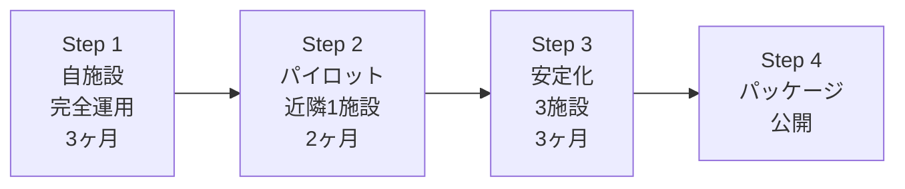

# 🏭 福祉DXパッケージ設計書

> **文書タイプ:** アーキテクチャ設計 + 展開計画
> **作成日:** 2026-03-10
> **対象:** audit-management-system-mvp → 福祉DXパッケージ
> **ゴール:** 1施設 → 10施設展開可能な構造を設計する

---

## 📊 現在地の正確な評価

コードベースを精査した結果、**「8割完成」は正確**です。
以下がその根拠です。

### ✅ 既にパッケージ化に適した設計（完成済み）

| 要素 | 現在の状態 | パッケージ化への評価 |
|------|-----------|-------------------|
| **SP_LIST_REGISTRY** | 25リスト全て `envOr()` で環境変数オーバーライド可能 | 🟢 施設ごとのリスト名差異を吸収できる |
| **Feature Flags** | 7個の `VITE_FEATURE_*` フラグ | 🟢 施設ごとの機能ON/OFFが既に可能 |
| **MSAL認証** | テナントID/クライアントIDが環境変数 | 🟢 施設（テナント）切り替え済み対応 |
| **SP Site設定** | `VITE_SP_RESOURCE` + `VITE_SP_SITE_RELATIVE` で分離 | 🟢 施設ごとのSPサイトに接続可能 |
| **checkAllLists()** | 25リストの自動ヘルスチェック | 🟢 新施設の検証ツールとしてそのまま使える |
| **OpeningVerificationPage** | リスト存在+フィールド+CRUD 4ステップ検証 | 🟢 導入時の自動セットアップ検証 |
| **CSVインポート** | `CsvImportPage` + パーサー3種 | 🟢 初期データ投入の仕組みが既にある |
| **spListHealthCheck.ts** | 並列5、ステータス分類、サマリー | 🟢 そのまま導入キットの一部 |
| **ConfigErrorBoundary** | 設定不備時のガイド表示 | 🟢 新施設での初期設定ミスに対応 |
| **FIELD_MAP** | 15ドメインのフィールド定義 | 🟢 スキーマテンプレートの元データ |
| **導入ドキュメント** | Day0テスト、ロードマップ、判定表 | 🟢 そのまま導入キットに同梱可能 |

### 🟡 パッケージ化に足りない部分（残り2割）

| 要素 | 現状 | 必要な変更 |
|------|------|-----------|
| **施設設定ファイル** | 環境変数が散在（`.env` に40+変数） | 1つの施設設定JSONに集約 |
| **SharePoint自動構築** | 手動でリスト作成 | PowerShellスクリプトで自動化 |
| **テナント分離** | 1テナント = 1デプロイ前提 | 複数施設 = 複数デプロイの標準化 |
| **初期データテンプレート** | CSVパーサーはあるがテンプレートCSVがない | 空テンプレート + サンプルデータ |
| **導入自動化フロー** | ドキュメントはあるが手順が散在 | 統合セットアップウィザード |

---

## 🧱 アーキテクチャ設計

### 現在の構造（単一施設）

```
┌─────────────────────────────────────────┐
│           React SPA (Vite)              │
│                                         │
│  ┌──────────┐  ┌──────────────────────┐ │
│  │  MSAL    │  │  SP_LIST_REGISTRY    │ │
│  │  Auth    │  │  25 lists × envOr()  │ │
│  └────┬─────┘  └──────────┬───────────┘ │
│       │                   │             │
│  ┌────▼───────────────────▼───────────┐ │
│  │         spClient / spFetch         │ │
│  │  VITE_SP_RESOURCE + SITE_RELATIVE  │ │
│  └────────────────┬───────────────────┘ │
└───────────────────┼─────────────────────┘
                    │
          ┌─────────▼─────────┐
          │   SharePoint      │
          │   Site A          │
          │   (25 lists)      │
          └───────────────────┘
```

### 展開後の構造（マルチ施設）

```
┌──────────────────────────────────────────────────┐
│              React SPA (同一コードベース)            │
│                                                    │
│  ┌──────────────────┐  ┌───────────────────────┐  │
│  │  FacilityConfig  │  │  SP_LIST_REGISTRY     │  │
│  │  (施設設定JSON)   │  │  (envOr は変更不要)    │  │
│  └────────┬─────────┘  └───────────────────────┘  │
│           │                                        │
│  ┌────────▼────────────────────────────────────┐  │
│  │            Cloudflare Worker                 │  │
│  │  施設ごとに window.__ENV__ を注入             │  │
│  └──────────┬────────────┬────────────────────┘  │
└─────────────┼────────────┼───────────────────────┘
              │            │
    ┌─────────▼──┐  ┌──────▼──────┐
    │ SP Site A  │  │  SP Site B  │
    │ 施設A      │  │  施設B      │
    │ (25 lists) │  │ (25 lists)  │
    └────────────┘  └─────────────┘
```

> **重要な発見:** 現在の `Cloudflare Worker` が既に `window.__ENV__` を注入する構造になっている。
> つまり **Worker のバインディングを施設ごとに変えるだけ** でマルチ施設に対応できる。
> アプリコード自体の変更は**ほぼ不要**。

---

## 📦 パッケージ化に必要な5つの成果物

### 1️⃣ 施設設定ファイル（FacilityConfig）

現在40+の環境変数が `.env` に散在しています。
これを **1つの施設設定テンプレート** にまとめます。

```jsonc
// facility-config.template.jsonc
{
  // ── 施設基本情報 ──
  "facility": {
    "name": "〇〇地域活動ホーム",
    "code": "facility-001",
    "capacity": 30,
    "timezone": "Asia/Tokyo",
    "serviceType": "生活介護"    // 生活介護 | 就労B | 放課後デイ
  },

  // ── Microsoft 365 接続 ──
  "auth": {
    "tenantId": "<your-tenant-id>",
    "clientId": "<your-client-id>",
    "redirectUri": "https://<your-domain>/auth/callback",
    "spResource": "https://<tenant>.sharepoint.com",
    "spSiteRelative": "/sites/<SiteName>"
  },

  // ── 機能フラグ（施設に合わせてON/OFF）──
  "features": {
    "schedules": false,       // スケジュール週間表
    "complianceForm": false,  // コンプライアンスフォーム
    "staffAttendance": false, // 職員出勤管理
    "icebergPdca": false,     // 氷山モデルPDCA
    "todayOps": false,        // TodayOps ホーム
    "nurseBeta": false,       // 看護観察記録
    "usersCrud": false        // 利用者CRUD
  },

  // ── SharePoint リスト名オーバーライド（デフォルトと異なる場合のみ）──
  "listOverrides": {
    // "VITE_SP_LIST_USERS": "カスタム_利用者マスタ"
  },

  // ── 運用設定 ──
  "operations": {
    "writeEnabled": true,
    "demoMode": false,
    "auditDebug": false
  }
}
```

**実装方針:** 既存の `env.ts` の `readEnv()` / `readBool()` は `window.__ENV__` を参照する設計。
Cloudflare Worker が `facility-config.json` を読み込んで `window.__ENV__` に変換すれば、
**アプリコードの変更はゼロ**。

```
facility-config.json → Worker が読む → window.__ENV__ に注入 → 既存コードがそのまま動く
```

---

### 2️⃣ SharePoint 自動構築スクリプト

`SP_LIST_REGISTRY` と `FIELD_MAP` から自動生成可能。

```
📁 provisioning/
├── setup-facility.ps1          # メインスクリプト
├── lists/
│   ├── 01-masters.ps1          # マスタ系 3リスト
│   ├── 02-daily-records.ps1    # 日々記録系 4リスト
│   ├── 03-attendance.ps1       # 出席管理系 4リスト
│   ├── 04-handoff.ps1          # 引き継ぎ 1リスト
│   └── 05-optional.ps1         # オプション 13リスト
├── fields/
│   ├── users-master.json       # USERS_MASTER_FIELD_MAP から生成
│   ├── staff-master.json       # STAFF_MASTER_FIELD_MAP から生成
│   ├── daily-activity.json     # FIELD_MAP_DAILY_ACTIVITY から生成
│   ├── attendance-daily.json   # ATTENDANCE_DAILY_FIELDS から生成
│   └── ...                     # 各ドメインのフィールド定義
└── verify.ps1                  # checkAllLists() 相当の検証
```

**生成元のマッピング:**

| 元データ（コード内） | 生成先（スクリプト） |
|---|---|
| `SP_LIST_REGISTRY[].key` → リスト名 | `New-PnPList -Title "..."` |
| `SP_LIST_REGISTRY[].operations` → 権限 | `Set-PnPList -ReadSecurity` |
| `FIELD_MAP.Users_Master` → フィールド | `Add-PnPField -InternalName "..."` |
| `LIST_CONFIG[key].title` → デフォルト名 | スクリプト内のデフォルト値 |

**実行例:**

```powershell
# 新施設のSharePointを30分で構築
.\setup-facility.ps1 `
  -SiteUrl "https://contoso.sharepoint.com/sites/FacilityB" `
  -ConfigFile "./facility-config.json" `
  -Phase "day0"    # day0 = 必須12リストのみ / full = 全25リスト
```

---

### 3️⃣ 初期データテンプレート

既存の `CsvImportPage` + パーサー群を活用。

```
📁 templates/
├── csv/
│   ├── users_template.csv         # 利用者マスタ（空テンプレ）
│   ├── users_sample.csv           # 利用者マスタ（サンプル5名）
│   ├── staff_template.csv         # 職員マスタ（空テンプレ）
│   ├── staff_sample.csv           # 職員マスタ（サンプル3名）
│   └── README.md                  # カラム説明
└── data/
    └── default-support-templates.json  # 支援手順テンプレート（定型文）
```

**users_template.csv のカラム（USERS_MASTER_FIELD_MAP から導出）:**

```csv
UserCode,UserName,Gender,DisabilityType,Birthday,ServiceStartDate,ServiceType,GuardianName,GuardianPhone,TransportType,Notes
I001,山田太郎,男性,知的障害,1985-04-15,2024-04-01,生活介護,山田花子,090-xxxx-xxxx,送迎車,
```

---

### 4️⃣ Opening Verification の標準化

既に `OpeningVerificationPage` が存在するが、これを **導入ウィザード** に昇格させる。

```
現在の4ステップ:
  Step 1: リスト存在チェック (checkAllLists)
  Step 2: フィールド検証 (diagnosticsReports)
  Step 3: SELECT クエリテスト
  Step 4: CRUD テスト

追加すべきステップ:
  Step 0: 施設設定ファイル読み込み・検証
  Step 5: CSVインポート結果確認
  Step 6: Day0テスト連携（チェック項目の自動集計）
```

**実装コスト:** Step 0 は `facility-config.json` を Zod でバリデーション → 既存の `env.schema.ts` パターンの流用。
Step 5-6 は UI 追加のみ。

---

### 5️⃣ 導入キット（配布パッケージ）

```
📦 welfare-dx-kit/
│
├── README.md                      # 全体説明
│
├── 📁 app/                        # React SPA（ビルド済み or ソース）
│   └── dist/                      # Cloudflare Pages にデプロイ
│
├── 📁 provisioning/               # SharePoint 自動構築
│   ├── setup-facility.ps1
│   ├── lists/
│   └── fields/
│
├── 📁 config/                     # 施設設定テンプレート
│   ├── facility-config.template.jsonc
│   └── .env.template
│
├── 📁 templates/                  # 初期データ
│   ├── csv/
│   └── data/
│
├── 📁 docs/                       # 導入ドキュメント
│   ├── day0-test.md               # Day0テスト（印刷用）
│   ├── introduction-roadmap.md    # 10週間ロードマップ
│   ├── deployment-decision.md     # 導入判定表
│   ├── field-staff-guide.md       # 現場スタッフ向けガイド
│   └── management-briefing.md     # 管理者向け説明資料
│
└── 📁 worker/                     # Cloudflare Worker
    ├── wrangler.toml.template
    └── src/index.ts
```

---

## 🗺️ 展開戦略（4ステップ）



### Step 1：自施設で完全運用（3ヶ月）

**目的:** 「プロダクト」ではなく「実運用システム」として成熟させる

| 月 | やること | 成果物 |
|----|---------|--------|
| 1ヶ月目 | Phase 1-2 導入（出欠・記録・引継） | 運用データの蓄積開始 |
| 2ヶ月目 | Phase 3 導入（帳票・管理） + バグ修正 | 月次帳票の実運用 |
| 3ヶ月目 | Phase 4 選択的導入 + 安定化 | 「3ヶ月運用実績」という最強の営業素材 |

**Step 1 完了基準:**
- 紙の帳票を完全に廃止
- 月次監査提出を1回以上システムから実施
- 重大バグ（白画面・データ消失）が1ヶ月間ゼロ

---

### Step 2：パイロット施設（1施設）

**目的:** 「自分以外が構築できるか」を検証する

| 週 | やること |
|----|---------|
| Week 1 | `facility-config.json` を新施設向けに作成 |
| Week 2 | `setup-facility.ps1` で SP リスト自動構築 |
| Week 3 | CSVインポートで利用者・職員データ投入 |
| Week 4 | OpeningVerificationPage で自動検証 → Day0テスト実施 |
| Week 5-8 | Phase 2 導入（出欠・記録・引継） |

**Step 2 で検証すること:**

| 検証項目 | 合否基準 |
|---------|---------|
| 設定ファイル1枚で動くか | config.json + .env だけで起動 |
| SP構築は30分以内か | スクリプト実行+検証で30分以内 |
| CSVインポートは1回で成功するか | テンプレート通りに入力すればエラー0 |
| Day0テストは他人が実行できるか | テストシートだけで説明不要 |
| 自施設のデータが混入しないか | テナント分離の完全性確認 |

---

### Step 3：3施設での安定化

**目的:** 「パターン」を見つけて標準化する

施設ごとに違うもの：

```
施設名、定員、利用者、職員、テナント、
リスト名（微妙に違う場合がある）、
有効な機能フラグ
```

施設ごとに同じもの：

```
アプリコード、フィールド定義、認証フロー、
Day0テスト項目、ロードマップ構造
```

**この差分を `facility-config.json` に全て吸収できれば、パッケージ化成功。**

---

### Step 4：パッケージ公開

| 配布方式 | メリット | デメリット |
|---------|---------|-----------|
| **GitHub Private** | 変更履歴管理、Fork展開 | Git知識必要 |
| **ZIP配布 + 手順書** | ITリテラシーが低くてもOK | バージョン管理困難 |
| **SaaS化** | スケーラブル | 開発コスト大 |

**推奨:** 最初は **GitHub Private + 導入支援サービス** がベスト。

---

## 🔧 実装優先順位

アプリコードの変更は最小限に抑え、**周辺ツールの整備** を優先します。

### Priority 1（Step 1 と並行で準備）

| タスク | 工数 | 内容 |
|--------|------|------|
| `facility-config.template.jsonc` | 1日 | 現在の環境変数を整理しJSONテンプレ作成 |
| CSVテンプレート作成 | 1日 | FIELD_MAP から users/staff のCSVテンプレ生成 |
| 導入キット docs/ 整理 | 0.5日 | 既存ドキュメントを1フォルダに集約 |

### Priority 2（Step 2 の前に準備）

| タスク | 工数 | 内容 |
|--------|------|------|
| PowerShell SP構築スクリプト | 3日 | Day-0必須12リスト + フィールド自動作成 |
| `verify.ps1` | 1日 | checkAllLists相当の PowerShell 版 |
| Worker テンプレート化 | 1日 | `wrangler.toml` を施設設定JSONから生成 |

### Priority 3（Step 3 で洗練）

| タスク | 工数 | 内容 |
|--------|------|------|
| Opening Verification Step 0/5/6 追加 | 2日 | 施設設定検証 + CSV確認 + Day0連携 |
| 導入ウィザードUI | 3日 | 非技術者向けのガイド付きセットアップ画面 |
| テナント分離テスト | 1日 | 2施設の並列運用で相互干渉がないことを確認 |

**合計:** 約 **13.5日**（Priority 1-3 全て）

---

## 💰 ビジネスモデル案

### 収益モデル

| モデル | 内容 | 月額目安 |
|--------|------|---------|
| **導入支援費** | SP構築 + 初期データ投入 + Day0テスト実施 | 初回 30〜50万円 |
| **月額サポート** | バグ対応 + 機能追加 + 問い合わせ | 月 3〜5万円/施設 |
| **自主運用ライセンス** | GitHub アクセス + ドキュメント | 月 1〜2万円/施設 |

### 市場規模の現実的な試算

```
生活介護施設: 約 10,000 施設（全国）
  うち 30名規模: 約 3,000 施設
  うち DX未着手: 約 80% = 2,400 施設
  うち Microsoft 365 導入済み: 約 30% = 720 施設

→ 初期ターゲット: 720 施設
→ 1% シェアでも: 7 施設 × 月5万 = 月35万円の継続収入
→ 導入支援費: 7 × 40万 = 280万円の初期収入
```

---

## 🧬 あなたのコードが既にパッケージに適している理由

最後に、なぜ「8割完成」と言えるかを技術的に整理します。

```
✅ envOr() パターン
   → 全25リストが環境変数で名前を変更可能
   → 施設ごとにリスト名が違っても対応済み

✅ window.__ENV__ 注入
   → Cloudflare Worker が既にこの仕組みを持っている
   → 施設設定ファイルから __ENV__ を生成するだけ

✅ Feature Flags
   → 7個のフラグで施設ごとの機能ON/OFFが可能
   → 追加コード不要

✅ ConfigErrorBoundary
   → 設定ミスを自動検出してガイドを表示
   → 新施設の初期構築時の安全ネット

✅ checkAllLists() + OpeningVerificationPage
   → 導入検証ツールが既に組み込み済み
   → 新施設のDay0テストインフラがそのまま使える

✅ CSVインポート基盤
   → パーサー3種 + インポートUI が既にある
   → テンプレートCSVを用意するだけ

✅ 導入ドキュメント資産
   → Day0テスト、ロードマップ、判定表、スタッフガイド
   → 施設名を書き換えるだけで再利用可能
```

**足りないのは「これらを1つのパッケージにまとめて、他の人が使える形にする」だけです。**

---

> [!TIP]
> **次のアクション候補:**
> 1. `facility-config.template.jsonc` を実際に作成して `.env` 変数との対応表を確定する
> 2. PowerShell SP構築スクリプトの雛形を `provisioning/` に作成する
> 3. CSVテンプレートを `FIELD_MAP` から自動生成するスクリプトを書く
>
> どれから始めますか？
> あるいは Step 1（自施設完全運用）に集中して、パッケージ化は3ヶ月後に着手する方が成功率は高いです。
