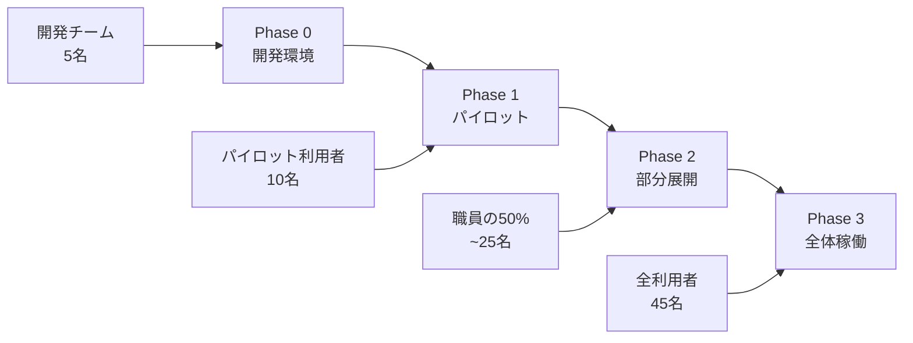
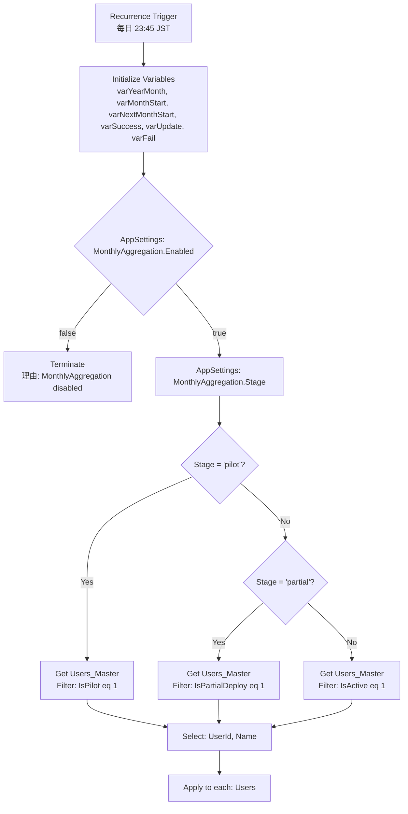

# 段階デプロイ戦略 - 月次記録集計システム

## 概要

月次記録集計システムの安全な本番稼働を実現するため、Feature Flag とAppSettings を活用した段階的ロールアウト戦略を実装します。

## フェーズ別展開計画



## AppSettings 制御設計

### SharePoint AppSettings リスト

| Key | Value | Description | Phase |
|-----|-------|-------------|-------|
| `MonthlyAggregation.Enabled` | `true/false` | 機能全体の有効/無効 | All |
| `MonthlyAggregation.Stage` | `dev/pilot/partial/full` | デプロイステージ | All |
| `MonthlyAggregation.Schedule` | `23:45` | 実行時刻 | All |
| `MonthlyAggregation.NotifyTeams` | `true/false` | Teams通知の有効/無効 | All |
| `MonthlyAggregation.RetryCount` | `3` | リトライ回数 | All |
| `MonthlyAggregation.BatchSize` | `10` | バッチサイズ | All |
| `MonthlyAggregation.TimeoutMinutes` | `30` | タイムアウト時間 | All |

### Users_Master パイロット制御

```sql
-- パイロット対象利用者の設定
UPDATE Users_Master
SET IsPilot = 1
WHERE UserId IN ('U001', 'U002', 'U003', 'U004', 'U005', 'U006', 'U007', 'U008', 'U009', 'U010');

-- 部分展開対象利用者（パイロット + 追加15名）
UPDATE Users_Master
SET IsPartialDeploy = 1
WHERE IsPilot = 1 OR UserId IN ('U011', 'U012', 'U013', 'U014', 'U015', 'U016', 'U017', 'U018', 'U019', 'U020', 'U021', 'U022', 'U023', 'U024', 'U025');
```

## Power Automate フロー設計（改良版）

### 1. トリガーと初期設定



### 2. AppSettings 取得アクション

**Get items** (SharePoint)
- **リスト名**: `AppSettings`
- **フィルタークエリ**: `startswith(Key, 'MonthlyAggregation.')`
- **Select**: `Key,Value`

**Parse JSON** - AppSettings
```json
{
  "type": "object",
  "properties": {
    "enabled": {"type": "boolean"},
    "stage": {"type": "string"},
    "schedule": {"type": "string"},
    "notifyTeams": {"type": "boolean"},
    "retryCount": {"type": "integer"},
    "batchSize": {"type": "integer"},
    "timeoutMinutes": {"type": "integer"}
  }
}
```

**Compose** - Parse Settings
```javascript
{
  "enabled": @{first(filter(body('Get_items_-_AppSettings'), equals(item()?['Key'], 'MonthlyAggregation.Enabled')))?['Value']},
  "stage": "@{first(filter(body('Get_items_-_AppSettings'), equals(item()?['Key'], 'MonthlyAggregation.Stage')))?['Value']}",
  "schedule": "@{first(filter(body('Get_items_-_AppSettings'), equals(item()?['Key'], 'MonthlyAggregation.Schedule')))?['Value']}",
  "notifyTeams": @{bool(first(filter(body('Get_items_-_AppSettings'), equals(item()?['Key'], 'MonthlyAggregation.NotifyTeams')))?['Value'])},
  "retryCount": @{int(first(filter(body('Get_items_-_AppSettings'), equals(item()?['Key'], 'MonthlyAggregation.RetryCount')))?['Value'])},
  "batchSize": @{int(first(filter(body('Get_items_-_AppSettings'), equals(item()?['Key'], 'MonthlyAggregation.BatchSize')))?['Value'])},
  "timeoutMinutes": @{int(first(filter(body('Get_items_-_AppSettings'), equals(item()?['Key'], 'MonthlyAggregation.TimeoutMinutes')))?['Value'])}
}
```

### 3. 利用者絞り込みロジック

**Condition** - Check Stage
- **条件**: `@equals(outputs('Compose_-_Parse_Settings')?['stage'], 'pilot')`

**If yes** - Get Pilot Users
```odata
IsActive eq 1 and IsPilot eq 1
```

**Else if** - Check Partial Stage
- **条件**: `@equals(outputs('Compose_-_Parse_Settings')?['stage'], 'partial')`

**If yes** - Get Partial Deploy Users
```odata
IsActive eq 1 and IsPartialDeploy eq 1
```

**Else** - Get All Active Users
```odata
IsActive eq 1
```

### 4. バッチ処理制御

**Chunk Array** (Custom Connector or Azure Function)
- **Input**: `body('Get_items_-_Users')?['value']`
- **ChunkSize**: `@{outputs('Compose_-_Parse_Settings')?['batchSize']}`

**Apply to each** - Process User Batches
- **Parallel**: `true`
- **Concurrency**: `3`

### 5. 集計処理（バッチ内）

**Apply to each** - Process Users in Batch

#### A. 基本データ取得
```javascript
// userId の取得
@{items('Apply_to_each_-_Process_Users_in_Batch')?['UserId']}

// Key の生成
@{concat(items('Apply_to_each_-_Process_Users_in_Batch')?['UserId'], '_', variables('varYearMonth'))}
```

#### B. SupportRecord_Daily 取得
**Get items** (SharePoint)
- **リスト名**: `SupportRecord_Daily`
- **フィルタークエリ**:
```odata
UserId eq '@{items('Apply_to_each_-_Process_Users_in_Batch')?['UserId']}'
and cr013_recorddate ge '@{variables('varMonthStart')}'
and cr013_recorddate lt '@{variables('varNextMonthStart')}'
```

#### C. KPI計算
**Filter array** - Completed Records
```javascript
@equals(item()?['Completed'], true)
```

**Filter array** - Pending Records
```javascript
@equals(item()?['Completed'], false)
```

**Filter array** - Incident Records
```javascript
@equals(item()?['Incident'], true)
```

**Filter array** - Special Note Records
```javascript
@and(not(empty(item()?['cr013_specialnote'])), not(equals(item()?['cr013_specialnote'], '')))
```

**Compose** - Calculate KPIs
```json
{
  "key": "@{concat(items('Apply_to_each_-_Process_Users_in_Batch')?['UserId'], '_', variables('varYearMonth'))}",
  "userId": "@{items('Apply_to_each_-_Process_Users_in_Batch')?['UserId']}",
  "userName": "@{items('Apply_to_each_-_Process_Users_in_Batch')?['Name']}",
  "yearMonth": "@{variables('varYearMonth')}",
  "totalDays": 22,
  "workingDays": 22,
  "completedCount": "@{length(body('Filter_array_-_Completed_Records'))}",
  "pendingCount": "@{length(body('Filter_array_-_Pending_Records'))}",
  "emptyCount": "@{sub(22, add(length(body('Filter_array_-_Completed_Records')), length(body('Filter_array_-_Pending_Records'))))}",
  "specialNoteCount": "@{length(body('Filter_array_-_Special_Note_Records'))}",
  "incidentCount": "@{length(body('Filter_array_-_Incident_Records'))}",
  "completionRate": "@{if(greater(22, 0), div(mul(length(body('Filter_array_-_Completed_Records')), 100), 22), 0)}"
}
```

### 6. MonthlyRecord_Summary 更新

#### A. 既存レコード確認
**Get items** (SharePoint)
- **リスト名**: `MonthlyRecord_Summary`
- **フィルタークエリ**: `Key eq '@{outputs('Compose_-_Calculate_KPIs')?['key']}'`
- **上位件数の制限**: `1`

#### B. 条件分岐処理
**Condition** - Record Exists
- **条件**: `@greater(length(body('Get_items_-_Check_existing_record')?['value']), 0)`

**If yes** - Update Record
**Update item** (SharePoint)
```json
{
  "TotalDays": "@{outputs('Compose_-_Calculate_KPIs')?['totalDays']}",
  "WorkingDays": "@{outputs('Compose_-_Calculate_KPIs')?['workingDays']}",
  "CompletedCount": "@{outputs('Compose_-_Calculate_KPIs')?['completedCount']}",
  "PendingCount": "@{outputs('Compose_-_Calculate_KPIs')?['pendingCount']}",
  "EmptyCount": "@{outputs('Compose_-_Calculate_KPIs')?['emptyCount']}",
  "SpecialNoteCount": "@{outputs('Compose_-_Calculate_KPIs')?['specialNoteCount']}",
  "IncidentCount": "@{outputs('Compose_-_Calculate_KPIs')?['incidentCount']}",
  "CompletionRate": "@{outputs('Compose_-_Calculate_KPIs')?['completionRate']}",
  "LastAggregatedAt": "@{utcNow()}"
}
```

**Increment variable** - varUpdate

**If no** - Create Record
**Create item** (SharePoint)
```json
{
  "Key": "@{outputs('Compose_-_Calculate_KPIs')?['key']}",
  "UserId": "@{outputs('Compose_-_Calculate_KPIs')?['userId']}",
  "YearMonth": "@{outputs('Compose_-_Calculate_KPIs')?['yearMonth']}",
  "TotalDays": "@{outputs('Compose_-_Calculate_KPIs')?['totalDays']}",
  "WorkingDays": "@{outputs('Compose_-_Calculate_KPIs')?['workingDays']}",
  "CompletedCount": "@{outputs('Compose_-_Calculate_KPIs')?['completedCount']}",
  "PendingCount": "@{outputs('Compose_-_Calculate_KPIs')?['pendingCount']}",
  "EmptyCount": "@{outputs('Compose_-_Calculate_KPIs')?['emptyCount']}",
  "SpecialNoteCount": "@{outputs('Compose_-_Calculate_KPIs')?['specialNoteCount']}",
  "IncidentCount": "@{outputs('Compose_-_Calculate_KPIs')?['incidentCount']}",
  "CompletionRate": "@{outputs('Compose_-_Calculate_KPIs')?['completionRate']}",
  "LastAggregatedAt": "@{utcNow()}"
}
```

**Increment variable** - varSuccess

### 7. エラーハンドリング

**Scope** - Error Handling
- **実行条件**: `@equals(result('SharePoint_Operations'), 'Failed')`

**内部アクション**:
1. **Increment variable** - varFail
2. **Compose** - Error Details
```json
{
  "userId": "@{outputs('Compose_-_Calculate_KPIs')?['userId']}",
  "error": "@{body('Create_item')?['error']?['message']}",
  "timestamp": "@{utcNow()}"
}
```

### 8. Teams通知（段階別）

#### A. 通知条件チェック
**Condition** - Notify Teams Enabled
- **条件**: `@outputs('Compose_-_Parse_Settings')?['notifyTeams']`

#### B. 段階別通知内容

**Switch** - Notification by Stage

**Case: 'pilot'**
```json
{
  "title": "🧪 月次記録集計完了 (パイロット版)",
  "summary": "パイロット利用者 @{variables('varSuccess')} 名の集計が完了しました",
  "color": "Good",
  "facts": [
    {"name": "実行段階", "value": "パイロット運用"},
    {"name": "対象利用者", "value": "@{add(variables('varSuccess'), variables('varUpdate'))} 名"},
    {"name": "新規作成", "value": "@{variables('varSuccess')} 件"},
    {"name": "更新", "value": "@{variables('varUpdate')} 件"},
    {"name": "エラー", "value": "@{variables('varFail')} 件"}
  ]
}
```

**Case: 'partial'**
```json
{
  "title": "📈 月次記録集計完了 (部分展開)",
  "summary": "部分展開利用者 @{add(variables('varSuccess'), variables('varUpdate'))} 名の集計が完了しました",
  "color": "Good",
  "facts": [
    {"name": "実行段階", "value": "部分展開 (50%)"},
    {"name": "対象利用者", "value": "@{add(variables('varSuccess'), variables('varUpdate'))} 名"},
    {"name": "新規作成", "value": "@{variables('varSuccess')} 件"},
    {"name": "更新", "value": "@{variables('varUpdate')} 件"},
    {"name": "エラー", "value": "@{variables('varFail')} 件"}
  ]
}
```

**Case: 'full'**
```json
{
  "title": "✅ 月次記録集計完了 (本格稼働)",
  "summary": "全利用者 @{add(variables('varSuccess'), variables('varUpdate'))} 名の集計が完了しました",
  "color": "Good",
  "facts": [
    {"name": "実行段階", "value": "本格稼働"},
    {"name": "対象利用者", "value": "@{add(variables('varSuccess'), variables('varUpdate'))} 名"},
    {"name": "新規作成", "value": "@{variables('varSuccess')} 件"},
    {"name": "更新", "value": "@{variables('varUpdate')} 件"},
    {"name": "エラー", "value": "@{variables('varFail')} 件"}
  ]
}
```

## 段階的ロールアウト手順書

### Phase 0: 開発環境準備

#### ✅ 事前準備
1. **SharePointリスト作成**
   - `AppSettings` リスト作成
   - `Users_Master` に `IsPilot`, `IsPartialDeploy` フィールド追加
   - `MonthlyRecord_Summary` のKey制約設定

2. **Power Automate フロー作成**
   - テスト環境でフロー作成・デバッグ
   - AppSettings との連携確認

3. **Teams通知設定**
   - 開発チーム用Webhook URL設定
   - 通知フォーマット確認

#### 🧪 開発テスト
```powershell
# AppSettings 初期設定
$settings = @(
    @{Key="MonthlyAggregation.Enabled"; Value="true"},
    @{Key="MonthlyAggregation.Stage"; Value="dev"},
    @{Key="MonthlyAggregation.NotifyTeams"; Value="true"},
    @{Key="MonthlyAggregation.RetryCount"; Value="3"},
    @{Key="MonthlyAggregation.BatchSize"; Value="5"}
)

foreach ($setting in $settings) {
    Add-PnPListItem -List "AppSettings" -Values $setting
}

# 開発チーム用テストユーザー設定
$devUsers = @('DEV001', 'DEV002', 'DEV003', 'DEV004', 'DEV005')
foreach ($user in $devUsers) {
    Set-PnPListItem -List "Users_Master" -Identity (Get-PnPListItem -List "Users_Master" -Query "<View><Query><Where><Eq><FieldRef Name='UserId'/><Value Type='Text'>$user</Value></Eq></Where></Query></View>") -Values @{IsPilot=$true}
}
```

### Phase 1: パイロット運用

#### 📅 実施期間: 2週間

#### ⚙️ 設定変更
```powershell
# パイロット段階への切り替え
Set-PnPListItem -List "AppSettings" -Identity (Get-PnPListItem -List "AppSettings" -Query "<View><Query><Where><Eq><FieldRef Name='Key'/><Value Type='Text'>MonthlyAggregation.Stage</Value></Eq></Where></Query></View>") -Values @{Value="pilot"}

# パイロットユーザー設定（10名）
$pilotUsers = @('U001', 'U002', 'U003', 'U004', 'U005', 'U006', 'U007', 'U008', 'U009', 'U010')
foreach ($user in $pilotUsers) {
    Set-PnPListItem -List "Users_Master" -Identity (Get-PnPListItem -List "Users_Master" -Query "<View><Query><Where><Eq><FieldRef Name='UserId'/><Value Type='Text'>$user</Value></Eq></Where></Query></View>") -Values @{IsPilot=$true}
}
```

#### 📊 成功基準
- [ ] **実行成功率**: 95%以上
- [ ] **データ整合性**: 手動集計との差分5%以内
- [ ] **パフォーマンス**: 5分以内での完了
- [ ] **利用者フィードバック**: 重大な問題報告なし

#### 🔍 監視項目
- 毎日のフロー実行ログ確認
- Teams通知内容の妥当性
- SharePointデータ整合性チェック
- パイロットユーザーからのフィードバック収集

### Phase 2: 部分展開

#### 📅 実施期間: 3週間

#### ⚙️ 設定変更
```powershell
# 部分展開段階への切り替え
Set-PnPListItem -List "AppSettings" -Identity (Get-PnPListItem -List "AppSettings" -Query "<View><Query><Where><Eq><FieldRef Name='Key'/><Value Type='Text'>MonthlyAggregation.Stage</Value></Eq></Where></Query></View>") -Values @{Value="partial"}

# 部分展開ユーザー設定（25名 = パイロット10 + 追加15）
$partialUsers = @('U001', 'U002', 'U003', 'U004', 'U005', 'U006', 'U007', 'U008', 'U009', 'U010', 'U011', 'U012', 'U013', 'U014', 'U015', 'U016', 'U017', 'U018', 'U019', 'U020', 'U021', 'U022', 'U023', 'U024', 'U025')
foreach ($user in $partialUsers) {
    Set-PnPListItem -List "Users_Master" -Identity (Get-PnPListItem -List "Users_Master" -Query "<View><Query><Where><Eq><FieldRef Name='UserId'/><Value Type='Text'>$user</Value></Eq></Where></Query></View>") -Values @{IsPartialDeploy=$true}
}

# バッチサイズ調整
Set-PnPListItem -List "AppSettings" -Identity (Get-PnPListItem -List "AppSettings" -Query "<View><Query><Where><Eq><FieldRef Name='Key'/><Value Type='Text'>MonthlyAggregation.BatchSize</Value></Eq></Where></Query></View>") -Values @{Value="8"}
```

#### 📊 成功基準
- [ ] **実行成功率**: 98%以上
- [ ] **処理時間**: 8分以内
- [ ] **リソース使用率**: SharePoint API制限の70%以内
- [ ] **業務影響**: 日常業務への支障なし

### Phase 3: 本格稼働

#### 📅 実施期間: 継続運用

#### ⚙️ 設定変更
```powershell
# 本格稼働段階への切り替え
Set-PnPListItem -List "AppSettings" -Identity (Get-PnPListItem -List "AppSettings" -Query "<View><Query><Where><Eq><FieldRef Name='Key'/><Value Type='Text'>MonthlyAggregation.Stage</Value></Eq></Where></Query></View>") -Values @{Value="full"}

# バッチサイズ最適化
Set-PnPListItem -List "AppSettings" -Identity (Get-PnPListItem -List "AppSettings" -Query "<View><Query><Where><Eq><FieldRef Name='Key'/><Value Type='Text'>MonthlyAggregation.BatchSize</Value></Eq></Where></Query></View>") -Values @{Value="10"}

# 最終確認
Get-PnPListItem -List "AppSettings" | Where-Object {$_.FieldValues["Key"] -like "MonthlyAggregation.*"} | Select-Object @{n='Key';e={$_.FieldValues["Key"]}}, @{n='Value';e={$_.FieldValues["Value"]}}
```

#### 📊 運用KPI
- **実行成功率**: 99%以上
- **平均処理時間**: 10分以内
- **データ整合性**: 手動集計との差分2%以内
- **利用者満足度**: 月次アンケート4.0/5.0以上

## 緊急時対応手順

### 🚨 緊急停止
```powershell
# 機能全体の無効化
Set-PnPListItem -List "AppSettings" -Identity (Get-PnPListItem -List "AppSettings" -Query "<View><Query><Where><Eq><FieldRef Name='Key'/><Value Type='Text'>MonthlyAggregation.Enabled</Value></Eq></Where></Query></View>") -Values @{Value="false"}
```

### 🔄 段階戻し
```powershell
# パイロットに戻す
Set-PnPListItem -List "AppSettings" -Identity (Get-PnPListItem -List "AppSettings" -Query "<View><Query><Where><Eq><FieldRef Name='Key'/><Value Type='Text'>MonthlyAggregation.Stage</Value></Eq></Where></Query></View>") -Values @{Value="pilot"}
```

### 📞 エスカレーション
1. **Level 1**: システム管理者（30分以内）
2. **Level 2**: 開発チーム（1時間以内）
3. **Level 3**: ベンダー緊急対応（2時間以内）

---

## 運用監視・メトリクス

### 📊 監視ダッシュボード項目
- フロー実行成功率（日次・週次・月次）
- 処理時間トレンド
- エラー発生パターン分析
- SharePoint API使用率
- Teams通知配信状況

### 📈 改善サイクル
- **日次**: 実行ログ確認
- **週次**: パフォーマンス分析
- **月次**: KPI評価・改善計画策定
- **四半期**: システム最適化・機能追加検討

これで段階デプロイ戦略の設計が完了しました！