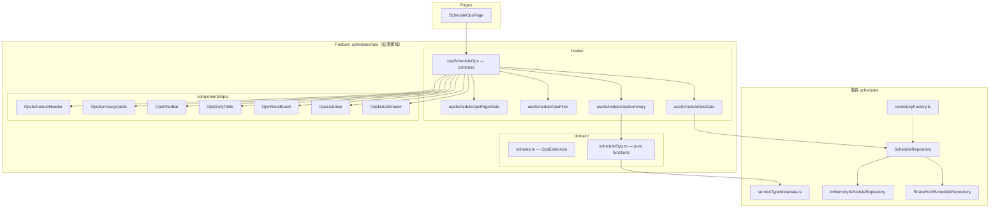
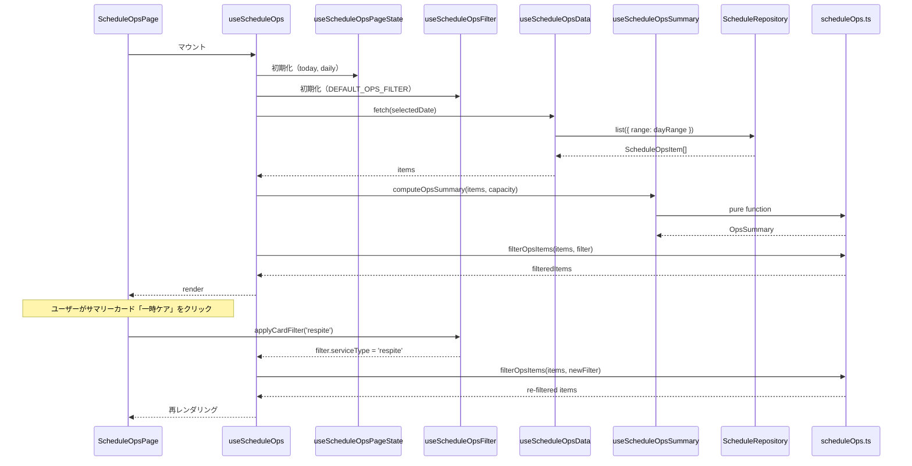

# スケジュール運営ビュー（Schedule Ops）実装設計書

> **生活介護 + 一時ケア + ショートステイ対応**
> 既存 `features/schedules` モジュールの上位拡張

| 項目 | 値 |
|------|-----|
| ステータス | Draft → Ready for Phase 1 |
| 作成日 | 2026-03-19 |
| 対象ブランチ | `feat/schedule-ops-v1` |
| 依存 PR | なし（既存 schedules モジュールに追加） |

---

## 目次

1. [目的と背景](#1-目的と背景)
2. [既存資産の分析と方針](#2-既存資産の分析と方針)
3. [アーキテクチャ概要](#3-アーキテクチャ概要)
4. [Domain 層設計](#4-domain-層設計)
5. [コンポーネント設計](#5-コンポーネント設計)
6. [Hooks 設計](#6-hooks-設計)
7. [ページ構成](#7-ページ構成)
8. [ロール別初期表示](#8-ロール別初期表示)
9. [データフロー](#9-データフロー)
10. [serviceType マッピング拡張](#10-servicetype-マッピング拡張)
11. [SharePoint リスト設計](#11-sharepoint-リスト設計)
12. [テスト計画](#12-テスト計画)
13. [段階導入計画](#13-段階導入計画)
14. [ルーティング](#14-ルーティング)
15. [既存コードとの接点](#15-既存コードとの接点)
16. [設計判断ログ](#16-設計判断ログ)

---

## 1. 目的と背景

### 1.1 目的

事業所における利用予定と支援運営を一元的に把握し、当日の運営確認・受け入れ調整・支援上の注意確認を円滑に行う。

一般的な予定表のように「予定を並べて見る」ことが目的ではなく、以下を**即座に判断**できることを重視する。

- その日に**誰**が利用するか
- **どのサービス種別**で利用するか
- **誰が担当**するか
- 支援上の**注意や配慮事項**があるか
- 受け入れ枠や職員配置に**無理がないか**

### 1.2 対象事業

- 生活介護
- 横浜市独自の生活支援事業
  - 一時ケア
  - ショートステイ

### 1.3 対象ユーザー

| ロール | 主な利用目的 |
|--------|-------------|
| 現場職員 | 当日の利用予定・担当・注意事項の確認 |
| 管理者 / サビ管 | 全体調整・定員管理・配置確認 |
| ショートステイ担当 | 宿泊利用者の確認・申し送り |

---

## 2. 既存資産の分析と方針

### 2.1 現在の `features/schedules` 構成

```
features/schedules/
├── domain/                            ← Zod schema SSOT + Repository interface
│   ├── schema.ts                      ← ScheduleCore / Detail / Full (3-tier)
│   ├── types.ts                       ← 型エイリアス
│   ├── ScheduleRepository.ts          ← Port (list/create/update/remove)
│   ├── scheduleFormState.ts           ← フォーム状態 + バリデーション
│   └── ...
├── infra/                             ← Adapters
│   ├── InMemoryScheduleRepository.ts
│   └── SharePointScheduleRepository.ts
├── hooks/                             ← useSchedules, useSchedulesPageState...
├── components/                        ← SchedulesHeader, ScheduleFilterBar...
├── routes/                            ← DayView, WeekView, WeekPage, MonthPage
├── repositoryFactory.ts               ← Factory + useScheduleRepository
├── serviceTypeMetadata.ts             ← サービス種別マッピング（SSOT）
└── statusMetadata.ts                  ← ステータス表示設定
```

### 2.2 拡張方針

| 判断 | 理由 |
|------|------|
| **既存 `features/schedules` を拡張** | domain 層（schema, repository, serviceType）が既に基盤として存在 |
| **新規ページ `ScheduleOpsPage` を追加** | 現在の月/週/日ビューと別導線で「業務運営ビュー」を提供 |
| **domain 層は schema 拡張 + pure function 追加** | 既存の3-tier schema に支援タグ・配慮事項フィールドを追加 |
| **サマリー・フィルタは pure domain 関数** | テスト容易性のため UI から分離 |

### 2.3 再利用する既存資産

| 資産 | 用途 |
|------|------|
| `ScheduleDetailSchema` | `assignedStaffId` が既に定義されている — 直接参照 |
| `ScheduleRepository` | list/create/update/remove ポートをそのまま利用 |
| `repositoryFactory.ts` | `useScheduleRepository()` で DI |
| `serviceTypeMetadata.ts` | `normalizeServiceType()` + metadata を SSOT として利用 |
| `toDateIso()` | `useSchedulesPageState.ts` に既存 — 共通化して再利用 |

---

## 3. アーキテクチャ概要



---

## 4. Domain 層設計

### 4.1 Zod Schema 拡張 — `domain/scheduleOpsSchema.ts`（新規）

既存の `ScheduleDetailSchema` を `.merge()` で拡張。
`assignedStaffId` は既に `ScheduleDetailSchema` に存在するため、
`assignedStaffName` のみ追加する。

```typescript
import { z } from 'zod';
import { ScheduleDetailSchema } from './schema';

// ─── Support Tags ────────────────────────────────────────────────────
export const SupportTagSchema = z.enum([
  'pickup',      // 送迎
  'meal',        // 昼食
  'bath',        // 入浴
  'medication',  // 服薬
  'overnight',   // 宿泊
  'extension',   // 延長
  'needsReview', // 要確認
  'medical',     // 医療配慮
  'behavioral',  // 行動配慮
  'firstVisit',  // 初回
  'changed',     // 変更
]);
export type SupportTag = z.infer<typeof SupportTagSchema>;

// ─── Ops Status (業務ステータス) ─────────────────────────────────────
// 既存 status (Planned/Postponed/Cancelled) = 予約ステータス
// opsStatus = 当日運営ステータス（別の責務）
export const OpsStatusSchema = z.enum([
  'planned',    // 予定
  'confirmed',  // 確定
  'changed',    // 変更あり
  'cancelled',  // キャンセル
  'completed',  // 対応済み
]);
export type OpsStatus = z.infer<typeof OpsStatusSchema>;

// ─── Schedule Ops Extension ─────────────────────────────────────────
// ScheduleDetailSchema には assignedStaffId が既に定義されている
// ここでは「運営ビュー固有」のフィールドのみ定義
export const ScheduleOpsExtensionSchema = z.object({
  // 担当者名（既存 assignedStaffId の補助）
  assignedStaffName: z.string().optional(),

  // Support flags（保存の元データ = SSOT）
  hasPickup: z.boolean().optional(),
  hasMeal: z.boolean().optional(),
  hasBath: z.boolean().optional(),
  hasMedication: z.boolean().optional(),
  hasOvernight: z.boolean().optional(),

  // Attention
  hasAttention: z.boolean().optional(),
  attentionSummary: z.string().optional(),
  medicalNote: z.string().optional(),
  behavioralNote: z.string().optional(),

  // Ops status（既存 status とは責務が異なる）
  opsStatus: OpsStatusSchema.optional(),

  // Handoff
  handoffSummary: z.string().optional(),

  // Related
  relatedRecordId: z.string().optional(),
});

// Full ops schema = ScheduleDetail + OpsExtension
export const ScheduleOpsSchema = ScheduleDetailSchema.merge(
  ScheduleOpsExtensionSchema,
);
export type ScheduleOpsItem = z.infer<typeof ScheduleOpsSchema>;
```

> **設計判断: `supportTags` はスキーマに持たない**
>
> フラグ（`hasPickup`, `hasBath` 等）を SSOT とし、表示用タグは
> `deriveSupportTags()` で導出する。二重管理を防ぐため。

> **設計判断: `opsStatus` vs 既存 `status`**
>
> - 既存 `status` (`Planned`/`Postponed`/`Cancelled`) = **予約ステータス**
> - `opsStatus` = **当日運営ステータス**
>
> 責務が異なるため併存させる。命名で役割を明確化。

---

### 4.2 Pure Domain Functions — `domain/scheduleOps.ts`（新規）

#### 4.2.1 型定義

```typescript
import type { ServiceTypeKey } from '../serviceTypeMetadata';
import { normalizeServiceType, SERVICE_TYPE_META } from '../serviceTypeMetadata';
import type { ScheduleOpsItem, SupportTag } from './scheduleOpsSchema';

// ─── Ops Service Type (業務3分類) ───────────────────────────────────
export type OpsServiceType = 'normal' | 'respite' | 'shortStay';

// ─── Capacity 設定 ──────────────────────────────────────────────────
export type OpsCapacity = {
  normalMax: number;
  respiteMax: number;
  shortStayMax: number;
};

// ─── Summary ────────────────────────────────────────────────────────
export type OpsSummary = {
  totalCount: number;
  normalCount: number;
  respiteCount: number;
  shortStayCount: number;
  cancelledCount: number;
  attentionCount: number;

  // 総枠
  availableSlots: number;
  // 種別枠（Phase 2 以降で UI 表示）
  availableNormalSlots: number;
  availableRespiteSlots: number;
  availableShortStaySlots: number;

  requiredStaff: number;
  assignedStaff: number;
};

// ─── Filter ─────────────────────────────────────────────────────────
export type OpsFilterState = {
  serviceType: OpsServiceType | 'all';
  staffId: string | null;
  hasAttention: boolean;
  hasPickup: boolean;
  hasBath: boolean;
  hasMedication: boolean;
  includeCancelled: boolean;
  searchQuery: string;
};
// timeSlot は Phase 1 では含めない（設計判断 #3）

// ─── View Mode ──────────────────────────────────────────────────────
export type OpsViewMode = 'daily' | 'weekly' | 'list';

// ─── Summary Card Key (onCardClick 用 union) ────────────────────────
export type OpsSummaryCardKey =
  | 'total'
  | 'normal'
  | 'respite'
  | 'shortStay'
  | 'cancelled'
  | 'attention'
  | 'capacity'
  | 'staffing';
```

#### 4.2.2 デフォルト値

```typescript
export const DEFAULT_OPS_FILTER: OpsFilterState = {
  serviceType: 'all',
  staffId: null,
  hasAttention: false,
  hasPickup: false,
  hasBath: false,
  hasMedication: false,
  includeCancelled: false,
  searchQuery: '',
};

export const DEFAULT_OPS_CAPACITY: OpsCapacity = {
  normalMax: 20,
  respiteMax: 3,
  shortStayMax: 2,
};
```

#### 4.2.3 サービス種別正規化（metadata SSOT 経由）

```typescript
// serviceTypeMetadata.ts の ServiceTypeKey → 業務3分類へのマッピング
const SERVICE_KEY_TO_OPS: Partial<Record<ServiceTypeKey, OpsServiceType>> = {
  normal: 'normal',
  respite: 'respite',
  shortStay: 'shortStay',
  // transport, nursing 等は生活介護の一部として 'normal' に分類
};

/**
 * サービス種別を業務3分類に正規化。
 * 既存 serviceTypeMetadata.ts の normalizeServiceType() を内部で使用し、
 * 文字列揺れの吸収は metadata 側に一任する。
 */
export function toOpsServiceType(
  serviceType?: string | null,
): OpsServiceType {
  if (!serviceType) return 'normal';
  const key = normalizeServiceType(serviceType);
  return SERVICE_KEY_TO_OPS[key] ?? 'normal';
}
```

> **設計判断: metadata 経由で正規化**
>
> `toOpsServiceType()` は既存の `normalizeServiceType()` を参照する**薄いアダプタ**。
> `shortStay` / `short_stay` / `ショート` / `短期入所` 等の揺れは
> metadata 側のエイリアスマッピングが一括で吸収する。

#### 4.2.4 支援タグ導出

```typescript
/**
 * フラグから表示用 supportTags を導出する。
 * DB に SupportTags 列は持たない（フラグが SSOT）。
 */
export function deriveSupportTags(item: ScheduleOpsItem): SupportTag[] {
  const tags: SupportTag[] = [];
  if (item.hasPickup) tags.push('pickup');
  if (item.hasMeal) tags.push('meal');
  if (item.hasBath) tags.push('bath');
  if (item.hasMedication) tags.push('medication');
  if (item.hasOvernight) tags.push('overnight');
  if (item.hasAttention) tags.push('needsReview');
  if (item.opsStatus === 'changed') tags.push('changed');
  // medicalNote / behavioralNote がある場合もタグを追加
  if (item.medicalNote?.trim()) tags.push('medical');
  if (item.behavioralNote?.trim()) tags.push('behavioral');
  return tags;
}

/** SupportTag の日本語ラベル */
export const SUPPORT_TAG_LABELS: Record<SupportTag, string> = {
  pickup: '送迎',
  meal: '昼食',
  bath: '入浴',
  medication: '服薬',
  overnight: '宿泊',
  extension: '延長',
  needsReview: '要確認',
  medical: '医療配慮',
  behavioral: '行動配慮',
  firstVisit: '初回',
  changed: '変更',
};
```

#### 4.2.5 サマリー算出

```typescript
/**
 * 当日サマリーを算出。
 * キャンセル済みは totalCount に含めない。
 * 種別別の空き枠も算出する。
 */
export function computeOpsSummary(
  items: readonly ScheduleOpsItem[],
  capacity: OpsCapacity,
): OpsSummary {
  let normalCount = 0;
  let respiteCount = 0;
  let shortStayCount = 0;
  let cancelledCount = 0;
  let attentionCount = 0;
  const staffIds = new Set<string>();

  for (const item of items) {
    if (item.opsStatus === 'cancelled') {
      cancelledCount++;
      continue;
    }
    const svc = toOpsServiceType(item.serviceType);
    if (svc === 'normal') normalCount++;
    else if (svc === 'respite') respiteCount++;
    else if (svc === 'shortStay') shortStayCount++;

    if (item.hasAttention) attentionCount++;
    if (item.assignedStaffId) staffIds.add(item.assignedStaffId);
  }

  const totalCount = normalCount + respiteCount + shortStayCount;
  const totalMax = capacity.normalMax + capacity.respiteMax + capacity.shortStayMax;

  return {
    totalCount,
    normalCount,
    respiteCount,
    shortStayCount,
    cancelledCount,
    attentionCount,
    availableSlots: Math.max(0, totalMax - totalCount),
    availableNormalSlots: Math.max(0, capacity.normalMax - normalCount),
    availableRespiteSlots: Math.max(0, capacity.respiteMax - respiteCount),
    availableShortStaySlots: Math.max(0, capacity.shortStayMax - shortStayCount),
    requiredStaff: Math.ceil(totalCount / 5), // 5:1 配置基準（設定化予定）
    assignedStaff: staffIds.size,
  };
}
```

#### 4.2.6 フィルタリング

```typescript
/**
 * フィルター適用。
 * filter.searchQuery は userName, title, notes,
 * attentionSummary, handoffSummary を対象に部分一致（大文字小文字無視）。
 */
export function filterOpsItems(
  items: readonly ScheduleOpsItem[],
  filter: OpsFilterState,
): ScheduleOpsItem[] {
  return items.filter(item => {
    // キャンセル除外
    if (!filter.includeCancelled && item.opsStatus === 'cancelled') return false;

    // サービス種別
    if (filter.serviceType !== 'all') {
      if (toOpsServiceType(item.serviceType) !== filter.serviceType) return false;
    }

    // 担当職員
    if (filter.staffId && item.assignedStaffId !== filter.staffId) return false;

    // 注意あり
    if (filter.hasAttention && !item.hasAttention) return false;

    // 送迎あり
    if (filter.hasPickup && !item.hasPickup) return false;

    // 入浴あり
    if (filter.hasBath && !item.hasBath) return false;

    // 服薬あり
    if (filter.hasMedication && !item.hasMedication) return false;

    // 検索
    if (filter.searchQuery) {
      const q = filter.searchQuery.toLowerCase();
      const haystack = [
        item.userName,
        item.title,
        item.notes,
        item.attentionSummary,
        item.handoffSummary,
        item.assignedStaffName,
      ].filter(Boolean).join(' ').toLowerCase();
      if (!haystack.includes(q)) return false;
    }

    return true;
  });
}
```

#### 4.2.7 週間サマリー

```typescript
export type DaySummaryEntry = {
  dateIso: string;
  totalCount: number;
  respiteCount: number;
  shortStayCount: number;
  attentionCount: number;
  availableSlots: number;
  isOverCapacity: boolean;
};

/**
 * 週間の日別集計。
 * キャンセル済みは集計から除外。
 */
export function computeWeeklySummary(
  items: readonly ScheduleOpsItem[],
  weekDates: readonly string[],
  capacity: OpsCapacity,
): DaySummaryEntry[] {
  const totalMax = capacity.normalMax + capacity.respiteMax + capacity.shortStayMax;

  return weekDates.map(dateIso => {
    const dayItems = items.filter(item => {
      const itemDate = item.start?.slice(0, 10);
      return itemDate === dateIso && item.opsStatus !== 'cancelled';
    });

    let respiteCount = 0;
    let shortStayCount = 0;
    let attentionCount = 0;

    for (const item of dayItems) {
      const svc = toOpsServiceType(item.serviceType);
      if (svc === 'respite') respiteCount++;
      if (svc === 'shortStay') shortStayCount++;
      if (item.hasAttention) attentionCount++;
    }

    return {
      dateIso,
      totalCount: dayItems.length,
      respiteCount,
      shortStayCount,
      attentionCount,
      availableSlots: Math.max(0, totalMax - dayItems.length),
      isOverCapacity: dayItems.length > totalMax,
    };
  });
}
```

#### 4.2.8 日付ユーティリティ

```typescript
/**
 * Date → ISO日付文字列 (YYYY-MM-DD)。
 * 既存 useSchedulesPageState.ts の toDateIso と同一ロジック。
 * 共通化して re-export する。
 *
 * ルール:
 * - UI state: Date オブジェクト
 * - domain / repository / URL: 'YYYY-MM-DD' string
 * - 表示: formatter 経由
 */
export function toDateIso(date: Date): string {
  const year = date.getFullYear();
  const month = String(date.getMonth() + 1).padStart(2, '0');
  const day = String(date.getDate()).padStart(2, '0');
  return `${year}-${month}-${day}`;
}

export function fromDateIso(dateIso: string): Date {
  const [y, m, d] = dateIso.split('-').map(Number);
  return new Date(y, m - 1, d);
}
```

---

## 5. コンポーネント設計

### 5.1 ファイル構成

```
components/ops/
├── OpsScheduleHeader.tsx          ← ヘッダー領域
├── OpsSummaryCards.tsx             ← 当日サマリー領域
├── OpsFilterBar.tsx               ← 絞り込み領域
├── OpsDailyTable.tsx              ← 日次ビュー
├── OpsDailyTableRow.tsx           ← 日次ビューの行
├── OpsWeekBoard.tsx               ← 週間ビュー
├── OpsWeekDayCell.tsx             ← 週間ビューの日セル
├── OpsListView.tsx                ← 一覧ビュー
├── OpsDetailDrawer.tsx            ← 詳細コンテナ（PC: 右/モバイル: 下）
├── OpsDetailBasicInfo.tsx         ← 詳細: 基本情報セクション
├── OpsDetailSupportFlags.tsx      ← 詳細: 対応項目セクション
├── OpsDetailAttentionSection.tsx  ← 詳細: 配慮事項セクション
├── OpsDetailHandoffSection.tsx    ← 詳細: 申し送りセクション
├── OpsDetailRelatedLinks.tsx      ← 詳細: 関連記録リンク
├── OpsSupportTagChips.tsx         ← 支援タグ表示
├── OpsStatusBadge.tsx             ← ステータスバッジ
├── OpsServiceTypeChip.tsx         ← サービス種別チップ
└── index.ts
```

> **設計判断: DetailDrawer を section 分割**
>
> `OpsDetailDrawer` は5つの presentational component に分割。
> - Storybook/単体テストが容易
> - 権限差分を section 単位で切り替え可能
> - モバイル下部シートへの流用が容易

### 5.2 `OpsScheduleHeader`

```typescript
type OpsScheduleHeaderProps = {
  selectedDate: Date;
  viewMode: OpsViewMode;
  onDateChange: (date: Date) => void;
  onViewModeChange: (mode: OpsViewMode) => void;
  onSearch: (query: string) => void;
  onCreateClick: () => void;
};
```

**UI構成:**
- 左: 画面タイトル「利用スケジュール」
- 中央: DateNavigator（◀ 今日 ▶）
- 右: ViewModeTabs（日 | 週 | 一覧）+ 新規登録ボタン
- 下段: 検索ボックス（モバイルではアイコンボタンでトグル）

**要件:**
- 初期表示は「今日」
- 日付移動はワンタップで可能
- 表示モード変更後もフィルター状態を保持

### 5.3 `OpsSummaryCards`

```typescript
type OpsSummaryCardsProps = {
  summary: OpsSummary;
  isLoading?: boolean;
  onCardClick?: (key: OpsSummaryCardKey) => void;
};
```

**UI:**
```
┌──────┐ ┌──────┐ ┌──────┐ ┌──────┐ ┌──────┐ ┌──────┐ ┌──────┐
│ 合計 │ │生活介│ │一時ケ│ │ SS  │ │キャン│ │ 注意 │ │ 空枠 │
│  18  │ │  12  │ │   3  │ │  3  │ │  1  │ │🔴 4  │ │  2  │
└──────┘ └──────┘ └──────┘ └──────┘ └──────┘ └──────┘ └──────┘
```

**警告条件:**
| 条件 | 対象カード | 表示 |
|------|----------|------|
| `availableSlots <= 2` | 空き枠 | warning 色 |
| `attentionCount > 0` | 注意対象 | error 色 |
| `requiredStaff > assignedStaff` | 職員配置 | warning 色 |

### 5.4 `OpsFilterBar`

```typescript
type OpsFilterBarProps = {
  filter: OpsFilterState;
  onFilterChange: (patch: Partial<OpsFilterState>) => void;
  onClear: () => void;
  staffOptions: readonly { id: string; name: string }[];
  activeFilterCount: number;
};
```

**UI構成:**
- サービス種別: `ToggleButtonGroup`（全て | 生活介護 | 一時ケア | SS）
- 担当職員: `Select`
- トグルフィルタ: `Chip` 群（注意あり | 送迎 | 入浴 | 服薬）
- キャンセル: `Switch`（キャンセル含む）
- クリアボタン（`activeFilterCount > 0` 時のみ表示）

### 5.5 `OpsDailyTable`

```typescript
type OpsDailyTableProps = {
  items: ScheduleOpsItem[];
  isLoading?: boolean;
  error?: string | null;
  onRetry?: () => void;
  onItemClick: (item: ScheduleOpsItem) => void;
};
```

**列構成:**

| 列 | 幅 | モバイル | 内容 |
|----|----|---------|------|
| 時間帯 | 80px | 表示 | `09:00-15:00` |
| 利用者名 | flex | 表示 | 名前 + 注意アイコン |
| サービス種別 | 100px | 表示 | `OpsServiceTypeChip` |
| 支援タグ | 200px | 非表示 | `OpsSupportTagChips`（最大3個 + "+N"） |
| 担当職員 | 120px | 非表示 | 職員名 |
| 状態 | 80px | 表示 | `OpsStatusBadge` |

**3状態表示:**
| 状態 | 表示 |
|------|------|
| `isLoading` | Skeleton rows (5行) |
| `items.length === 0` | EmptyState コンポーネント（「本日の利用予定はありません」） |
| `error` | Alert + Retry ボタン |

**行スタイル:**
- 注意ありの行: `background: alpha(error, 0.04)`
- キャンセル行: `opacity: 0.55`

### 5.6 `OpsWeekBoard`

```typescript
type OpsWeekBoardProps = {
  weekSummary: DaySummaryEntry[];
  onDayClick: (dateIso: string) => void;
  isLoading?: boolean;
};
```

**UI:**
```
 月        火        水        木        金
┌────────┐┌────────┐┌────────┐┌────────┐┌────────┐
│ 3/17   ││ 3/18   ││🔴3/19  ││ 3/20   ││ 3/21   │
│ 合計 16 ││ 合計 18 ││ 合計 21 ││ 合計 15 ││ 合計 14 │
│ 一時 2  ││ 一時 3  ││ 一時 4  ││ 一時 1  ││ 一時 2  │
│ SS  1  ││ SS  2  ││ SS  3  ││ SS  1  ││ SS  0  │
│ 注意 3  ││ 注意 4  ││🔴注意 6││ 注意 2  ││ 注意 1  │
│ 空き 4  ││ 空き 2  ││🔴空き 0││ 空き 5  ││ 空き 6  │
└────────┘└────────┘└────────┘└────────┘└────────┘
```

- 定員超過日: 赤枠 + 警告アイコン
- セルクリックで日次ビューに遷移
- モバイル: 簡略表示（合計 + 注意のみ）

### 5.7 `OpsDetailDrawer`

```typescript
type OpsDetailDrawerProps = {
  item: ScheduleOpsItem | null;
  open: boolean;
  onClose: () => void;
  onEdit?: (item: ScheduleOpsItem) => void;
  canEdit: boolean;
};
```

**表示方法:**
- PC: `Drawer anchor="right"` (width: 400px)
- モバイル: `SwipeableDrawer anchor="bottom"`

**内部セクション:**

| セクション | コンポーネント | 内容 |
|-----------|---------------|------|
| 基本情報 | `OpsDetailBasicInfo` | 利用者名, 日付, 時間, サービス種別, 担当 |
| 対応項目 | `OpsDetailSupportFlags` | 送迎/食事/入浴/服薬のチェックリスト |
| 配慮事項 | `OpsDetailAttentionSection` | 医療/行動配慮テキスト |
| 申し送り | `OpsDetailHandoffSection` | 引き継ぎメモ |
| 関連記録 | `OpsDetailRelatedLinks` | 記録リンクボタン |

---

## 6. Hooks 設計

### 6.1 責務分離

```
useScheduleOps (compose のみ)
  ├── useScheduleOpsPageState   ← 日付, viewMode, detail open/close
  ├── useScheduleOpsFilter      ← query param 同期, フィルター状態
  ├── useScheduleOpsData        ← repo fetch + CRUD
  └── useScheduleOpsSummary     ← pure function のメモ化
```

> **設計判断: hook を4層に分離**
>
> 既存の `useWeekPageOrchestrator` / `useWeekPageRouteState` / `useWeekPageUiState`
> の分離パターンに合わせた。`useScheduleOps` は compose のみ。

### 6.2 `useScheduleOpsPageState`

```typescript
type UseScheduleOpsPageStateReturn = {
  selectedDate: Date;
  setSelectedDate: (date: Date) => void;
  goToday: () => void;
  goPrev: () => void;
  goNext: () => void;
  viewMode: OpsViewMode;
  setViewMode: (mode: OpsViewMode) => void;
  selectedItem: ScheduleOpsItem | null;
  selectItem: (item: ScheduleOpsItem | null) => void;
  detailOpen: boolean;
};
```

- `selectedDate` / `viewMode` は URL path + search params で永続化
- `goPrev` / `goNext` は `viewMode` に応じて日/週単位で移動

### 6.3 `useScheduleOpsFilter`

```typescript
type UseScheduleOpsFilterReturn = {
  filter: OpsFilterState;
  setFilter: (patch: Partial<OpsFilterState>) => void;
  clearFilter: () => void;
  activeFilterCount: number;
  applyCardFilter: (key: OpsSummaryCardKey) => void;
};
```

- URL search params との同期（`serviceType`, `staffId`, `hasAttention` 等）
- `activeFilterCount`: デフォルトから変更されているフィルター条件数
- `applyCardFilter`: サマリーカードクリック時のフィルター適用

### 6.4 `useScheduleOpsData`

```typescript
type UseScheduleOpsDataReturn = {
  items: ScheduleOpsItem[];
  isLoading: boolean;
  error: string | null;
  refetch: () => void;
  createSchedule: (input: CreateScheduleInput) => Promise<void>;
  updateSchedule: (input: UpdateScheduleInput) => Promise<void>;
  deleteSchedule: (id: string) => Promise<void>;
};
```

- `useScheduleRepository()` 経由で DI
- 既存の `useSchedules` の range 計算ロジックを流用

### 6.5 `useScheduleOpsSummary`

```typescript
type UseScheduleOpsSummaryReturn = {
  summary: OpsSummary;
  weekSummary: DaySummaryEntry[];
};
```

- `useMemo` で `computeOpsSummary` / `computeWeeklySummary` をメモ化
- capacity は Settings or 環境変数から取得

### 6.6 `useScheduleOps`（統合）

```typescript
export function useScheduleOps(): UseScheduleOpsReturn {
  const pageState = useScheduleOpsPageState();
  const filter = useScheduleOpsFilter();
  const data = useScheduleOpsData(pageState.selectedDate, pageState.viewMode);
  const { summary, weekSummary } = useScheduleOpsSummary(data.items, ...);

  const filteredItems = useMemo(
    () => filterOpsItems(data.items, filter.filter),
    [data.items, filter.filter],
  );

  return {
    ...pageState,
    ...filter,
    ...data,
    summary,
    weekSummary,
    filteredItems,
  };
}
```

---

## 7. ページ構成

```typescript
// pages/ScheduleOpsPage.tsx
export default function ScheduleOpsPage() {
  const ops = useScheduleOps();

  return (
    <Box sx={{ display: 'flex', flexDirection: 'column', height: '100%' }}>
      {/* Zone A: ヘッダー */}
      <OpsScheduleHeader
        selectedDate={ops.selectedDate}
        viewMode={ops.viewMode}
        onDateChange={ops.setSelectedDate}
        onViewModeChange={ops.setViewMode}
        onSearch={(q) => ops.setFilter({ searchQuery: q })}
        onCreateClick={...}
      />

      {/* Zone B: サマリー */}
      <OpsSummaryCards
        summary={ops.summary}
        isLoading={ops.isLoading}
        onCardClick={ops.applyCardFilter}
      />

      {/* Zone C: フィルター */}
      <OpsFilterBar
        filter={ops.filter}
        onFilterChange={ops.setFilter}
        onClear={ops.clearFilter}
        staffOptions={...}
        activeFilterCount={ops.activeFilterCount}
      />

      {/* Zone D: メイン表示 */}
      <Box sx={{ flex: 1, overflow: 'auto' }}>
        {ops.viewMode === 'daily' && (
          <OpsDailyTable
            items={ops.filteredItems}
            isLoading={ops.isLoading}
            error={ops.error}
            onRetry={ops.refetch}
            onItemClick={ops.selectItem}
          />
        )}
        {ops.viewMode === 'weekly' && (
          <OpsWeekBoard
            weekSummary={ops.weekSummary}
            isLoading={ops.isLoading}
            onDayClick={(d) => {
              ops.setSelectedDate(fromDateIso(d));
              ops.setViewMode('daily');
            }}
          />
        )}
        {ops.viewMode === 'list' && (
          <OpsListView
            items={ops.filteredItems}
            isLoading={ops.isLoading}
            error={ops.error}
            onItemClick={ops.selectItem}
          />
        )}
      </Box>

      {/* Zone E: 詳細 */}
      <OpsDetailDrawer
        item={ops.selectedItem}
        open={ops.detailOpen}
        onClose={() => ops.selectItem(null)}
        onEdit={...}
        canEdit={...}
      />
    </Box>
  );
}
```

---

## 8. ロール別初期表示

```typescript
export function getInitialOpsFilter(
  role: 'staff' | 'admin' | 'shortStay',
  currentStaffId?: string,
): Partial<OpsFilterState> {
  switch (role) {
    case 'staff':
      return { staffId: currentStaffId ?? null };
    case 'admin':
      return {}; // デフォルト全表示（サマリー重視）
    case 'shortStay':
      return { serviceType: 'shortStay' };
    default:
      return {};
  }
}
```

| ロール | 初期ビュー | 初期フィルタ | 重視項目 |
|--------|-----------|------------|---------|
| 現場職員 | 日次 | 自分担当 | 注意あり行を目立たせる |
| 管理者 | 日次 + サマリー | なし | 定員・空き枠・注意対象人数 |
| SS担当 | 日次 | `serviceType: 'shortStay'` | 宿泊タグ・申し送り |

---

## 9. データフロー



---

## 10. serviceType マッピング拡張

既存の `serviceTypeMetadata.ts` との対応:

| 設計書の種別 | 既存 `ServiceTypeKey` | 現行色 | 推奨変更 | ラベル |
|-------------|----------------------|--------|---------|--------|
| 生活介護 | `normal` | `info` | 変更なし | 通常利用 |
| 一時ケア | `respite` | `success` | 変更なし | 一時ケア |
| ショートステイ | `shortStay` | `success` | → **`warning`** | ショートステイ |

**推奨: `serviceTypeMetadata.ts` で `shortStay` の色を `warning` に変更**

理由: 一時ケアとショートステイが同色だと視覚的に区別できない。

`serviceTypeMetadata.ts` に `opsType` フィールドを追加する将来計画:

```typescript
type ServiceTypeMeta = {
  key: ServiceTypeKey;
  label: string;
  color: ServiceTypeColor;
  opsType: OpsServiceType; // ← 追加
};
```

---

## 11. SharePoint リスト設計

既存のスケジュールリストに追加する列:

| 列名（内部名） | 型 | 必須 | 用途 | Phase |
|----------------|-----|------|------|-------|
| `AssignedStaffName` | 1行テキスト | × | 担当者名（表示用） | 1 |
| `HasPickup` | Boolean | × | 送迎有無 | 1 |
| `HasMeal` | Boolean | × | 食事有無 | 1 |
| `HasBath` | Boolean | × | 入浴有無 | 1 |
| `HasMedication` | Boolean | × | 服薬有無 | 1 |
| `HasOvernight` | Boolean | × | 宿泊有無 | 2 |
| `HasAttention` | Boolean | × | 注意有無 | 1 |
| `AttentionSummary` | 複数行テキスト | × | 注意概要 | 1 |
| `MedicalNote` | 複数行テキスト | × | 医療配慮 | 2 |
| `BehavioralNote` | 複数行テキスト | × | 行動配慮 | 2 |
| `OpsStatus` | 選択肢 | × | 業務ステータス | 1 |
| `HandoffSummary` | 複数行テキスト | × | 申し送り | 2 |
| `RelatedRecordId` | 1行テキスト | × | 関連記録ID | 3 |

> **SupportTags 列は作成しない**（設計判断 #5）。
> フラグから `deriveSupportTags()` で導出する。

---

## 12. テスト計画

### 12.1 Pure Function テスト — `scheduleOps.spec.ts`（Phase 1-A）

#### `toOpsServiceType`

| ケース | 入力 | 期待値 |
|--------|------|--------|
| null | `null` | `'normal'` |
| undefined | `undefined` | `'normal'` |
| 空文字 | `''` | `'normal'` |
| 英語キー | `'respite'` | `'respite'` |
| 英語キー | `'shortStay'` | `'shortStay'` |
| 日本語 | `'一時ケア'` | `'respite'` |
| 日本語 | `'ショートステイ'` | `'shortStay'` |
| 不明値 | `'unknown_type'` | `'normal'` |
| 通常利用 | `'normal'` | `'normal'` |
| transport | `'transport'` | `'normal'` |

#### `computeOpsSummary`

| ケース | 観点 |
|--------|------|
| 正常集計 | 各種別の件数が正しい |
| 全件キャンセル | totalCount = 0, cancelledCount = N |
| capacity 0 | availableSlots = 0, isOverCapacity 相当 |
| 担当未設定 | assignedStaff = 0 |
| 同一staffIdの重複 | assignedStaff = 1（Set で重複排除） |
| unknown serviceType | normal として集計 |
| 種別別空き枠 | availableNormalSlots 等が正しい |

#### `filterOpsItems`

| ケース | 観点 |
|--------|------|
| デフォルトフィルタ | キャンセル除外、他は全通過 |
| serviceType 指定 | 該当種別のみ |
| staffId 指定 | 該当担当のみ |
| hasAttention = true | 注意ありのみ |
| 複合条件 | AND 動作 |
| 複合条件で0件 | 空配列 |
| 空検索 | 全通過 |
| 大小文字差 | ケースインセンシティブ |
| notes / handoffSummary / attentionSummary | 部分一致 |

#### `computeWeeklySummary`

| ケース | 観点 |
|--------|------|
| 日付に item 0件 | totalCount = 0 |
| 同日複数件 | 正しく集計 |
| cancelled 混在 | 除外して集計 |
| totalMax 超過 | isOverCapacity = true |
| 全日正常 | isOverCapacity = false |

#### `deriveSupportTags`

| ケース | 観点 |
|--------|------|
| 全フラグ false | 空配列 |
| hasPickup only | `['pickup']` |
| 複数フラグ | 順序が期待通り |
| medicalNote あり | `'medical'` タグ含む |
| opsStatus changed | `'changed'` タグ含む |

### 12.2 Smoke テスト — `ScheduleOpsPage.spec.tsx`（Phase 1-C）

| 観点 | 確認内容 |
|------|---------|
| 初期表示 | header, summary, filter, table が表示される |
| viewMode 切替 | weekly/list が切り替わる |
| 行クリック | drawer が開く |
| drawer 閉じ | drawer が閉じる |

### 12.3 Hook テスト（Phase 2）

| テスト | 観点 |
|--------|------|
| `useScheduleOpsFilter` | URL params 同期: フィルター設定→URL反映→復元 |
| `useScheduleOpsSummary` | メモ化: 同一入力で再計算しない |

### 12.4 コンポーネントテスト（Phase 3）

| テスト | 観点 |
|--------|------|
| `OpsSummaryCards` | 警告条件での色変化 |
| `OpsDailyTable` | loading/empty/error の3状態 |
| `OpsFilterBar` | フィルター操作 → 状態変更 |

---

## 13. 段階導入計画

### Phase 1-A: Domain（推定: 1日）

```
□ domain/scheduleOpsSchema.ts — Zod schema 拡張
□ domain/scheduleOps.ts — pure functions 全量
□ tests/unit/scheduleOps.spec.ts — 境界条件含むテスト
□ InMemory mock データ拡張（ops フィールド付き）
□ lib/dateKey.ts に toDateIso / fromDateIso を共通化
```

### Phase 1-B: UI 部品（推定: 2日）

```
□ components/ops/OpsServiceTypeChip.tsx
□ components/ops/OpsStatusBadge.tsx
□ components/ops/OpsSupportTagChips.tsx
□ components/ops/OpsScheduleHeader.tsx
□ components/ops/OpsSummaryCards.tsx
□ components/ops/OpsFilterBar.tsx
□ components/ops/OpsDailyTable.tsx + OpsDailyTableRow.tsx
□ components/ops/OpsDetailDrawer.tsx (+ 5 section components)
□ hooks/useScheduleOpsPageState.ts
□ hooks/useScheduleOpsFilter.ts
□ hooks/useScheduleOpsData.ts
□ hooks/useScheduleOpsSummary.ts
□ hooks/useScheduleOps.ts
```

### Phase 1-C: ページ統合（推定: 1日）

```
□ pages/ScheduleOpsPage.tsx
□ routing 追加 (/schedule-ops)
□ navigationConfig.ts にナビ項目追加
□ testids.ts にテストID追加
□ smoke test (ScheduleOpsPage.spec.tsx)
```

### Phase 2: 拡張ビュー（推定: 2-3日）

```
□ OpsWeekBoard + OpsWeekDayCell
□ OpsListView（ソート対応）
□ フィルター拡張（全FilterBar項目）
□ キャンセル表示切替
□ 種別別空き枠表示（availableRespiteSlots等のUI化）
□ serviceTypeMetadata.ts に opsType フィールド追加
```

### Phase 3: 最適化 + SP連携（推定: 2-3日）

```
□ ロール別初期表示
□ モバイル最適化（カードビュー, SwipeableDrawer）
□ 支援記録連携（relatedRecordId リンク）
□ 申し送り連携
□ SharePoint 列追加 + SharePointScheduleRepository 拡張
□ serviceTypeMetadata.ts の shortStay 色変更
```

---

## 14. ルーティング

```typescript
// App.tsx or routes config
{ path: '/schedule-ops',       element: <ScheduleOpsPage /> }
{ path: '/schedule-ops/:date', element: <ScheduleOpsPage /> }
```

**URL パラメータ:**

| URL | 表示 |
|-----|------|
| `/schedule-ops` | 今日の日次ビュー |
| `/schedule-ops/2026-03-19` | 指定日の日次ビュー |
| `/schedule-ops?view=weekly` | 週間ビュー |
| `/schedule-ops?view=list` | 一覧ビュー |
| `/schedule-ops?serviceType=shortStay&hasAttention=true` | フィルター付き |

**日付ルール:**
- UI state: `Date` オブジェクト
- URL / domain / repository: `YYYY-MM-DD` string
- 表示: Intl.DateTimeFormat 経由

---

## 15. 既存コードとの接点

| 接続先 | 方法 | ファイル |
|--------|------|---------|
| `ScheduleRepository` | 既存 port の list/create/update/remove | `domain/ScheduleRepository.ts` |
| `serviceTypeMetadata.ts` | `normalizeServiceType()` を `toOpsServiceType` 内で参照 | `serviceTypeMetadata.ts` |
| `repositoryFactory.ts` | `useScheduleRepository()` で DI | `repositoryFactory.ts` |
| `ScheduleDetailSchema` | `.merge()` で OpsExtension を追加 | `domain/schema.ts` |
| `toDateIso()` | 既存実装を共通ユーティリティに昇格 | `lib/dateKey.ts` |
| Today ページ | OpsSummaryCards の簡易版をウィジェット化可能 | 将来 |
| `navigationConfig.ts` | 新規ナビ項目追加 | Phase 1-C |
| `testids.ts` | テストID追加 | Phase 1-C |

---

## 16. 設計判断ログ

| # | 判断 | 理由 | 代替案 |
|---|------|------|--------|
| 1 | `assignedStaffId` は既存 `ScheduleDetailSchema` を参照、`assignedStaffName` のみ OpsExtension に追加 | 二重定義を避ける。detail schema に既に `assignedStaffId` と `assignedTo` が存在 | OpsExtension に両方定義 → schema 分裂リスク |
| 2 | `toOpsServiceType()` は `normalizeServiceType()` 経由で正規化 | 文字列揺れの吸収を metadata 1箇所に集約。将来 metadata に `opsType` を追加すれば直接参照可能 | 直書き比較 → 揺れ対応が分散 |
| 3 | `timeSlot` は Phase 1 から削除 | 未実装のフィルター条件はバグ源。必要になった時点で追加する | 最低限の実装を入れる → 過剰設計リスク |
| 4 | `supportTags` は DB に保存しない。フラグから `deriveSupportTags()` で導出 | SSOT をフラグに固定し二重管理を防ぐ | SP に JSON 列で保存 → フラグとの不整合リスク |
| 5 | `onCardClick` の型を `OpsSummaryCardKey` union に厳密化 | switch 安全性、テスト容易性、実装漏れ防止 | `string` → 広すぎて事故リスク |
| 6 | `OpsDetailDrawer` を5つの section component に分割 | テスタビリティ、権限差分対応、モバイル流用 | 1コンポーネント → 将来肥大化 |
| 7 | hook を4層（pageState/filter/data/summary）に分離し、`useScheduleOps` は compose のみ | 既存 `useWeekPageOrchestrator` パターンに合わせる。責務単位でテスト可能 | 1 hook に全部 → 肥大化 |
| 8 | Date と ISO string の境界を「UI=Date, domain/URL=string」で固定 | 週表示・URL同期・SP の date handling での事故防止 | 混在 → timezone バグ |
| 9 | `opsStatus` と既存 `status` の共存 | 予約ステータスと運営ステータスは責務が異なる | 既存 status を拡張 → 既存機能に影響 |
| 10 | `availableSlots` に加え種別別空き枠を型に含める（Phase 2 で UI 化） | 「総数は空いているが SS 枠は埋まっている」ケースに対応 | 総枠のみ → 運用判断が不十分 |
| 11 | Phase 1 は InMemory で開発、SP 列追加は Phase 3 | Port-First 拡張戦略に準拠。UI 要件を先に固める | SP 先行 → UI 変更で列の手戻り |
| 12 | `shortStay` の色を `success` → `warning` に変更推奨 | 一時ケアと同色だと視覚的に区別不能 | 同色維持 → ラベル依存で判断速度低下 |
