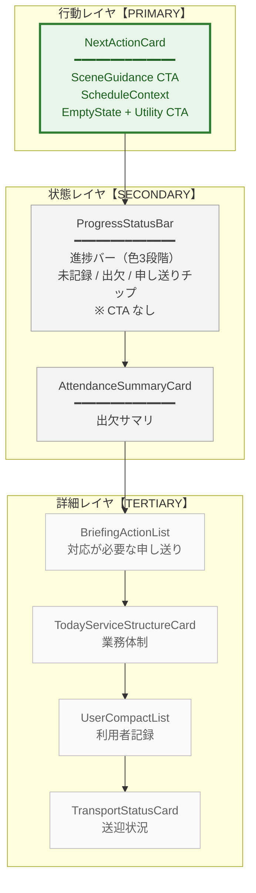
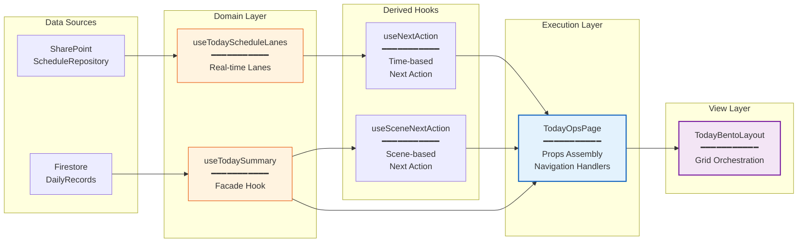
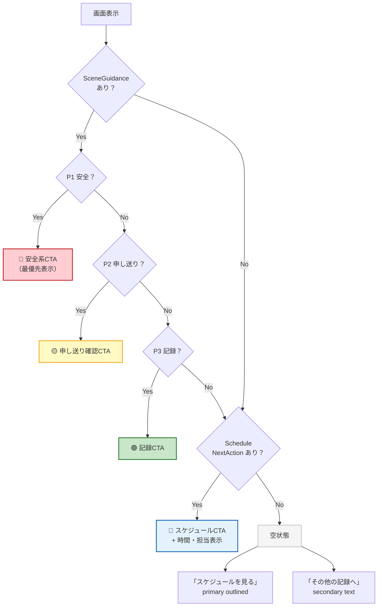

# /today ページ 最終アーキテクチャ

> **最終更新**: 2026-03-11  
> **ステータス**: 実装済み・本番運用中

## 設計原則

`/today` は **行動ダッシュボード** である。情報ダッシュボードではない。

| 原則 | 説明 |
|------|------|
| **Single Action Focus** | 画面上のCTAは常に `NextActionCard` に集約する |
| **Execution Layer** | 集約・分析ロジックを持たない。`useTodaySummary` facade 経由でデータを受け取る |
| **Visual Hierarchy** | 意思決定 → 状況理解 → 詳細 の順で視線を誘導する |
| **Calm Status** | 進捗表示は informational に留め、urgency を過度に煽らない |

## レイヤ構造



## データフロー



## NextActionCard 行動判定フロー



## ProgressStatusBar 色設計

```
完了率    色        意味
━━━━━━━━━━━━━━━━━━━━━━━━━━
≥ 70%    success   順調（緑系）
≥ 30%    info      対応中（青系）
< 30%    warning   対応が必要（黄系）
```

> **設計意図**: 朝一は完了率 0% が正常。`warning` が出すぎないよう閾値を 30% に設定。

## Bento Grid レイアウト

### Desktop (md: 4-column)

```
┌──────────────────────────────────────┐
│  NextActionCard (4col, accent)       │  ← ROW 0: PRIMARY
├──────────────────┬───────────────────┤
│  Progress (3col)  │ Attendance (1col) │  ← ROW 1: STATUS
├──────────────────┴───────────────────┤
│  Briefing (4col, subtle)             │  ← ROW 2
├──────────────────────────────────────┤
│  ServiceStructure (4col)             │  ← ROW 3
├──────────────────────────────────────┤
│  Users (4col)                        │  ← ROW 4
├──────────────────────────────────────┤
│  Transport (4col)                    │  ← ROW 5
└──────────────────────────────────────┘
```

### Mobile (xs: 1-column)

```
NextActionCard
ProgressStatusBar
AttendanceSummaryCard
BriefingActionList
ServiceStructure
UserCompactList
TransportStatusCard
```

## コンポーネント責務マトリクス

| コンポーネント | CTA | 色制御 | データ集約 | 行動起点 |
|---------------|-----|--------|-----------|---------|
| **NextActionCard** | ✅ Primary | accent | ❌ 受領のみ | ✅ |
| **ProgressStatusBar** | ❌ なし | neutral | ❌ 受領のみ | ❌ |
| **AttendanceSummaryCard** | chip link | neutral | ❌ 受領のみ | ❌ |
| **BriefingActionList** | item link | neutral | ❌ 受領のみ | ❌ |

## 関連ADR

- [ADR-002: Today Execution Layer Guardrails](../adr/ADR-002-today-execution-layer-guardrails.md)
- [Hero-NextAction Responsibility Design](./hero-nextaction-responsibility.md)

## 変更履歴

| 日付 | 変更 |
|------|------|
| 2026-03-11 | Hero 廃止 → ProgressStatusBar 導入、CTA 一元化、色設計正常化 |
