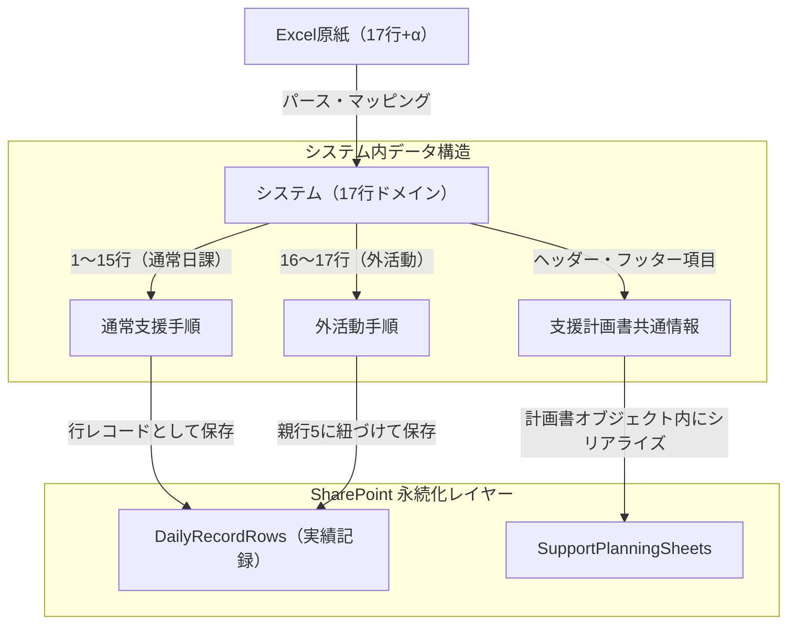

# 17行標準手順モデル インポート仕様 ＆ SharePoint展開設計

本設計書は、重度障害支援加算（外出入り）が適用される実務者4名（塩田さん、桂川さん、中村さん、石渡さん）のExcel原紙から得られた共通パターンに基づき、**「Excelインポート（データ取り込み・パース仕様）」** および **「SharePointリスト（本番列展開）設計」** を定義したものです。

これにより、制度監査（実地指導）に耐えうる「手戻りのない追跡性」と、現場職員が迷わず一発でインポートできる「運用の簡便さ」を両立させます。

---

## 1. 全体データモデル構造（概念図）

Excel原紙に記載されている「時間帯ごとの本人の動き・支援」と「一日を通した共通事項」は、システム内で以下のように役割を分担してマッピングされ、SharePointに永続化されます。

---

## 2. Excelインポート（データパース仕様）

4名分の実データを分析した結果、Excelシート（`.xlsx` または `.xls`）の構造は以下のように完全に共通化されています。

### 2.1 行マッピング（17行 SSOT）
Excelの行位置は、時間帯表記の揺れ（例: `9:30頃` と `09:40頃`）にかかわらず、**インデックス（RowNo 1〜17）を最優先**してインポートします。

| 行番号 (RowNo) | 区分 (Category) | Excelの行ヘッダー / デフォルト活動内容 | マッピング先 |
| :---: | :---: | :--- | :--- |
| **1** | normal | 通所・朝の準備 | 通常手順 |
| **2** | normal | 体操 | 通常手順 |
| **3** | normal | スケジュール確認 (AM) | 通常手順 |
| **4** | normal | お茶休憩 (AM) | 通常手順 |
| **5** | normal | AM日中活動 | 通常手順（親行） |
| **6** | normal | 昼食準備 | 通常手順 |
| **7** | normal | 昼食 | 通常手順 |
| **8** | normal | 昼休み | 通常手順 |
| **9** | normal | スケジュール確認 (PM) | 通常手順 |
| **10** | normal | PM日中活動 | 通常手順 |
| **11** | normal | お茶休憩 (PM) | 通常手順 |
| **12** | normal | PM日中活動 | 通常手順 |
| **13** | normal | のんびりタイム (ダンスタイム等) | 通常手順 |
| **14** | normal | 帰りの準備 | 通常手順 |
| **15** | normal | 退所 | 通常手順 |
| **16** | external | AM/PM日中活動（外活動準備） | 外活動（子行: 親はRowNo 5） |
| **17** | external | AM/PM日中活動（外活動） | 外活動（子行: 親はRowNo 5） |

### 2.2 特記事項・補足ブロックのパースルール
各人の原紙下部にある共通・注意事項セクションは、計画書の「共通アセスメント・注意事項・感覚トリガー」として取り込み、日々の日誌表示用 `specialNotes`（申し送り・注意喚起エリア）へ自動集約します。

| Excel上のセクション名 | 解析パターン | 取り込み先の計画書フィールド | 役割と活用 |
| :--- | :--- | :--- | :--- |
| **一日を通して気を付ける事** | 「一日を通して」を前方一致検索 | `observationFacts` (観察事項) / `specialNotes` | 日々の記録画面のトップに警告・ヒントとして表示 |
| **注意事項・補足 / その他** | 表下部の自由記述エリア | `environmentalAdjustments` (環境調整) | アラート表示、支援時の配慮事項として表示 |
| **感覚トリガー** | 特定のトリガー語句（ささくれ、かさぶた等） | `sensoryTriggers` (感覚過敏等) | 支援者の行動にトリガーチェックとして連携 |

---

## 3. SharePoint 列展開設計（本番適用仕様）

SharePoint 側の列は、データの更新やスキーマ変動（Drift）に対して堅牢である必要があります。これまでの SharePoint hardening（#1791 完了済み）での知見を反映し、**末尾に `0`（ゼロ）を付与した内部名**を使用して本番展開を行います。これにより、SharePoint の内部フィールド名競合エラー（400/500 Bad Request）を完全に回避します。

### 3.1 支援記録・実績保存リスト: `DailyRecordRows` (実績・進捗)
日々実行した手順とその状態を、1行＝1レコードの正規化された構造で保存します。

| 内部名 (InternalName) | 表示名 (DisplayName) | データ型 | 説明 / マッピング仕様 |
| :--- | :--- | :--- | :--- |
| **Title** | レコードキー | 1行テキスト | 複合ユニークキー: `[Date]-[UserCode]-[RowNo]` |
| **UserCode0** | 利用者コード | 1行テキスト | 利用者を一意に特定（例: `I016`, `U-001`, `U-003`） |
| **RecordDate0** | 記録日 | 日付と時刻 | サービス提供日（時刻は 00:00:00 統一） |
| **RowNo0** | 行番号 | 数値 | 1〜17。通常日課：1〜15、外活動：16〜17 |
| **TimeSlot0** | 時間帯 | 1行テキスト | 計画書からスナップショットされた時間文字列（例: `9:30頃`） |
| **Activity0** | 活動内容 | 1行テキスト | 計画書からスナップショットされた活動内容名 |
| **PersonManual0** | 本人の動き | 複数行テキスト | 計画書手順書：本人の動きをスナップショット |
| **SupporterManual0** | 支援者の動き | 複数行テキスト | 計画書手順書：支援者の動きをスナップショット |
| **Situation0** | 当日の様子・記録 | 複数行テキスト | 支援員が當日の記録として入力したテキスト |
| **Completed0** | 実行ステータス | 1行テキスト | `completed` (完了) / `triggered` (一部実施) / `skipped` (スキップ) |
| **ProcedureType0** | ブロックカテゴリ | 1行テキスト | `morning` (午前) / `afternoon` (午後) / `outing` (外活動) |
| **ParentRowNo0** | 親行番号 | 数値 | 外活動 (Row 16, 17) の場合に親行番号 `5` を保持 |
| **CreatedByName0** | 記録者氏名 | 1行テキスト | 当日の記録を入力・承認した職員名 |

---

## 4. 堅牢性（Hardening）および耐障害設計

### 4.1 計画書テンプレート更新による過去実績の保護（Snapshot パターン）
支援計画書（SupportPlanningSheet）が更新されても、過去の実績記録は影響を受けてはなりません。
- **解決策**: `DailyRecordRows` にデータを保存する際、`PersonManual0` (本人の動き) および `SupporterManual0` (支援者の動き) に、**保存時点の手順内容をテキストコピー（スナップショット）**して書き込みます。
- **効果**: 監査時において、「数ヶ月前のサービス提供日に、実際にどのような手順書に沿って支援を行ったか」を完全に復元して証明できます。

### 4.2 Excelインポート時の表記ゆれ吸収
インポーター（Parser）は以下の補正ロジックを自動で適用します。
1. **空白行のスキップ**: Excel内の手動調整による空行やデコレーション行は自動スキップ。
2. **全角・半角の統一**: `AM`, `PM`, `〜`, `~` などの全角記号や、時間の余分なスペースを自動トリミング・半角化。
3. **未記入箇所のフォールバック**: 桂川さんの外活動（Row 17）のように、手順自体は存在するが本人の動き・支援者の動きが空欄である場合は、行自体は生成し、活動内容のみをテンプレートプレースホルダーで補完して取り込みます。

---

## 5. 監査用ログとトレーサビリティ要件

監査員（実地指導員）による「支援計画」と「支援記録」の突合監査をスムーズに通過するため、以下の項目をインポートおよび保存ログ（メタデータ）として保護します。

1. **インポート元ファイル名 (`SourceFileName0`)**:
   - `DailyRecordRows` および `SupportPlanningSheets` に `SourceFileName0` 列を追加。
   - 取り込みに使用した元のExcelファイル名（例: `石渡さん_重度加算（外出入り）.xlsx`）を記録。
2. **インポート日時および実行者**:
   - 誰がいつ Excel を元にマスタデータを作ったのか、システム監査証跡ログに記録。
