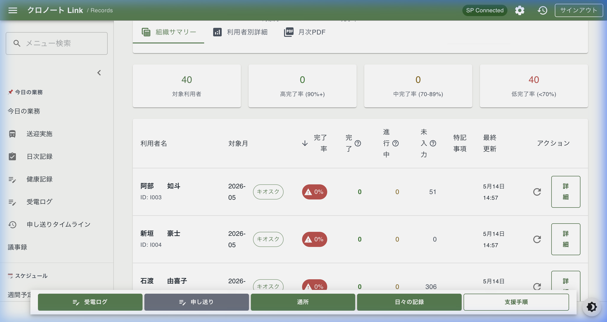
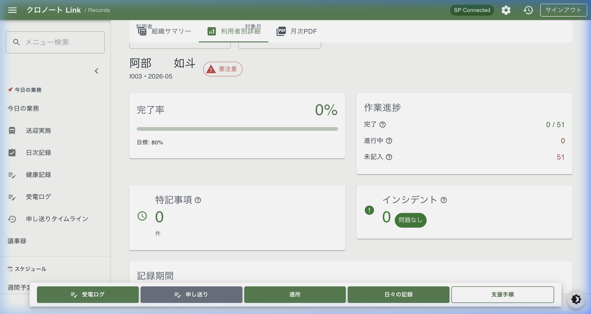

# 月次KPI plannedRows 実データ突き合わせ報告書（2026-05）

## 概要

PR #1909「feat(monthly): refine planned rows using contracts holidays and absences」の実装内容が、SharePoint 本番データを用いた運用環境下においても期待どおり動作することを検証した。

- 検証日: 2026-05-14
- 対象月: 2026-05
- 対象画面: `/records/monthly`
- 判定: **PASS**

## 検証結果詳細

### 代表利用者の手計算との突き合わせ

| 利用者名 | UserID | 契約予定日数（手計算） | 期待値 plannedRows | 実測値 actual | 判定 |
|---|---|---:|---:|---:|---|
| 石渡　由喜子 | I005 | 18日 ※1 | 306 | 306 | PASS |
| 阿部　如斗 | I003 | 3日 | 51 | 51 | PASS |
| 新垣　豪士 | I004 | 0日 ※2 | 0 | 0 | PASS |

※1: 2026年5月の月〜金21日から、契約曜日に重なる祝日3日間（5/4, 5/5, 5/6）を控除。18日 × 17行 = 306。  
※2: 契約曜日が変換後に0件となっている、または対象月内に契約予定日がないケース。

## データソースに関する注記

月次KPIの `completedRows` は、自由記述の日次記録ではなく、**17行支援手順の実施証跡**を集計対象とする。

現行実装では、SharePoint の親リスト `SupportRecord_Daily` と子リスト `DailyRecordRows` の2層構成を使用しており、月次集計（`getRecordsInRange`）では主に **`DailyRecordRows`** の行単位データを対象月・利用者単位で取得している。

そのため、現場で自由記述形式の日次記録のみが運用されている場合、`plannedRows`（分母）は精密に算出されても `completedRows`（分子）は `0` に近くなる。これは分母精密化ロジックの不具合ではなく、17行支援手順の実施証跡がシステム上に未蓄積であることを示している。

自由記述の日次記録の提出状況（提出率等）を可視化する場合は、本件の監査用17行KPIとは別の指標として設計・管理することを推奨する。

## エビデンス

### 1. 組織サマリー（2026-05）
本番データ接続下で、各利用者の予定行数が精密に算出されていることを確認した。
- 証跡画像: `summary_table.png`

### 2. 利用者別KPIカード（秋山 龍二 氏 / 阿部 如斗 氏）
個別詳細画面においても、分母が正しく算出（秋山氏: 306 / 阿部氏: 51）されていることを確認した。
- 証跡画像: `user_kpi_card.png` (阿部氏の例)

## 結論

PR #1909 により導入された精密分母算出ロジックは、SharePoint 実データおよび UI 表示の双方で整合性が確認された。

plannedRows は、契約曜日、祝日、**承認済み欠席**、および17行モデルに基づき期待どおり算出されている。

### 運用上の重要事項
- **フォールバック挙動**: `AttendanceDays`（通所曜日）が未設定の場合、現行実装では月〜金（平日）を暫定的な契約曜日として扱うフォールバックが働く。
- **データ整備の推奨**: 利用者固有の正確なKPI（週3日契約等）を算出するには、`Users_Master.AttendanceDays` への正しい曜日情報の登録が必須である。

これをもって、PR #1909 の月次KPI plannedRows 精密化について、運用確認を **PASS** と判断し、本件を完了とする。
