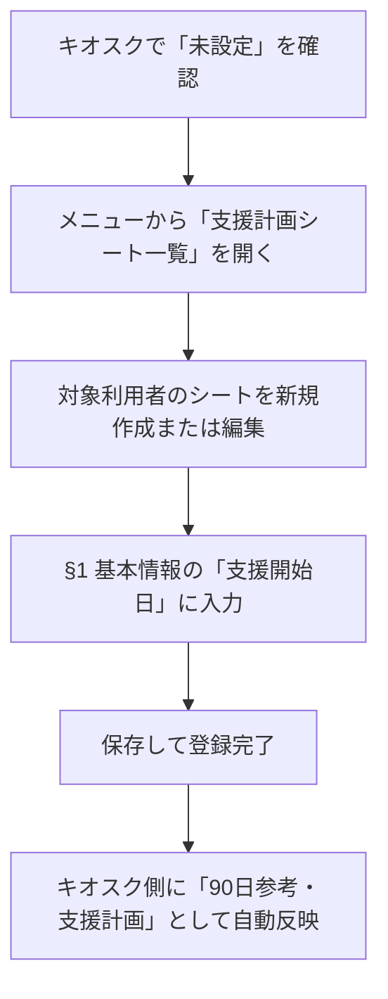

# 支援手順兼記録開始日の設定・仕様ガイド (Kiosk Support Start Date Guide)

本ドキュメントは、L3キオスク（現場支援手順兼記録画面）に表示される **「支援手順兼記録開始日（90日モニタリング参考起点）」** の役割、現場での設定手順、およびシステム仕様について解説するものです。

現場職員向け（Part 1）と管理者・開発者向け（Part 2）の2部構成になっています。

---

## 🌸 Part 1: 現場職員向け運用ガイド

### 1. 「支援手順兼記録開始日」とは？
強度行動障害支援の17手順を運用する際の、**90日モニタリング参考起点**となる日（あるいは予定日）です。
この日付を起点として、**90日（3ヶ月）ごとのモニタリングサイクル（見直し・評価期限）** の予定日が自動計算されます。

> [!IMPORTANT]
> **「個別支援計画（ISP）」の6ヶ月更新日とは別物です！**
> * **個別支援計画（ISP）**: 事業所全体で管理する、生活介護サービス全体の包括的な計画書（原則6ヶ月更新）。
> * **支援計画シート（SPS / 強度行動障害支援計画）**: 強度行動障害の対象者向けに、個別の指導手順やFBA（行動分析）を管理する専用シート（**90日参考サイクル**）。
> 
> 今回キオスクに表示されるのは、強度行動障害に特化した **「支援計画シート（SPS）」側の開始日** です。通常のISPのモニタリング面談日等と混同しないようご注意ください。

---

### 2. 設定手順

もしキオスク画面に **「未設定（90日参考）」** と表示されている場合、以下の手順で正しい手順開始日をセットできます。



#### ① 設定画面を開く
1. 管理システムにログインし、メニューから **「支援計画（SPS）管理」**（一覧URL: `/planning-sheet-list`）を開きます。
2. 日付をセットしたい利用者の支援計画シートを新規作成する（`/support-planning-sheet/new`）、または既存のシートの「編集」をクリックします。

#### ② 日付を入力する
1. フォームの最初のステップである **「§1 基本情報」** セクションに移動します。
2. **「支援開始日（モニタリング起点）」** という項目（日付選択カレンダー）を見つけます。
3. ここに、対象の指導手順を現場で始動する（した）日付を入力します。
   *(※「今日モニタリングした日」ではなく、手順の「90日モニタリング参考起点（サイクルの起算日）」となる日付を入れます)*

#### ③ 保存する
1. フォームの入力内容を保存・確定します。
2. これにより、L3キオスク側に自動的に日付と次回期限が連動して表示されるようになります。

---

### ❓ よくある質問 (FAQ)

**Q: 利用者マスタの「サービス開始日」と、支援計画シート（SPS）の「支援開始日」はどちらを入力すべきですか？**
**A: 原則として、強度行動障害専用の「支援計画シート（SPS）」に入力してください。**
「サービス開始日」は契約全般の開始日であり、強度行動障害の個別アプローチが始まった日とズレることがあります。SPS側に「支援開始日（モニタリング起点）」を入力しておくと、キオスク側でもそれが最優先（個別最適値）として参照されます。

**Q: キオスクに「確認中（90日参考）」と表示されるのはなぜですか？**
**A: システムが裏側で日付データの取得・照会処理を行っている最中です。**
数秒待つか、画面を再読込しても「確認中」のまま変わらない場合は、ネットワーク環境等をご確認ください。

---

## ⚙️ Part 2: 管理者・開発者向け技術仕様

### 1. 概要
本機能は、L3（キオスク）の支援手順画面において、L2（支援計画シート = SPS）およびマスタ層に存在する「支援起点日」を動的に解決・解決優先順位に従って表示し、現場の90日モニタリング期限の認知をサポートするものです。
**L3（キオスク）は独自の日付状態を所有せず、L2（SPS）を完全に参照・同期するアーキテクチャ** を採用しています。

---

### 2. 日付解決ロジックと優先順位
システムは、[resolveSupportStartDateDetailed](file:///Users/yasutakesougo/audit-management-system-mvp/src/features/planning-sheet/monitoringSchedule.ts) 関数を使用して、以下の優先順位（1〜5）で表示用日付およびその「参照ソース（情報元）」を自動的に解決します。

| 優先度 | 状態・該当データ | 表示されるテキスト形式 | 解決ソース定義 (`source`) |
| :---: | :--- | :--- | :---: |
| **1** | SPSの `supportStartDate` が存在 | `YYYY年M月D日（90日参考・支援計画）` | `'planning'` |
| **2** | SPSになく、利用者マスタの `ServiceStartDate` が存在 | `YYYY年M月D日（90日参考・利用者マスタ）` | `'master'` |
| **3** | 上記がなく、SPSの `appliedFrom` が存在 | `[暫定] YYYY年M月D日（90日参考・計画適用日）` | `'fallback'` |
| **4** | 利用可能な日付データが一切存在しない | `未設定（90日参考）` | `'none'` |
| **5** | 非同期ロード中（データ取得中） | `確認中（90日参考）` | (Loading state) |

---

### 3. データフロー

```text
 [SPS List/Editor] (L2)           [User Master] (M)
    | supportStartDate / appliedFrom  | ServiceStartDate
    v                                 v
+───────────────────────────────────────────────────+
|      resolveSupportStartDateDetailed (L2)         |  <-- 日付解決関数
+───────────────────────────────────────────────────+
                        |
                        v (Resolved Date & Source)
+───────────────────────────────────────────────────+
|     usePlanningSheetData (React Hook)             |  <-- L3キオスク用カスタムフック
+───────────────────────────────────────────────────+
                        |
                        v (UI State & Labels)
 [KioskProcedureListScreen] (L3 / UI Rendering)
```

---

### 4. 関連ファイル構成と責務

| ファイルパス | 責務 |
| :--- | :--- |
| [monitoringSchedule.ts](file:///Users/yasutakesougo/audit-management-system-mvp/src/features/planning-sheet/monitoringSchedule.ts) | 日付の解決・計算コアロジックを実装。`resolveSupportStartDateDetailed` をエクスポートする。 |
| [usePlanningSheetData.ts](file:///Users/yasutakesougo/audit-management-system-mvp/src/features/planning-sheet/hooks/usePlanningSheetForm.ts) | キオスク側で `planningSheetId` から該当シートのデータをロードし、解決日付を提供する React Hook。 |
| [KioskProcedureListScreen.tsx](file:///Users/yasutakesougo/audit-management-system-mvp/src/features/kiosk/components/KioskProcedureListScreen.tsx) | キオスク支援手順画面。ヘッダー内に「支援手順兼記録開始日」として解決されたラベルを描画する。 |

---

### 5. 品質保証（テスト観点）
実装された自動テスト（[KioskProcedureListScreen.spec.tsx](file:///Users/yasutakesougo/audit-management-system-mvp/src/features/kiosk/components/__tests__/KioskProcedureListScreen.spec.tsx)）は、以下の4つのエッジケースを検証し、リグレッションを完全に防止しています。

* **Case 1: `planning` 最優先**
  * 条件: SPSの `supportStartDate`、利用者マスタ `ServiceStartDate`、SPSの `appliedFrom` が全て存在。
  * 期待結果: SPSの `supportStartDate` の日付が `'90日参考・支援計画'` の文言と共に最優先で表示される。
* **Case 2: `master` 解決**
  * 条件: SPSの `supportStartDate` は無いが、利用者マスタ `ServiceStartDate` が存在。
  * 期待結果: 利用者マスタの日付が `'90日参考・利用者マスタ'` の文言と共に表示される。
* **Case 3: `fallback` 解決**
  * 条件: SPSの `supportStartDate`、利用者マスタ `ServiceStartDate` が共に無いが、SPSの `appliedFrom` が存在。
  * 期待結果: `appliedFrom` の日付が `[暫定]` マーク及び `'90日参考・計画適用日'` の文言と共に表示される。
* **Case 4: `none` 未設定解決**
  * 条件: 日付データが一切存在しない（または `planningSheetId` 自体が未設定）。
  * 期待結果: `未設定（90日参考）` と正しくフォールバック表示される。

---

### 🔗 参照情報
* **関連PR**: PR #1882 (表示枠追加) / PR #1883 (動的解決ロジック実装)
* **関連画面URL**:
  * SPS一覧: `/planning-sheet-list`
  * SPS詳細・編集: `/support-planning-sheet/:id`
  * キオスク手順画面: `/kiosk/users/:userId/procedures`
