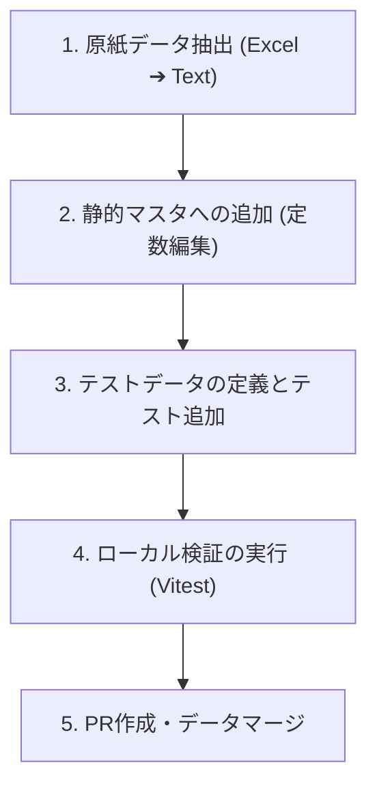

# Support Procedure Addition Guide (支援手順・下部欄追加ガイド)

本ドキュメントは、新しく重度障害児者等の加算対象者（桂川さん、塩田さん、中村さんなど）のExcel原紙から、**「17行の支援手順」** および **「シート下部欄（一日を通して気を付ける事、その他）」** を静的マスタとしてシステムに安全かつ正確に追加する際の手順をまとめた開発用プロセスガイドです。

---

## 📋 全体開発プロセス（5つのステップ）



---

## 🛠️ 各ステップの具体手順

### Step 1. 原紙データの抽出
手元にある追加対象者の Excel 原紙（例：`桂川さん_重度加算.xlsx`）を開き、以下のデータをプレーンテキストとして抽出・整理します。

1. **基本情報**
   - **利用者ID（システムID）**: 例：`3` (DB上のプライマリキー)
   - **利用者ID（英数字エイリアス）**: 例：`'U-001'` (テストフィクスチャなどで使われる形式)
2. **17行手順（本人の動き・支援者の動き）**
   - **Row 1〜Row 17** までの各行について、`personAction（本人の動き）` と `supporterAction（支援者の動き）` のセルからテキストを抽出します。
   - > [!IMPORTANT]
     > **セル内の改行はそのまま保持**し、コード上では `\n` で表現してください。
3. **下部欄データ**
   - **一日を通して気を付ける事** (`dailyCarePoints`)
   - **その他** (`otherNotes`)

---

### Step 2. 静的マスタへのデータ投入
抽出したテキストを、ドメイン定数定義ファイルに追加します。

- **対象ファイル:** `src/features/planning-sheet/constants/userProcedureDetails.ts`

#### ① 17行手順 of `USER_PROCEDURE_DETAILS`
`USER_PROCEDURE_DETAILS` 配列の末尾に、抽出した17行データを追加します。
```typescript
export const USER_PROCEDURE_DETAILS: UserProcedureDetail[] = [
  // ...既存の石渡さん(userId: 4)データ...
  
  // 桂川さん（Id: 3, UserID: 'U-001'）用の手技データ例
  {
    userId: 3,
    rowNo: 1,
    personAction: '手洗い 荷物をロッカーへ',
    supporterAction: '血圧測定等のバイタル確認\n連絡帳の受け取り・確認\n検温。手洗いの見守り又は介助。',
  },
  // ...これを rowNo: 17 まで繰り返す
];
```

#### ② 下部欄データ of `USER_PROCEDURE_SHEET_NOTES`
`USER_PROCEDURE_SHEET_NOTES` 配列 of `userProcedureDetails.ts` に、下部欄のテキストを追加します。
```typescript
export const USER_PROCEDURE_SHEET_NOTES: UserProcedureSheetNotes[] = [
  // ...既存の石渡さん(userId: 4)データ...
  
  {
    userId: 3,
    dailyCarePoints: '自発的な水分補給要望がないため、こまめな水分提供が必要。',
    otherNotes: '活動前後のバイタル確認を確実に行い、本人の体調変化に十分注意する。',
  },
];
```

#### ③ 柔軟な利用者IDエイリアス解決のアップデート
テストフィクスチャID（例：`'U-001'`）と、本番用の数値ID（例：`3`）を同一人物として安全にバインドするために、`src/features/planning-sheet/constants/userProcedureDetails.ts` 最下部のエイリアスヘルパー関数をメンテします。

```typescript
function isKatsuragawaUserId(userId: string | number): boolean {
  const s = String(userId);
  return s === '3' || s === 'U-001';
}

// 例：複数の利用者のエイリアス判定を一律で解決できるように拡張する
function isUserMatch(targetId: string | number, queryId: string | number): boolean {
  const target = String(targetId);
  const query = String(queryId);
  if (target === query) return true;
  
  // 石渡さんのエイリアス判定
  if ((target === '4' || target === 'U-002' || target === 'U-003') &&
      (query === '4' || query === 'U-002' || query === 'U-003')) {
    return true;
  }
  
  // 桂川さんのエイリアス判定
  if ((target === '3' || target === 'U-001') &&
      (query === '3' || query === 'U-001')) {
    return true;
  }
  
  return false;
}
```
これを用いて、`findUserProcedureDetail` と `findUserProcedureSheetNotes` をアップデートします：
```typescript
export function findUserProcedureDetail(userId: string | number, rowNo: number): UserProcedureDetail | undefined {
  return USER_PROCEDURE_DETAILS.find((detail) => {
    return isUserMatch(detail.userId, userId) && detail.rowNo === rowNo;
  });
}

export function findUserProcedureSheetNotes(userId: string | number): UserProcedureSheetNotes | undefined {
  return USER_PROCEDURE_SHEET_NOTES.find((notes) => {
    return isUserMatch(notes.userId, userId);
  });
}
```

---

### Step 3. テストの定義と結合
データ追加によるデグレードを防ぐため、新規追加した利用者の結合テストを定義・修正します。

- **対象ファイル:** `src/features/planning-sheet/logic/__tests__/dailyProcedureMapper.spec.ts`

すでに存在する `Katsuragawa-san Severe Support Case` などの `describe` ブロックをアップデートし、**静的マスタから下部欄が期待通りにロードできるか**のアサーションを1件追加します。

```typescript
  describe('Katsuragawa-san Severe Support Case (17-Row Validation)', () => {
    it('should map all 17 rows correctly including external activities', () => {
      // 既存の17行手順テスト
    });

    it('should map overall sheet notes (dailyCarePoints, otherNotes) unique to Katsuragawa-san', () => {
      const doc = bridgePlanningSheetToDailyProcedures(KATSURAGAWA_SEVERE_SUPPORT_SHEET);

      expect(doc.dailyCarePoints).toBe('自発的な水分補給要望がないため、こまめな水分提供が必要。');
      expect(doc.otherNotes).toBe('活動前後のバイタル確認を確実に行い、本人の体調変化に十分注意する。');
    });
  });
```

---

### Step 4. ローカル検証の実行
修正を終えたら、該当のテストを実行して全てグリーンになることを確認します。

```bash
npx vitest run src/features/planning-sheet/logic/__tests__/dailyProcedureMapper.spec.ts
```

全体の整合性に問題がないかを広く確認するため、以下のディレクトリ全体のテストも走らせます。
```bash
npx vitest run src/features/planning-sheet
```

---

### Step 5. PR の作成
テストがすべてパスしたら、**「データ追加のみにスコープを絞った」** 綺麗な PR を作成します。
仕組み自体（ロジックファイル等）は編集しないため、レビューコストが極めて低く、迅速にマージできます。

#### PR タイトル案
```txt
feat(daily): add Katsuragawa-specific procedure details
```

#### コミットメッセージ
```txt
feat(daily): add Katsuragawa 17-row details and overall sheet remarks
```

---

## 💡 開発時のベストプラクティスと注意点
1. **テキストの改行保持**
   - 抽出した手順テキストに `\n` が正確に入っていることを、PR 差分（diff）等で二重チェックしてください。
2. **下位互換性の保証**
   - 本番のデータベース上のユーザーIDと、テスト環境におけるモックIDに乖離が発生した場合に備え、必ず **`isUserMatch` ヘルパーによるエイリアスバインド** を通してデータを引くように設計してください。これにより画面がデータ不整合でクラッシュするのを防ぎます。
3. **影響範囲の制限**
   - マスタの追加作業時には、`dailyProcedureMapper.ts` などの「ロジック本体」は絶対に修正しないでください。これらを書き換える必要がないほど、現在の仕組みは強固かつ抽象化されています。
