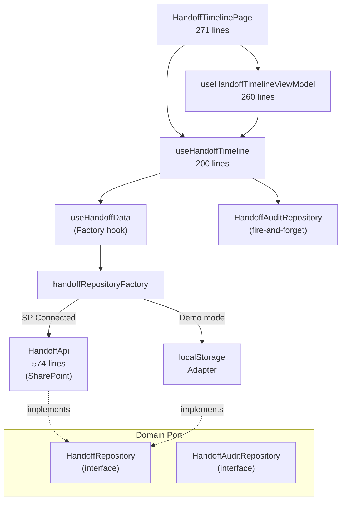

# /handoff-timeline 改修ガードレール

> **目的**: `/handoff-timeline` を改修する際に守るべき不変条件・テスト範囲・レビュー基準をまとめたドキュメント。
> 「何を壊してはいけないか」を事前に明示し、安全に変更を届ける。

---

## 1. アーキテクチャ概要



**要点**: レイヤーを飛び越えた直接依存は禁止。Page → ViewModel → Timeline → Data/Repo の一方向フローを維持する。

### Hook 間の責務境界

| Hook | 責務 |
|------|------|
| **useHandoffTimelineViewModel** | 画面の表示状態、フィルタ状態、会議モード、UI アクション公開を担当する |
| **useHandoffTimeline** | CRUD、楽観的更新、ロールバック、監査ログ送信など**実行**責務を担当する |

> UI 判断は ViewModel、実行は Timeline Hook — この境界を越えない。

---

## 2. 不変条件（絶対に壊してはいけないもの）

### 2.1 状態マシン

| ルール | 詳細 |
|--------|------|
| **6 ステータス** | `未対応` → `対応中` → `対応済` → `確認済` → `明日へ持越` → `完了` |
| **3 モード** | `normal` / `evening` / `morning` — 各モードで許可される遷移が異なる |
| **終端判定** | `isTerminalStatus()` は `対応済` と `完了` のみ `true` を返す（下記注参照） |
| **遷移ガード** | UI は `getAllowedActions()` の戻り値のみでボタンを描画する（ゼロ計算原則） |

> [!CAUTION]
> ステータスの追加・並び替え・削除は **SharePoint 列定義**・**監査ログ**・**会議モード遷移**・**全 UI コンポーネント** に波及する。PR レビュー必須。

> [!NOTE]
> `isTerminalStatus()` は **UI 上の完了扱い判定**であり、会議モードにおける後続遷移可否とは別概念。`対応済` は normal モードでの終端だが、evening モードでは `確認済` へ遷移済みの時点でこのステータスには至らない。

### 2.2 Repository Port

| ルール | 根拠 |
|--------|------|
| `HandoffRepository` interface を変更したら **全 Adapter** を更新 | SP / localStorage 2 系統 |
| `HandoffAuditRepository` は **fire-and-forget** を前提にする | UI をブロックしない |
| Adapter は **Plain Object** で実装（class 不使用） | ADR-1 準拠 (this バインディング回避) |

### 2.3 楽観的更新 & キャッシュ

| ルール | 場所 |
|--------|------|
| ステータス変更は楽観的更新 → ロールバック付き | `useHandoffTimeline.ts` |
| TTL キャッシュは **15 秒** (`CACHE_TTL_MS`) | `handoffApi.ts` |
| `CarryOverDateStore` は SP 値優先、ローカルはフォールバック | `handoffApi.ts` L116-152 |
| キャッシュ invalidation は `invalidateByPrefix()` 経由 | `HandoffCache` class |

### 2.4 外部参照 — 変更時の影響範囲

以下のファイルが `features/handoff/` を import しており、handoff 側の型・関数シグネチャを変更すると **コンパイルエラー** になる。

| 外部ファイル | 使用内容 |
|-------------|---------|
| [DashboardPageTabs.tsx](file:///Users/yasutakesougo/audit-management-system-mvp/src/pages/DashboardPageTabs.tsx) | handoff summary widget, navigation state |
| [DailyRecordPage.tsx](file:///Users/yasutakesougo/audit-management-system-mvp/src/pages/DailyRecordPage.tsx) | 申し送り作成リンク / メニュー |
| [MeetingGuidePage.tsx](file:///Users/yasutakesougo/audit-management-system-mvp/src/pages/MeetingGuidePage.tsx) | `dayScope + timeFilter` をナビ state で渡す |
| [PersonalJournalPage.tsx](file:///Users/yasutakesougo/audit-management-system-mvp/src/pages/PersonalJournalPage.tsx) | handoff summary 参照 |
| [meeting/useCurrentMeeting.ts](file:///Users/yasutakesougo/audit-management-system-mvp/src/features/meeting/useCurrentMeeting.ts) | 朝会/夕会モード連携 |
| [sharepoint/fields/handoffFields.ts](file:///Users/yasutakesougo/audit-management-system-mvp/src/sharepoint/fields/handoffFields.ts) | SP 列定義 (Select フィールド) |

> [!IMPORTANT]
> 型・シグネチャ・ナビ state を変更した場合は、**外部参照元のコンパイル確認**と**主要遷移のブラウザ確認**を必須とする。

### 2.5 Today との関係

- `/today` は handoff 機能の **consumer**（読み取りのみ）
- [TodayHandoffTimelineList.tsx](file:///Users/yasutakesougo/audit-management-system-mvp/src/features/handoff/TodayHandoffTimelineList.tsx) は**簡易表示専用**
- ステータス遷移、コメント、監査、会議モードなどの詳細ワークフローは `/handoff-timeline` 本体に委譲する
- Today に handoff の操作機能を持ち込む場合は、このガードレール全体のレビュー対象になる

---

## 3. 変更カテゴリ別チェックリスト

### ✅ 低リスク（セルフレビューで OK）

- [ ] UI テキスト・色・余白の調整
- [ ] 既存コンポーネント内のリファクタ（export 変更なし）
- [ ] テストの追加

### ⚠️ 中リスク（PR レビュー推奨）

- [ ] 新しい UI コンポーネントの追加
- [ ] `HandoffRecord` 型へのオプショナルフィールド追加
- [ ] フィルタ条件の追加（`HandoffDayScope` / `HandoffTimeFilter` への enum 追加）
- [ ] キャッシュ TTL の変更

### 🔴 高リスク（設計レビュー + 全テスト通過必須）

- [ ] ステータスの追加・削除・名前変更 → 状態マシン + SP 列 + 監査ログ + 全 UI
- [ ] `HandoffRepository` interface の変更 → 全 Adapter 更新
- [ ] 会議モード (`MeetingMode`) の追加・変更
- [ ] 楽観的更新ロジックの変更
- [ ] 外部参照ファイルの import パスに影響する構造変更
- [ ] `meetingSessionKey` / `carryOverDate` / `source*` 系フィールドの意味変更・必須化（会議モード・持越処理・外部連携に波及）

---

## 4. テスト安全ネット

### 4.1 既存テストスイート — 9 spec files（改修前に必ず全通過を確認）

```bash
# ドメインロジック
npx vitest run src/features/handoff/__tests__/handoffStateMachine.spec.ts
npx vitest run src/features/handoff/__tests__/handoffWorkflow.spec.ts
npx vitest run src/features/handoff/__tests__/computeHandoffSummary.spec.ts

# データ層
npx vitest run src/features/handoff/__tests__/handoffApi.spec.ts
npx vitest run src/features/handoff/__tests__/handoffMappers.spec.ts
npx vitest run src/features/handoff/__tests__/handoffCommentTypes.spec.ts

# ViewModel
npx vitest run src/features/handoff/__tests__/useHandoffTimelineViewModel.spec.ts

# UI
npx vitest run src/features/handoff/components/__tests__/HandoffItem.spec.tsx

# 外部連携
npx vitest run src/features/handoff/hooks/__tests__/useImportantHandoffsForDaily.test.ts
```

### 4.2 一括実行

```bash
npx vitest run src/features/handoff/
```

### 4.3 ブラウザ確認ポイント（UI 改修時）

1. **通常モード**: 未対応 → 対応中 → 対応済 の遷移がワンタップで完了するか
2. **夕会モード**: `MeetingGuidePage` からの遷移で `dayScope=today, timeFilter=evening` が正しく適用されるか
3. **朝会モード**: `明日へ持越` → `完了` の遷移が動作し、監査ログに記録されるか
4. **Dashboard 連携**: DashboardPageTabs からの「今日」「昨日」切り替えが handoff に反映されるか

---

## 5. 改修パターン別ガイド

### パターン A: UI コンポーネントの追加

```
1. components/ にコンポーネント作成
2. HandoffTimelinePage.tsx に組み込み
3. 既存テスト通過確認
4. 新コンポーネントの spec を追加
```

**触るべきでないもの**: ViewModel, Timeline Hook, Repository

### パターン B: フィルタ条件の追加

```
1. handoffTypes.ts に新しい union member を追加
2. handoffApi.ts の getHandoffRecords() にフィルタロジック追加
3. useHandoffTimelineViewModel.ts の状態管理に反映
4. HandoffTimelinePage.tsx の UI に反映
5. テスト追加: handoffApi.spec.ts + useHandoffTimelineViewModel.spec.ts
```

**チェック**: `HandoffRepository.getRecords()` の引数型が変わる場合は全 Adapter を更新。

### パターン C: ステータス追加（最高リスク）

```
1. handoffTypes.ts の HandoffStatus に追加
2. handoffStateMachine.ts の全関数を更新
3. handoffStateMachine.spec.ts にテスト追加
4. HANDOFF_STATUS_META にメタデータ追加
5. handoffMappers.ts の SP ↔ Domain 変換を更新
6. SharePoint 列定義の更新（handoffFields.ts）
7. HandoffItem.tsx の表示更新
8. handoffWorkflow.spec.ts + handoffApi.spec.ts 更新
9. 全外部参照元のコンパイル確認
```

---

## 6. コード規約

| 規約 | 詳細 |
|------|------|
| **日本語ラベル** | `HandoffStatus` / `HandoffCategory` / `HandoffSeverity` は日本語リテラル型 |
| **JST 安全** | 日付比較は `formatYmdLocal()` を使う（UTC 不可） |
| **コメント言語** | JSDoc は日本語、変数名は英語 |
| **テスト** | ドメインロジックは spec 必須、UI は最低限の smoke test |

---

## 7. ファイルサイズ警報ライン

| ファイル | 現在 | 閾値 | 超えたら |
|---------|------|------|---------|
| `handoffApi.ts` | 574 行 | 600 行 | クラス分割を検討 |
| `HandoffTimelinePage.tsx` | 271 行 | 350 行 | Widget 抽出を検討 |
| `useHandoffTimelineViewModel.ts` | 260 行 | 300 行 | サブ hook 抽出を検討 |
| `useHandoffTimeline.ts` | 200 行 | 300 行 | 現状は健全 |

---

*最終更新: 2026-03-09 — 構造分析 (conversation abd5264f) に基づき作成*
