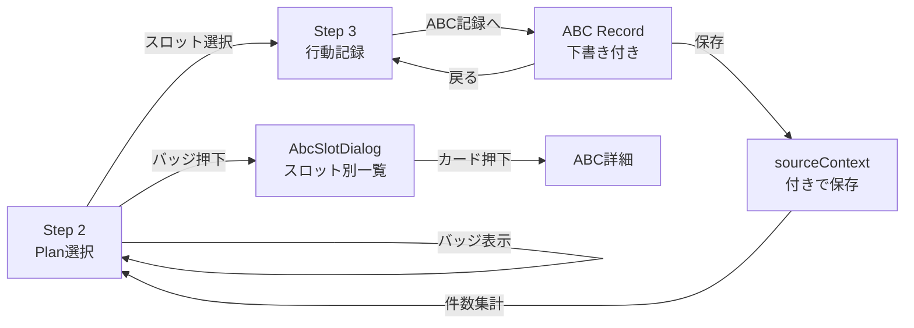

# ABC記録 × 支援手順 連動MVP — Handoff Document

> **Date**: 2026-03-20
> **Status**: MVP-1〜6 完了 — 記録運用の一体化達成
> **Branch**: `feat/abc-support-integration-mvp`

---

## 🎯 達成した全体像

**「ABCは別機能」→「支援手順の運用フローに埋め込まれた分析記録」** への進化。



---

## ✅ MVP 実装一覧

### MVP-1: ナビゲーション連携
> Step 2 から ABC記録ページへの基本導線

- `source=daily-support` パラメータ付きで `/abc-record` へ遷移
- `returnUrl` で元の支援手順へ正確に復帰
- コンテキストバナーで遷移元情報を表示

### MVP-2: sourceContext 保存
> ABC記録に「どの支援手順由来か」を残す

```typescript
type AbcRecordSourceContext = {
  source: 'daily-support' | 'standalone';
  slotId?: string;
  date?: string;
};
```

- `AbcRecord` に `sourceContext` フィールド追加
- `QuickRecordTab` で保存時に自動付与
- `returnUrl` は保存せず遷移専用に留める

### MVP-4: Step 3 からの導線
> 入力中のスロットからピンポイントで ABC へ飛べる

- `RecordInputStep` に「ABC記録へ」ボタン追加
- `slotId` (e.g. `09:00|朝の受け入れ`) を URL で渡す
- `returnUrl` で Step 3 の **同じスロット** に正確復帰

### MVP-3: スロット別 ABC 件数バッジ
> Step 2 でどのスロットに ABC が集中しているか一目で分かる

- `buildAbcCountBySlot` — 純粋関数で集計
- `ProcedurePanel` の各スロット行に `ABC N` バッジ表示
- `useAbcTodayCount` hook を拡張して `abcCountBySlot` を返却

### MVP-5: 行動下書き補助
> Step 3 → ABC 遷移時に behavior フィールドを下書き付きで開く

- `navigate state` で `draftBehavior` を渡す（URL肥大化防止）
- `QuickRecordTab` で `initialBehavior` として受け取り、初期値セット
- ドラフトバナーで「下書きです」と明示
- `draftApplied` フラグで一度だけ適用（リセット時の再適用防止）

### MVP-6: ABCバッジ → スロット別一覧ダイアログ
> バッジ押下で「何が書かれているか」まで辿れる

- `AbcSlotDialog` コンポーネント新規作成
- `filterAbcBySlot` でスロット単位の記録抽出
- ダイアログにスロットラベル・件数・記録カード一覧を表示
- カードクリックで ABC 詳細ページへ遷移
- `onPointerDown` / `onMouseDown` で親行へのバブリング完全阻止

---

## 📁 変更ファイル一覧

| ファイル | 変更種別 | MVP |
|---------|---------|-----|
| `abcRecord.ts` | 型追加 | 2 |
| `buildAbcCountBySlot.ts` | 新規 + 拡張 | 3, 6 |
| `AbcSlotDialog.tsx` | **新規** | 6 |
| `AbcRecordPage.tsx` | 機能追加 | 1, 2, 5 |
| `QuickRecordTab.tsx` | 機能追加 | 2, 5 |
| `TimeBasedSupportRecordPage.tsx` | 導線追加 | 1, 4, 5 |
| `RecordInputStep.tsx` | UI追加 | 4 |
| `PlanSelectionStep.tsx` | hook拡張 + ダイアログ統合 | 3, 6 |
| `ProcedurePanel.tsx` | バッジ追加 + クリックハンドラ | 3, 6 |

---

## 📋 PR 説明文

```markdown
## feat(abc): complete ABC ↔ support procedure integration (MVP-1〜6)

### Summary

ABC record page and time-based support wizard are now fully integrated
with a bidirectional navigation flow, context preservation, draft
assistance, and slot-scoped record browsing.

### What's New

#### Navigation (MVP-1, MVP-4)
- Step 2 & Step 3 → ABC record page with full context
- ABC → same slot in Step 3 (precise returnUrl)
- Context banner shows origin information

#### Data Persistence (MVP-2)
- ABC records store `sourceContext` (source, slotId, date)
- `returnUrl` is navigation-only — not persisted

#### Visibility (MVP-3, MVP-6)
- Step 2 shows per-slot ABC record count badges (`ABC N`)
- Badge click opens `AbcSlotDialog` with filtered record list
- Record card click navigates to ABC detail page

#### Input Assistance (MVP-5)
- Step 3 → ABC pre-fills behavior field with slot info
- Draft banner explicitly marks pre-filled content
- One-time application via `draftApplied` flag

### Technical Highlights

- `onPointerDown` + `onMouseDown` stopPropagation on badges
  (parent row uses `onPointerDown` for slot navigation)
- `filterAbcBySlot` pure function for slot-scoped filtering
- `useAbcTodayCount` extended to return `allRecords` for dialog

### Not Included (intentionally deferred)

- Repository unification (ABC + behavior records)
- Automatic formal record creation
- SourceContext-based analytics filters
- Advanced behavior detection rules
```

---

## 🔨 設計判断の根拠

| 判断 | 理由 |
|------|------|
| `sourceContext` を optional | 既存ABC記録との後方互換維持 |
| `returnUrl` を保存しない | URL は遷移目的のみ、保存は汚染の原因 |
| 自動保存ではなく下書き補助 | 記録品質を現場に委ねる安全な設計 |
| Step 2 で件数→MVP-6 で一覧 | 段階的な情報開示で UI 過負荷を防止 |
| `onPointerDown` でバブリング阻止 | 親行が `onPointerDown` で遷移するため `onClick` だけでは不十分 |
| ダイアログからの遷移は URL ベース | navigate state だと戻り時にコンテキスト消失リスク |

---

## 🚧 意図的に保留したもの

| 項目 | 理由 |
|------|------|
| 両リポジトリ統合 | 影響範囲大、現状で十分機能 |
| 自動正式記録化 | 記録品質リスク、下書き補助で十分 |
| ABC詳細からダイアログ復帰 | 次の自然な改善点として残す |
| sourceContext フィルタ（分析） | 分析画面側の整備と合わせて後続 |
| 下書きルール高度化 | 現状のテンプレートで運用開始は十分 |

---

## 🔜 推奨 Next Actions

### 優先度 1: ABC詳細からダイアログ復帰

```
feat(abc): preserve slot dialog context when returning from abc detail
```

- ダイアログ内カード → ABC詳細 → 戻ると同じスロット一覧に復帰
- 確認体験がさらに滑らかに

### 優先度 2: ABC一覧の sourceContext フィルタ

```
feat(abc): add sourceContext filter to log tab
```

- ABC記録一覧で `source`, `date`, `slotId` で絞り込み可能に
- 支援手順由来のABCだけ表示するフィルタ

### 優先度 3: 時間帯別ABC発生傾向分析

```
feat(analytics): ABC occurrence heatmap by time slot
```

- `sourceContext` を使ってスロット別の発生パターンを可視化
- 特定活動での集中を発見する支援

---

## 📸 動作証跡

````carousel

<!-- slide -->

<!-- slide -->

<!-- slide -->

<!-- slide -->

````
