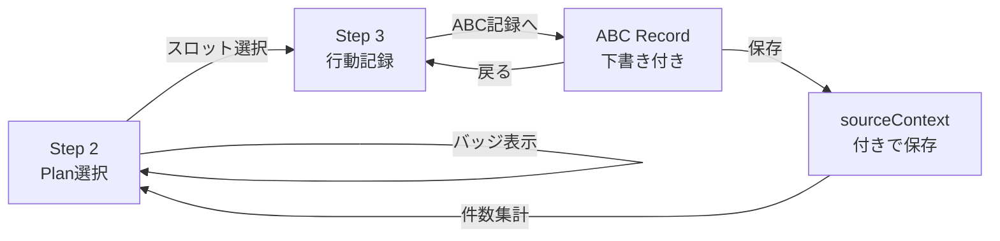

# ABC記録 × 支援手順 連動MVP — Handoff Document

> **Date**: 2026-03-20
> **Status**: MVP-1〜5 完了 — 現場循環フロー確立

---

## 🎯 達成した全体像

**「ABCは別機能」→「支援手順の中で自然に起票・追跡できる分析記録」** への進化。



---

## ✅ MVP 実装一覧

### MVP-1: ナビゲーション連携
> Step 2 から ABC記録ページへの基本導線

- `source=daily-support` パラメータ付きで `/abc-record` へ遷移
- `returnUrl` で元の支援手順へ正確に復帰
- コンテキストバナーで遷移元情報を表示

### MVP-2: sourceContext 保存
> ABC記録に「どの支援手順由来か」を残す

```typescript
type AbcRecordSourceContext = {
  source: 'daily-support' | 'standalone';
  slotId?: string;
  date?: string;
};
```

- `AbcRecord` に `sourceContext` フィールド追加
- `QuickRecordTab` で保存時に自動付与
- `returnUrl` は保存せず遷移専用に留める

### MVP-4: Step 3 からの導線
> 入力中のスロットからピンポイントで ABC へ飛べる

- `RecordInputStep` に「ABC記録へ」ボタン追加
- `slotId` (e.g. `09:00|朝の受け入れ`) を URL で渡す
- `returnUrl` で Step 3 の **同じスロット** に正確復帰

### MVP-3: スロット別 ABC 件数バッジ
> Step 2 でどのスロットに ABC が集中しているか一目で分かる

- [buildAbcCountBySlot.ts](file:///Users/yasutakesougo/audit-management-system-mvp/src/domain/abc/buildAbcCountBySlot.ts) — 純粋関数で集計
- `ProcedurePanel` の各スロット行に `ABC N` バッジ表示
- `useAbcTodayCount` hook を拡張して `abcCountBySlot` を返却

### MVP-5: 行動下書き補助
> Step 3 → ABC 遷移時に behavior フィールドを下書き付きで開く

- `navigate state` で `draftBehavior` を渡す（URL肥大化防止）
- `QuickRecordTab` で `initialBehavior` として受け取り、初期値セット
- ドラフトバナーで「下書きです」と明示
- `draftApplied` フラグで一度だけ適用（リセット時の再適用防止）

---

## 📁 変更ファイル一覧

| ファイル | 変更種別 | MVP |
|---------|---------|-----|
| [abcRecord.ts](file:///Users/yasutakesougo/audit-management-system-mvp/src/domain/abc/abcRecord.ts) | 型追加 | 2 |
| [buildAbcCountBySlot.ts](file:///Users/yasutakesougo/audit-management-system-mvp/src/domain/abc/buildAbcCountBySlot.ts) | 新規 | 3 |
| [AbcRecordPage.tsx](file:///Users/yasutakesougo/audit-management-system-mvp/src/pages/abc-record/AbcRecordPage.tsx) | 機能追加 | 1,2,5 |
| [QuickRecordTab.tsx](file:///Users/yasutakesougo/audit-management-system-mvp/src/pages/abc-record/QuickRecordTab.tsx) | 機能追加 | 2,5 |
| [TimeBasedSupportRecordPage.tsx](file:///Users/yasutakesougo/audit-management-system-mvp/src/pages/TimeBasedSupportRecordPage.tsx) | 導線追加 | 1,4,5 |
| [RecordInputStep.tsx](file:///Users/yasutakesougo/audit-management-system-mvp/src/features/daily/components/wizard/RecordInputStep.tsx) | UI追加 | 4 |
| [PlanSelectionStep.tsx](file:///Users/yasutakesougo/audit-management-system-mvp/src/features/daily/components/wizard/PlanSelectionStep.tsx) | hook拡張 | 3 |
| [ProcedurePanel.tsx](file:///Users/yasutakesougo/audit-management-system-mvp/src/features/daily/components/split-stream/ProcedurePanel.tsx) | バッジ追加 | 3 |

---

## 📋 PR 説明文

```markdown
## feat(abc): complete ABC ↔ support procedure integration (MVP-1〜5)

### Summary

ABCrecord page and time-based support wizard are now fully integrated
with a bidirectional navigation flow, context preservation, and draft
assistance.

### What's New

- **Navigation**: Step 2 & Step 3 → ABC record page with full context
- **Return paths**: ABC → same slot in Step 3 (precise returnUrl)
- **sourceContext**: ABC records now store origin (source, slotId, date)
- **Badges**: Step 2 shows per-slot ABC record count
- **Draft assist**: Step 3 → ABC pre-fills behavior field with slot info

### Design Decisions

- Draft assist uses `navigate state` (not URL params) to avoid URL bloat
- `draftApplied` flag prevents re-application on form reset
- Draft banner explicitly communicates "this is a suggestion, not final"
- sourceContext is saved but returnUrl is not (navigation-only concern)

### Not Included (intentionally deferred)

- Repository unification (ABC + behavior records)
- Automatic formal record creation
- Inline ABC list in Step 2 badges
- Advanced behavior detection rules
```

---

## 📝 CHANGELOG

```markdown
## [Unreleased] — 2026-03-20

### Added
- feat(abc): Step 2 → ABC record navigation with context banner
- feat(abc): Step 3 → ABC record navigation with slotId precision
- feat(abc): sourceContext saved on ABC records (source, slotId, date)
- feat(abc): per-slot ABC record count badges on Step 2
- feat(abc): draft behavior pre-fill from Step 3 with info banner

### Changed
- refactor(nav): unified cancel navigation to /today across daily pages
- refactor(hooks): renamed useCancelToDashboard → useCancelToToday

### Internal
- Added buildAbcCountBySlot pure function for slot-level aggregation
- Extended useAbcTodayCount hook with abcCountBySlot return
- Added initialBehavior prop to QuickRecordTab for draft assistance
```

---

## 🚧 意図的に保留したもの

| 項目 | 理由 |
|------|------|
| 両リポジトリ統合 | 影響範囲大、現状で十分機能 |
| 自動正式記録化 | 記録品質リスク、下書き補助で十分 |
| ABC一覧インライン表示 | バッジ→詳細の段差は残るが、次MVPで対応可能 |
| 分析画面連携 | 氷山PDCAへのリンクは既存、深い連携は後続 |
| 下書きルール高度化 | 現状のテンプレートで運用開始は十分 |

---

## 🔜 推奨 Next Actions

### 優先度 1: バッジ → スロット別ABC一覧

```
feat(abc): add slot-scoped record list from plan badges
```

- Step 2 の `ABC N` バッジ押下で、そのスロットのABC記録一覧をダイアログ表示
- 絞り込み: `userId + date + slotId + source=daily-support`
- 0件時はバッジ非表示（現状通り）

### 優先度 2: ABC一覧の sourceContext フィルタ

```
feat(abc): add sourceContext filter to log tab
```

- ABC記録一覧で `source`, `date`, `slotId` で絞り込み可能に
- 支援手順由来のABCだけ表示するフィルタ

### 優先度 3: 下書き文の改善

```
improve: enhance draft behavior template
```

- 活動名 + 記録カテゴリ + 直前の様子を混ぜた自然な下書き
- 将来的にはLLM支援の余地あり

---

## 📸 動作証跡

````carousel

<!-- slide -->

<!-- slide -->

<!-- slide -->

````
