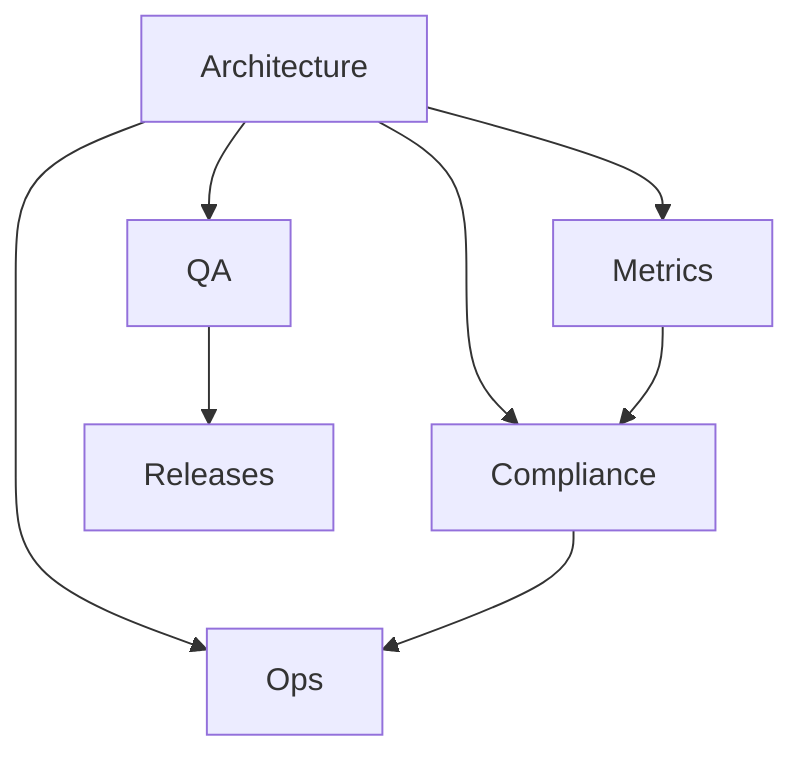

# システム設計ポータル

本ドキュメントは「設計 → 実装 → 品質保証 → リリース → 運用 → 監査・法令対応」まで、全工程を一元管理するためのポータルです。

## 全体構成（Mermaid）

---

## カテゴリ別ガイド（カードリンク）

::: cards

- [設計・構造・セキュリティ — Architecture](architecture/system-map.md)
    - システム全体像・フロー・RBAC・脅威分析・環境変数・スケジュール設計
- [品質保証・レビュー — QA](qa/qa-guide.md)
    - 開発プロセス・CI基準・テスト戦略・レビュー観点
- [メトリクスと可観測性 — Metrics](metrics/audit-observability.md)
    - 監査メトリクス・E2E検証・SLO・ダッシュボード例
- [リリーステンプレートとQA記録 — Releases](releases/CHANGELOG.template.md)
    - CHANGELOG/metrics.yaml テンプレ・リリース証跡
- [法令・監査対応 — Compliance](compliance/checklist.md)
    - 法令・加算要件・監査チェックリスト・証跡テンプレ
- [運用・復旧・日常管理 — Ops](ops/runbook.md)
    - 障害時トリアージ・復旧手順・運用ノウハウ

:::

---

## はじめに

1. 上記カテゴリから目的に応じて参照してください。
2. 新機能追加時は architecture/flows/ に設計フローを追記し、関連ドキュメントを更新してください。
3. 本ポータルは MkDocs + GitHub Pages で自動公開され、外部監査・運営指導にもそのまま利用できます。

---

## 参考
- [QAガイド](qa/qa-guide.md)
- [監査メトリクス](metrics/audit-observability.md)
- [リリーステンプレ](releases/CHANGELOG.template.md)
- [法令チェックリスト](compliance/checklist.md)
- [運用Runbook](ops/runbook.md)
