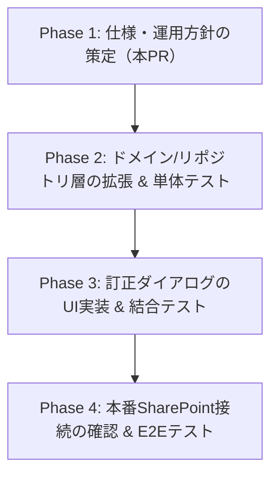

# キオスク端末におけるトイレ記録「訂正」機能の設計と運用方針

本ドキュメントは、現場の生活支援員からのフィードバック（「誤入力をその場で直したい」）に基づき、キオスク端末のトイレ確認画面（`ToiletDailyBoard`）に導入する**記録訂正機能**の仕様と運用上の整合性を定義します。

---

## 1. 「編集」ではなく「訂正」と呼ぶ理由

福祉事業所における支援記録は、障害福祉サービス費の請求根拠（サービス提供実績）や自治体の制度監査（運営指導）における最重要の証跡です。
安易な「修正」「編集」といった表現は、証跡改ざんの疑念を招きやすく、また現場スタッフの記録に対する責任意識（「確定した事実を残す」）を希薄化させる懸念があります。

そのため、UI上の表記およびデータモデル上の概念を**「訂正（Correction）」**に統一します。
* **訂正の定義**: 入力ミスや操作ミスといった「事実と異なる記録」を「正しい事実に直す」行為。
* **監査性への配慮**: 単なる上書き更新であっても、システムログやデータベース上での「初回記録時」と「訂正時」の差分管理（追跡可能性）を将来的に見据えた設計とします。

---

## 2. 仕様定義

現場の使いやすさ（即時変更）とデータ完全性（監査品質）のバランスをとるため、初期版（Phase 1）では以下の制限事項を設けます。

### 2.1 訂正可能な項目（入力ミス発生率が高いもの）
* **種類 (toiletType)**: 「排尿」と「排便」の押し間違い。
* **量 (amount)**: 「少量」と「多量」の誤認。
* **メモ (memo)**: 特記すべき状況の追記、タイポの修正。

### 2.2 訂正不可の項目（記録の完全性を保証するもの）
* **利用者 (userId)**:
  * ⚠️ **利用者の付け替えは一切不可とします。**
  * Aさんの排泄記録を誤ってBさんとして登録してしまった場合、Bさんの記録を訂正するのではなく、Bさんの記録は「削除（または誤記フラグ）」とし、Aさんの記録を「新規登録」し直す運用とします。利用者の付け替えを許容すると、別人のセンシティブな健康データを混同する重大な記録事故につながるリスクがあるためです。
* **記録日時 (occurredAt)**:
  * 排泄が実際にあった時刻は、キオスク端末から「追加記録」時に設定された値（デフォルトは現在時刻、または日付の初期時刻）を維持します。
* **記録日 (recordDate)**:
  * 選択中の日付（または今日の日付）に紐づくため、日付自体の移動は不可とします。
* **削除機能 (delete)**:
  * 初期版ではキオスクのフロントエンドから物理削除する機能は提供しません。監査上、支援の事実が完全に「消滅」することは避けるべきであり、どうしても消去したい場合は、管理者用ポータルからの管理操作または「誤記」メモ追記による運用でカバーします。

### 2.3 対象範囲と動作要件
* **対象データ**: 当日（または選択中の日付）のボード上に表示されているトイレ記録のみ。過去の確定済み記録（数日前など）の遡り訂正はキオスクからは行えません。
* **一覧の再取得**: 訂正情報の保存（APIリクエスト）が成功した直後に、画面全体のトイレ記録一覧を再取得（`refreshRecords`）し、ボード上の「最終記録時間」や「本日の全記録」の表記が即時に書き換わるようにします。

---

## 3. 将来的な監査対応（データモデルの拡張性）

初期版のSharePointリスト定義は変更せず、既存のスキーマで運用を開始しますが、将来的な制度監査対応および不正防止の観点から、以下のフィールドの追加と追跡ログの取得をロードマップに含めます。

| フィールド名 | 型 | 説明 |
|---|---|---|
| `Modified` (既存) | DateTime | 訂正があった最新のタイムスタンプ。 |
| `ModifiedBy` | User / StaffID | 訂正を行った職員の識別子（キオスクログインアカウント、または訂正者指定）。 |
| `CorrectionReason` | Choice | 訂正理由（「選択間違い」「メモ追記」「時間誤り」など）。 |
| `CorrectionHistory` | JSON / Multiple Text | 訂正前のデータ（Before）と訂正後のデータ（After）の履歴ログ。 |

---

## 4. 実装フェーズのロードマップ

影響範囲を抑え、CI/CDパイプラインの安定性を保つため、以下のステップに細分化してPRを作成します。

1. **Phase 1 (本PR)**: 運用方針および本仕様書の合意。
2. **Phase 2 (データ層)**:
   - `IToiletRecordRepository` インターフェースへの `update` メソッド追加。
   - `InMemoryDataProvider` / `SharePointToiletRecordRepository` における訂正処理の実装。
   - `useToiletRecords` フックへの訂正関数（`update`）の露出。
   - 各層のユニットテストによる機能・Timezone安定性の保証。
3. **Phase 3 (UI層)**:
   - 履歴一覧（`ToiletDailyBoard`）の各項目に「訂正（または鉛筆マーク）」アイコンを配置。
   - `openForm` を訂正モード（既存レコードの値をフォームにプレース）で起動するハンドラの実装。
   - 利用者名の読み取り専用化、保存押下時のリポジトリ `update` の呼び出し。
4. **Phase 4 (結合/E2E)**:
   - 本番SharePoint接続における挙動確認。
   - Playwright による「登録 → 一覧表示 → 訂正 → 表示更新」のE2Eスモークテストの追加。
