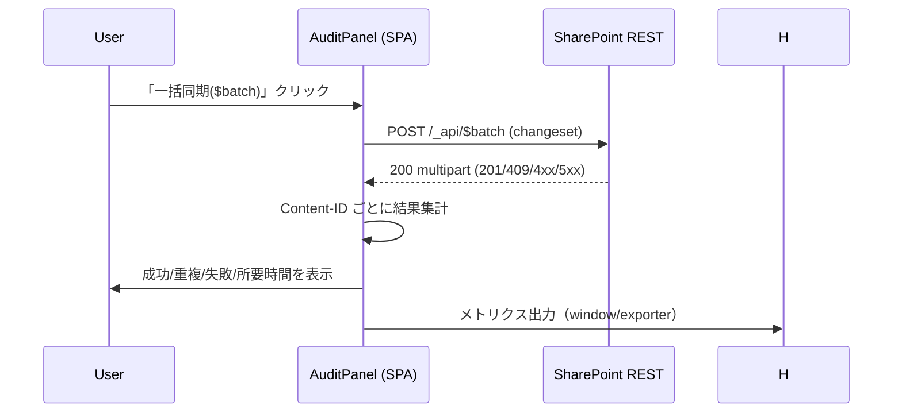

# 目的とスコープ

- **目的**: 「同期できているのか」「失敗の内訳は何か」「再送で回復したか」を**数値で**判定する。
- **範囲**: フロント（SPA）側の UI 指標と、SharePoint 側の結果を集約した**メトリクス面**。
- **非目標**: 個票（PHI 等の実データ）や全文検索。ここでは**件数/率**の健全性に限定。

---

# 1) 用語とイベント種別（Taxonomy）

| 用語 | 意味 |
|---|---|
| **New** | 今回のバッチで新規に作成された件数（201） |
| **Duplicate** | すでに存在（409 `entry_hash` 一意制約）。**成功扱い** |
| **Failed** | リトライ後も失敗した件数（429/5xx/4xx の残存） |
| **Success** | `New + Duplicate` |
| **Total** | 今回送出件数（`Success + Failed`） |
| **DurationMs** | バッチ開始→解析完了までの経過時間 |
| **Categories** | 失敗内訳（`auth / throttle / server / bad_request / not_found / other`） |

> UI では `data-testid="audit-metrics"` の data-* 属性で公開（E2E 用）。  
> 詳細は §4 参照。

---

# 2) 監査メトリクス定義（UI 面）

| ID | メトリクス | 種別 | 取得元 | しきい値（参考） | 備考 |
|---|---|---|---|---|---|
| A1 | `audit.new` | counter | UI 集計 | - | 新規作成件数 |
| A2 | `audit.duplicate` | counter | UI 集計 | - | 冪等成功 |
| A3 | `audit.failed` | counter | UI 集計 | 0 を目標 | 残存は再送対象 |
| A4 | `audit.success.rate` | gauge | UI 集計 | >= 99% | `success/total` |
| A5 | `audit.duration.ms` | histogram | UI 計測 | p95 <= 2000ms | バッチ処理時間 |
| A6 | `audit.fail.category.*` | counter | UI 集計 | throttle, server は徐々に 0 へ | 失敗の型別件数 |

> **SLO 提案**: `A4 >= 99%`（rolling 7d）, `A5 p95 <= 2000ms`（batch size=100 基準）。

---

# 3) 計測ポイント（Mermaid）

```mermaid
flowchart LR
  A[UI: ローカル監査ログ] --> B[バッチ生成 (max 100/chunk)]
  B --> C[POST _api/$batch]
  C --> D[multipart 解析 / Content-ID map]
  D --> E[New/Duplicate/Failed 集計]
  E --> F[UI 表示: audit-metrics]
  E --> G[(メトリクス送出: console / window.__AUDIT_BATCH_METRICS__ / exporter)]
  G --> H[ダッシュボード/アラート]
```



---

# 4) UI 公開インターフェイス（E2E用）

セレクタ: [data-testid="audit-metrics"]
属性（文字列化数値）:

属性	例	意味
data-total	"42"	総件数
data-success	"40"	成功（新規 + 重複）
data-duplicates	"5"	重複成功
data-new	"35"	新規
data-failed	"2"	失敗残
data-duration	"420"	処理時間 ms

各ピル要素には data-metric="new|duplicates|failed" を付与（順序アサートに使用）。

---

# 5) 受け入れ基準（E2E サンプル）

```ts
// tests/e2e/audit-metrics.e2e.ts
import { test, expect } from '@playwright/test';

test('audit metrics snapshot is consistent', async ({ page }) => {
  await page.goto('/audit');               // 同期ボタンのある画面
  // ここでダミーデータ同期をトリガーする操作を実施（省略）

  const m = page.getByTestId('audit-metrics');
  const total = Number(await m.getAttribute('data-total'));
  const success = Number(await m.getAttribute('data-success'));
  const duplicates = Number(await m.getAttribute('data-duplicates'));
  const _new = Number(await m.getAttribute('data-new'));
  const failed = Number(await m.getAttribute('data-failed'));

  // 整合性: success = new + duplicates, total = success + failed
  expect(success).toBe(_new + duplicates);
  expect(total).toBe(success + failed);

  // 参考しきい値: 成功率 >= 99%
  if (total > 0) {
    const rate = success / total;
    expect(rate).toBeGreaterThanOrEqual(0.99);
  }

  // 並び順（UIの視覚順序が変わっていないこと）
  const order = await m.locator('[data-metric]').evaluateAll(ns =>
    ns.map(n => n.getAttribute('data-metric'))
  );
  expect(order).toEqual(['new', 'duplicates', 'failed']);
});
```

---

# 6) バックエンド/構成向けメトリクス（任意）

SharePoint のレスポンスに対してUI 内で集計する前提だが、将来の外部収集も想定し識別キーを定義。

キー	形式	例	説明
batch.id	UUID	a3b2-... 	UI 側生成
batch.size	number	100	送出件数
env.tenant	string	contoso	テナント識別（公開可否は要審査）
env.site	string	/sites/Welfare	サイト相対
scope	string	records/daily	論理スコープ
ts	ISO8601	2025-10-21T09:00:00Z	送出時刻

JSON ペイロード（UI → Exporter 例）

{
  "batch": { "id": "uuid", "size": 42, "durationMs": 420 },
  "counts": { "new": 35, "duplicates": 5, "failed": 2, "success": 40, "total": 42 },
  "categories": { "bad_request": 1, "server": 1 },
  "env": { "tenant": "contoso", "site": "/sites/Welfare", "scope": "records/daily" },
  "ts": "2025-10-21T09:00:00.000Z"
}

---

# 7) しきい値とアラート（ドラフト）

しきい値	条件	期間	アクション
成功率低下	success/total < 0.98	15分連続	Slack 通知（Ops）
失敗継続	failed > 0	3バッチ連続	“失敗のみ再送” リマインド
スロットリング増加	categories.throttle > 0	30分で 3 回以上	VITE_SP_RETRY_BASE_MS 上げ／操作間隔ガイド提示
所要時間悪化	p95 durationMs > 2000	1h	バッチサイズ調整 or 回線確認

---

# 8) 実装ノート（UI）
	• 公開: window.__AUDIT_BATCH_METRICS__（DEV）にスナップショットをエクスポート
	• デバッグログ: VITE_AUDIT_DEBUG=1 で [audit:retry], [sp:retry], [audit:chunk] を出力
	• 冪等性: entry_hash 一意制約により 409 を成功扱い（Duplicate）で集計

---

# 9) トラブルシュート（よくある質問）
	• Q: Duplicate が急増した
A: 同期の再送や二重操作による“冪等成功”。異常ではないが、New の比率低下は要監視。
	• Q: Failed が 0 にならない
A: bad_request 系はデータ不備の可能性。UI で対象行の入力値を点検、サーバ側で列制約を確認。
	• Q: Duration が長い
A: ネットワークレイテンシや SPO 側の負荷。バッチサイズを小さく、再試行ベースを増やす等で緩和。

---

# 10) 参考: Playwright ユーティリティ（再掲）
	• getByTestId('audit-metrics') と data-* 属性でアサート。
	• i18n に依存せず、UI 文言を変更してもテストが壊れにくい。

---

# 付録: 監査メトリクスの“良い”ダッシュボード例（構成）
	• KPI: 成功率 (stacked: New / Duplicate / Failed)
	• 分布: Duration p50/p90/p95
	• アラート: 失敗種別の発生率（auth / throttle / server）
	• トレンド: 1d/7d ローリングで季節性を吸収
