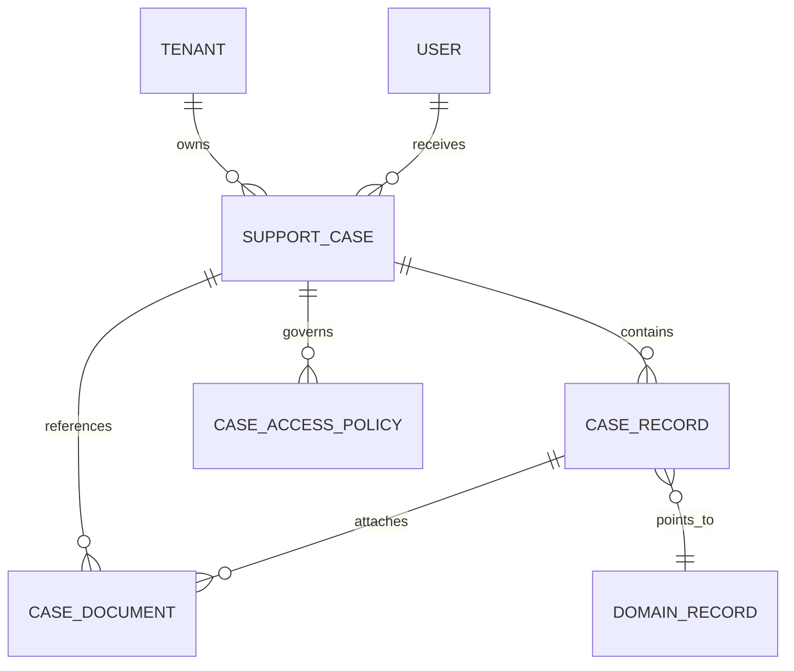

# 他事業所向け最小支援ケースデータモデル

> ステータス: Draft
> 作成日: 2026-06-07
> 対象: SharePointをバックエンドとする事業所共通モデル

## 目的

SharePointの文書フォルダ構成を、そのままアプリのデータ本体にせず、既存のISP三層モデルと共存できる共通索引へ変換する。

## 最小エンティティ

| エンティティ | 責務 | 主な参照先 |
|---|---|---|
| `SupportCase` | 事業所と利用者を結ぶ支援ケース | `Users_Master` |
| `CaseRecord` | 7分類を横断検索する業務記録索引 | 各専門モジュールのレコード |
| `CaseDocument` | SharePoint文書のメタデータと保管先参照 | ドキュメントライブラリ |
| `CaseAccessPolicy` | 分類単位の閲覧・更新・出力・監査要件 | Entra ID / SharePoint権限 |

`CaseRecord`は内容本体を持たない。個別支援計画は`ISP_Master`、モニタリングは`MonitoringMeetings`など、既存の専門モジュールをSSOTとして`sourceModule`と`sourceRecordId`で参照する。

## 7分類の対応

| SharePoint分類 | `CaseRecord.category` | 内容のSSOT候補 |
|---|---|---|
| 個別支援計画 | `individual_support_plan` | `ISP_Master` |
| 計画の進捗と見直し | `monitoring_review` | `MonitoringMeetings` |
| 利用者・家族の意見 | `user_family_intention` | ISPまたは専用意向記録 |
| サービス担当者会議 | `service_team_meeting` | 会議録モジュール |
| アセスメント記録 | `assessment` | アセスメントモジュール |
| 個人情報書類 | `personal_information` | 隔離ドキュメントライブラリ |
| テンプレート・承諾書 | `template_consent` | `SupportTemplates`と文書ライブラリ |

## 関係

## 個人情報書類の境界

`personal_information`は次の条件を必須とする。

1. ファイル本体を標準ライブラリへ置かない。
2. 共通モデルにはファイル内容や個人番号等を複製しない。
3. `restricted_library`への不透明な参照だけを保持する。
4. 閲覧・更新は`privacy_officers`に限定する。
5. 標準エクスポートを無効化する。
6. 閲覧、更新、ダウンロードを監査ログへ記録する。

## SharePoint実装時の最小構成

| 保存先 | 用途 |
|---|---|
| `SupportCases`リスト | `SupportCase` |
| `CaseRecordIndex`リスト | `CaseRecord` |
| `CaseDocumentIndex`リスト | `CaseDocument` |
| 標準ドキュメントライブラリ | 通常文書と事業所テンプレート |
| 制限付きドキュメントライブラリ | 個人情報書類 |

初期段階では`CaseAccessPolicy`をアプリ設定として管理し、事業所別の例外が必要になった時点でリスト化する。SharePointフォルダ名は表示・移行用情報として扱い、業務上の識別子には使用しない。

## SharePoint反映前のRepository境界

ドメイン層は`SupportCaseRepository`だけに依存し、SharePoint REST API、Graph API、リスト名、列名を参照しない。最初のAdapterは`InMemorySupportCaseRepository`とし、同じ契約テストを将来のSharePoint Adapterにも適用する。

Repositoryの全操作は`tenantId`を境界に含める。別事業所の`caseId`が判明しても取得・更新できないことをAdapter共通の契約とする。

文書追加経路は次の2つに分離する。

| メソッド | 許可する文書 | Repositoryが保証すること |
|---|---|---|
| `addDocumentReference` | 個人情報書類以外 | 標準ライブラリへの参照のみ |
| `addRestrictedPersonalDocument` | 個人情報書類のみ | 隔離ライブラリ、`restricted`、監査ログ必須を強制 |

通常追加メソッドの型から`personal_information`を除外し、実行時にも拒否する。個人情報書類用メソッドでは、呼び出し側が保管区分、機密区分、監査要件を指定できない。これにより、型キャストや外部入力で通常経路へ混入した場合も保存を防止する。

この段階では以下を実施しない。

- SharePointリスト・ライブラリの作成
- SharePointまたはGraph Adapterの実装
- 既存文書の移行
- UIの追加
- SharePoint権限の自動設定
