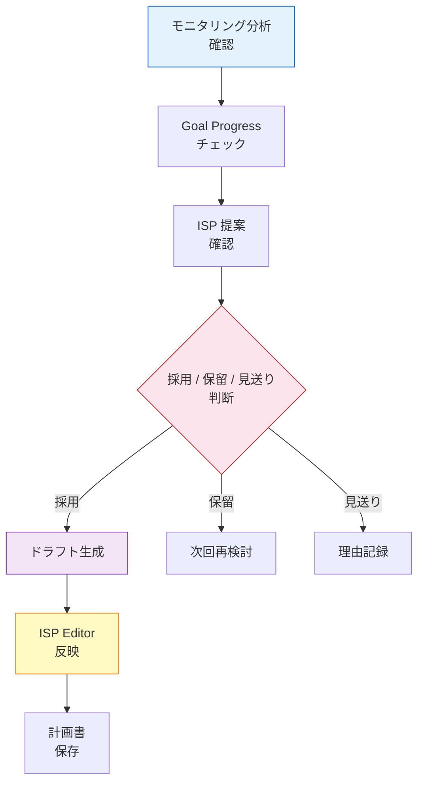
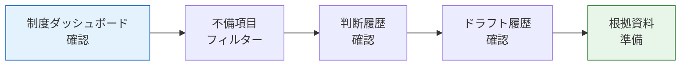
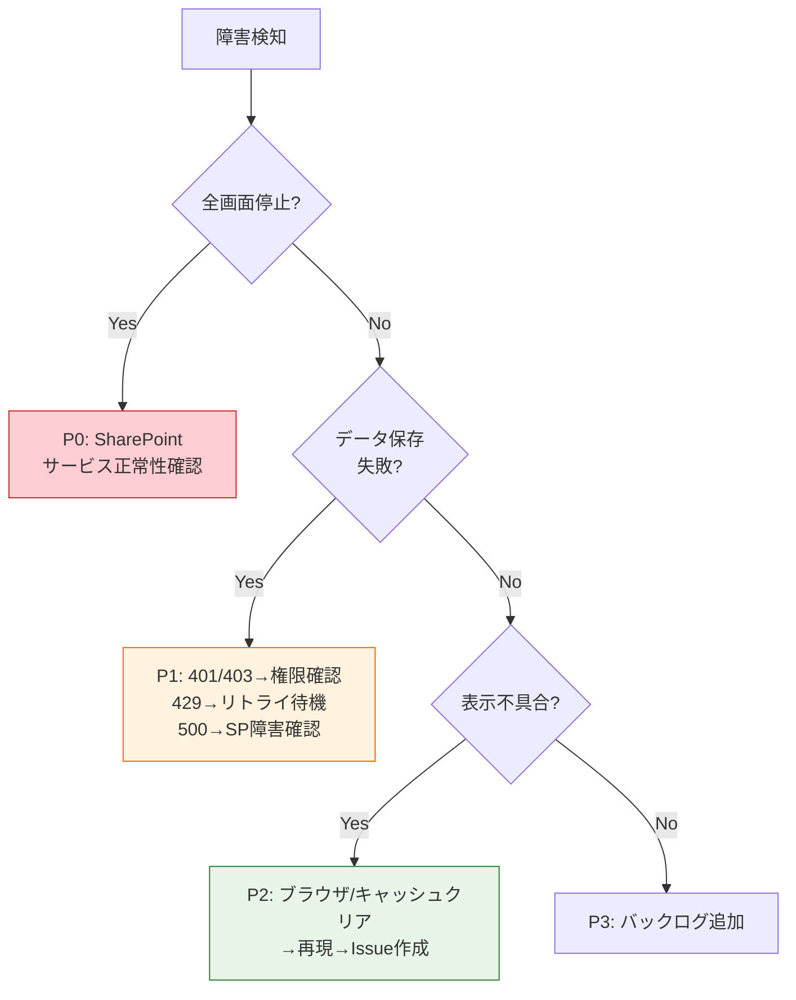

# 業務モデル・運用設計書

> **支援 PDCA OS を「誰が・いつ・どう使うか」を定義するドキュメント**

---

## 1. 利用者ロール定義

| ロール | 主な業務 | 使う機能 | 頻度 |
|---|---|---|---|
| **支援員** | 日次支援の記録・手順実施 | Daily 記録 / 手順書確認 / 行動タグ入力 | 毎日 |
| **サービス管理責任者 (サビ管)** | モニタリング・ISP 更新判断 | 分析ダッシュボード / ISP 提案 / 判断 / ドラフト保存 | 週1〜月1 |
| **管理者** | 全体状況把握・監査対応 | ドラフト履歴 / 制度ダッシュボード / 出席管理 | 月1〜監査時 |
| **開発者 / 運用担当** | システム保守・設定変更 | 環境変数 / SharePoint リスト管理 / CI/CD | 随時 |

---

## 2. 業務フロー

### 日次ルーチン（支援員）

### 週次〜月次ルーチン（サビ管）

### 監査対応（管理者）

---

## 3. 責務分離マップ

| 層 | 責務 | やること | やらないこと |
|---|---|---|---|
| **UI** | 表示と操作受付 | コンポーネント描画・イベントハンドリング・バリデーション表示 | ビジネスロジック・データ永続化 |
| **Hooks** | 画面状態・ユースケース調停 | ローディング管理・エラーハンドリング・Repository 呼び出し | ドメイン計算・直接 API アクセス |
| **Domain** | 純粋計算・ルール | 集計・進捗算出・提案導出・ドラフト生成 | 副作用・状態管理・UI 依存 |
| **Data (Repository)** | 抽象化されたデータアクセス | CRUD インターフェース定義・ファクトリ切替 | 具体的な API 実装 |
| **Infra** | 実装詳細 | SharePoint REST 呼び出し・MSAL 認証・リスト自動作成 | ドメインロジック・UI 定義 |

**判断基準**: 「このコードは SharePoint を知っているか？」

- **No** → Domain or Hooks
- **Yes** → Infra (SharePoint Adapter)

---

## 4. データ保全方針

### 保存先

| データ種別 | 保存先 | 保持期間 | バックアップ |
|---|---|---|---|
| 日次支援記録 | SharePoint `SupportRecord_Daily` | 無期限 | SharePoint 標準 + サイトバックアップ |
| ISP 判断記録 | SharePoint `IspRecommendationDecisions` | 無期限 | 自動作成 + Snapshot 凍結 |
| ドラフト記録 | SharePoint `SupportPlanningSheet_Master` | 無期限 | 自動作成 + Snapshot 凍結 |
| ISP 計画書 | SharePoint `SupportPlans` | 無期限 | SharePoint 標準 |
| 監査ログ | SharePoint `Audit_Events` + localStorage | 90日 (local) / 無期限 (SP) | CSV エクスポート対応 |

### 削除方針

- **原則として削除しない** (追記型イミュータブル)
- 将来的にアーカイブ機能を追加する場合は、論理削除 (`archivedAt` フラグ) で対応
- 物理削除は管理者のみ、SharePoint サイト管理画面から実施

### 復旧

- SharePoint のサイトコレクション復元 (93日以内)
- 判断記録・ドラフトは Snapshot に全情報が含まれるため、個別復元も可能

---

## 5. 環境構成

| 環境 | 用途 | データソース | 認証 |
|---|---|---|---|
| **本番** (`/sites/welfare`) | 実運用 | SharePoint Online | MSAL (Entra ID) |
| **開発** (`localhost:5173`) | 開発・テスト | InMemory / Demo データ | `VITE_SKIP_LOGIN=1` |
| **CI** (GitHub Actions) | 自動テスト | InMemory / Mock | 認証スキップ |

環境切替は `createIspDecisionRepository()` / `createSupportPlanningSheetRepository()` のファクトリ関数で自動判定。

---

## 6. 障害時対応フロー

### レベル定義

| レベル | 条件 | 対応 | 通知先 |
|---|---|---|---|
| **P0** (即時) | データ消失・認証不能・全画面停止 | 即時対応・SharePoint 管理画面確認 | 管理者 + 開発者 |
| **P1** (4h) | 特定画面の表示不能・保存失敗 | リトライ確認・ログ確認 | 管理者 |
| **P2** (24h) | 表示崩れ・軽微な計算誤差 | 次回デプロイで修正 | 開発者 |
| **P3** (計画) | 改善要望・UX 向上 | バックログに追加 | 開発者 |

### トリアージ手順

---

## 7. 属人化回避の設計

| 対策 | 実装 |
|---|---|
| **コードの型安全** | TypeScript strict mode + Zod スキーマ検証 |
| **自動テスト** | 517+ ユニットテスト + E2E スモーク |
| **SharePoint リスト自動作成** | `ensureListExists` で手動構築不要 |
| **環境構築ドキュメント** | `.env.example` + README の Quick Start |
| **ADR (意思決定記録)** | `docs/adr/` に設計判断の背景を記録 |
| **Domain 分離** | 純粋関数で業務ロジックを切り出し、インフラに依存しない |
| **Repository パターン** | SharePoint ↔ InMemory の切替で開発者が SP 知識なしで開発可能 |

---

## 8. 今後の拡張候補

| 機能 | 優先度 | 効果 |
|---|---|---|
| ドラフト差分比較 | ★★★ | 前回 ↔ 今回の変更を可視化 |
| PDF / Word 出力 | ★★★ | 制度報告書の自動生成 |
| AI 所見生成 | ★★☆ | タグ分析 + 進捗から文章を生成 |
| 管理者ダッシュボード | ★★☆ | 全利用者のドラフト状況を一望 |
| 多施設対応 | ★☆☆ | サイトコレクション分離 + テナント管理 |

---

## 9. 関連ドキュメント

| ドキュメント | 内容 |
|---|---|
| [System Architecture (Full)](../architecture/system-architecture-complete.md) | ISP 三層 + ブリッジ + PDCA 全体図 |
| [Support PDCA Engine Overview](../architecture/support-pdca-engine-overview.md) | 1 ページ概要版 |
| [Monitoring Hub Runbook](../ops/monitoring-hub-v1-runbook.md) | モニタリング画面の運用手順 |
| [TodayOps Runbook](../runbook/today-ops-rollout.md) | Today 画面のロールアウト手順 |
| [Feature Catalog](../feature-catalog.md) | 機能一覧 |
