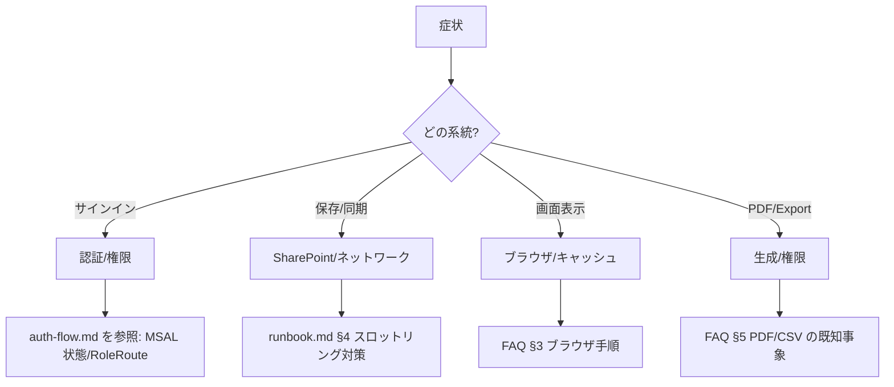

# 目的
現場での不具合を **1ページで素早く切り分け→復旧** するための実務FAQです。  
詳細手順や背景は各ドキュメントへリンクします（auth-flow / runbook / env-config など）。

---

# 0) クイックルーティング（Mermaid）

---

## 1) サインイン/権限まわり

| 症状 | 代表エラー | まずやること | 次の手 |
|---|---|---|---|
| 画面右上が「サインイン」のまま | 401/login_required | 右上のボタンから手動サインイン | ポップアップ許可 / 別ブラウザで再現 |
| サインイン後に 403 で弾かれる | Forbidden / insufficient_claims | ロール（Viewer/Staff/Admin）確認 | auth-flow.md の RoleRoute 到達表を参照 |
| 直リンクが 404/403 | ルートガード | /dashboard から遷移 | RBAC・Feature Flag 確認（schedules 等） |

関連: docs/architecture/auth-flow.md, docs/architecture/rbac.md

---

## 2) 保存/同期（SharePoint/ネットワーク）

| 症状 | 代表エラー | 切り分け | 対処 |
|---|---|---|---|
| 保存が時々失敗する | 429/503/504 | ネットワーク安定性/時間帯 | 再試行（指数バックオフ）/ バッチサイズ縮小 |
| 同期後に重複が増える | 409 (entry_hash) | 冪等成功 | 異常ではない。New 比率低下は監視 |
| 一部だけ失敗が残る | 400系（bad_request等） | データ不備/必須項目 | UIで該当行を修正→「失敗のみ再送」 |

- メトリクス確認: data-testid="audit-metrics"（success/new/duplicates/failed/duration）
- 詳細: docs/metrics/audit-observability.md / docs/ops/runbook.md

---

## 3) 画面が表示されない/おかしい（ブラウザ・キャッシュ）

チェック順（60秒）
1. 強制再読み込み（キャッシュ無効）：Ctrl+Shift+R / Cmd+Shift+R
2. Service Worker の解除：DevTools → Application → Service Workers → Unregister
3. HSTS の掃除（Chrome）：chrome://net-internals/#hsts → Delete domain: localhost
4. 別ブラウザで再現（Edge/Firefox）
5. PWA/HTTP→HTTPS切替後の残骸を疑う（docs/index.md → TLS トラブル項）

---

## 4) 速度が遅い/重い

| 兆候 | 確認 | 対策 |
|---|---|---|
| 体感遅延（特に夕方） | audit.duration.ms p95 | バッチサイズ縮小 / 再試行ベース上げ |
| ネットワーク不安定 | DevTools Network で待ち時間確認 | 回線切替/有線/モバイルルータ |
| 特定画面のみ | Lighthouse 一時測定 | 画像/表の件数/描画最適化を検討 |

---

## 5) PDF/CSV の出力トラブル

| 症状 | 原因候補 | 対処 |
|---|---|---|
| PDF が空白/崩れる | ブラウザ互換/フォント | 別ブラウザで出力 / Webフォント読込を待つ |
| CSV が文字化け | 文字コード | UTF-8/BOM で再出力（Excel取込設定） |
| PDF ダウンロード不可 | ポップアップ/ダウンロード権限 | ブラウザ許可 / 組織ポリシーの例外申請 |

---

## 6) 環境変数/.env の典型ミス

| 症状 | 代表メッセージ | 修正 |
|---|---|---|
| SharePoint 404 _api/web | サイトURL不一致 | VITE_SP_RESOURCE / VITE_SP_SITE_RELATIVE を再設定 |
| 認可スコープ警告 | insufficient_scope | env-config.md のスコープと MSAL 設定を確認 |
| 変数が反映されない | キャッシュ/ビルド | dev サーバ再起動、window.__ENV__ のマージ順を確認 |

関連: docs/architecture/env-config.md

---

## 7) 機能フラグ（Feature Flags）

| フラグ | 既定 | 説明 |
|---|---|---|
| VITE_FEATURE_SCHEDULES | 0 | スケジュール機能の公開切替 |
| VITE_FEATURE_SCHEDULES_GRAPH | 0 | 取得先を Demo→Graph へ |
| （E2E）localStorage["feature:schedules"]="1" | - | テスト時はこれで開通 |

関連: docs/architecture/schedules.md

---

## 8) ローカル運用モード（オフライン）
- 監査ログは端末ローカルに保持、復帰後に一括同期
- 復旧優先: 記録を消さない／「失敗のみ再送」で回復
- 手順: docs/local-mode.md（SOP/バックアップ/復元）

---

## 9) 重大度/連絡フロー（簡易）

| Sev | 事象 | 連絡 | 目安 |
|---|---|---|---|
| 1 | サインイン不可・全CRUD不可 | 管理者＋MSサービス正常性 | 即時/全体影響 |
| 2 | 保存不可が散発・連続429 | 管理者 | 30分継続 |
| 3 | 個別端末の表示不良 | 拠点IT/ヘルプデスク | 切替で回避可 |

詳細: docs/ops/runbook.md

---

## 10) よくある質問（FAQ）

Q. as const でTS/ESLintがエラー  
A. src/testids.ts は Object.freeze 方式で解消。tid() を使って data-testid を付与。

Q. 直リンクが弾かれる  
A. Guard順序（ProtectedRoute→RoleRoute）とロールを確認。auth-flow.md / rbac.md を参照。

Q. Duplicate が多い  
A. 409（一意制約）は冪等成功扱い。異常ではないが New 比率は監視。

---

## 参照リンク
- 設計ポータル: docs/index.md
- 認証・権限: docs/architecture/auth-flow.md, docs/architecture/rbac.md
- 環境変数: docs/architecture/env-config.md
- スケジュール: docs/architecture/schedules.md
- 監査メトリクス: docs/metrics/audit-observability.md
- 運用: docs/ops/runbook.md
