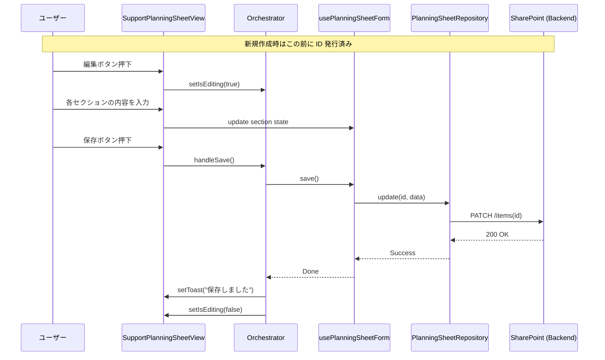

# 支援計画シート（L2）記録フロー・ウォークスルー
— planning-sheet-list から SharePoint 保存完了まで —

本ドキュメントでは、`http://localhost:5173/planning-sheet-list` から始まり、強度行動障害支援計画シート（L2）の入力・記録が完了するまでのシステムフローを解説します。

## 1. エントリポイント：一覧画面
**URL**: `/planning-sheet-list`  
**Page Component**: `PlanningSheetListPage.tsx`

1.  **利用者選択**: `UserSelectionGrid` コンポーネントにて対象の利用者を選択します。
2.  **データの取得**: `usePlanningSheetListOrchestrator` が起動し、`PlanningSheetRepository` を通じて当該利用者のシート一覧を取得します。
3.  **遷移選択**:
    *   **新規作成**: `handlers.onNewSheet` が呼ばれます。**詳細入力前に SharePoint 側へ初期レコードを作成し、その ID を `planningSheetId` として詳細画面へ遷移します。** そのため、詳細画面に入った時点で SharePoint 上に空レコード（または基本情報のみのレコード）が既に存在します。
    *   **既存編集**: テーブルの行をクリックすると `handlers.onNavigateToSheet` が呼ばれ、詳細画面へ遷移します。

## 2. 詳細画面：入力・構成
**URL**: `/support-planning-sheet/:planningSheetId`  
**Page Component**: `SupportPlanningSheetPage.tsx`

この画面は **L2 スクリーン責務境界パターン（Orchestrator パターン）** に基づき、以下の 3 層構造で動作します。

### A. オーケストレーター (`useSupportPlanningSheetOrchestrator`)
*   **状態管理**: `isEditing`（編集モード）の状態や、選択中のタブ `activeTab` を管理します。
*   **データ収集**: 支援記録（ABC記録）や氷山分析（PDCA）のデータをバックエンドから取得し、ViewModel へ供給します。
*   **ブリッジ接続**: `assessmentBridge` などを介して、アセスメント情報から支援設計への「根拠」の紐付けを仲介します。

### B. フォーム・ロジック (`usePlanningSheetForm`)
*   **スキーマ管理**: `SupportPlanningSheet` ドメインモデルに基づき、`intake`、`assessment`、`planning`（支援設計）の各セクションを構造化された状態で保持します。

### C. ビュー (`SupportPlanningSheetView`)
*   **モード切替**: 「編集」ボタン押下で `isEditing` が true になり、入力が可能になります。

## 3. 記録プロセス：永続化
1.  **保存アクション**: ユーザーがヘッダーの「保存」ボタンをクリックします。
2.  **ハンドラ実行**: オーケストレーターの `handleSave` が `form.save()` を呼び出します。
3.  **リポジトリ経由の書き込み**:
    *   `DataProviderPlanningSheetRepository.update()` が実行されます。
    *   内部で `DataProvider.updateItem`（SharePoint API への PATCH リクエスト）が呼ばれ、サーバーへデータが送信されます。

### 記録完了の定義
**SharePoint への PATCH が成功し、保存成功トーストが表示され、編集モードが解除された状態** を「記録完了」と定義します。

## 4. 異常系への対応

| 異常系シナリオ | 挙動 / 対策 |
| :--- | :--- |
| **保存失敗・通信失敗** | 保存に失敗した場合は、エラートーストを表示し、**編集モードを維持**します。これにより、入力内容を失わずに通信環境の復旧を待って再試行することが可能です。 |
| **権限不足** | 閲覧権限はあるが編集権限がない場合、画面上部に警告が表示される、または「編集」ボタンが無効化（もしくは非表示）になります。実際の編集可否は画面側の権限制御に従います。 |
| **編集中離脱** | ブラウザを閉じたり、保存せずに一覧へ戻ろうとした場合、未保存変更がある場合は「変更が保存されない可能性があります」という警告（BeforeUnload ガード）を表示する設計です。未実装の場合は、今後の安全対策として追加対象になります。 |

---

> [!NOTE]
> **ISPガイド（L1）との挙動の違いについて**
> `SupportPlanGuidePage`（個別支援計画ガイド）では `localStorage` を利用した **オートセーブ機構**（「最新の状態です」の表示）が実装されていますが、本機能（L2 支援計画シート）は SharePoint への直接保存を基本とするため、**手動保存ボタンによる確実な記録** を採用しています。

## データの流れ図 (Mermaid)

