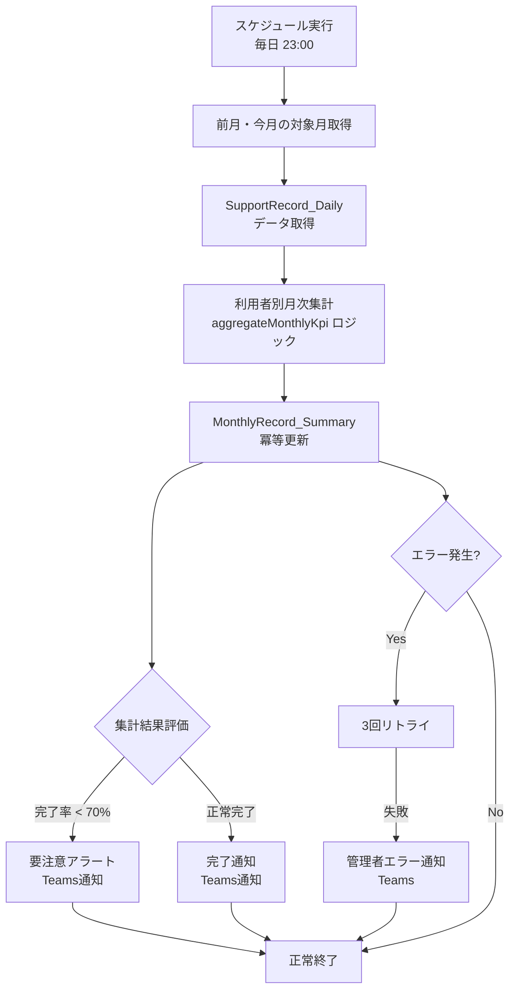

# Power Automate 月次再集計フロー設計書

## 概要

毎日夜間（午後11時）に自動実行される月次記録集計フローです。`aggregateMonthlyKpi` と同等の集計処理をPower Automate で実装し、SharePoint統合、Teams通知、リトライ機能を含みます。

## アーキテクチャ



## フロー仕様

### 1. トリガー設定

- **種類**: スケジュール実行（Recurrence）
- **実行時刻**: 毎日 午後11:00（JST）
- **タイムゾーン**: Asia/Tokyo
- **週末実行**: 有効（土日も実行）

### 2. 集計対象月の決定

```javascript
// Power Automate 式
// 今月と前月を対象とする
utcNow() // 現在時刻
formatDateTime(utcNow(), 'yyyy-MM') // 今月 (2025-11)
formatDateTime(addDays(utcNow(), -30), 'yyyy-MM') // 前月 (2025-10)
```

### 3. SupportRecord_Daily データ取得

**SharePoint REST API クエリ:**

```http
GET https://[tenant].sharepoint.com/sites/[site]/_api/web/lists/GetByTitle('SupportRecord_Daily')/items?
$select=UserId,cr013_recorddate,Completed,Incident,cr013_specialnote
&$filter=(
  (startswith(cr013_recorddate, '2025-11') or startswith(cr013_recorddate, '2025-10'))
)
&$orderby=UserId,cr013_recorddate
&$top=5000
```

### 4. aggregateMonthlyKpi ロジック実装

#### A. 稼働日数計算（Power Automate版）

```javascript
// 月の稼働日数を計算（土日祝日除外）
// ※ 祝日配列は定数として定義
variables('holidays_2025_11') // ['2025-11-03', '2025-11-23']

// startOfMonth, endOfMonth の計算
startOfMonth(variables('targetYearMonth'))
endOfMonth(variables('targetYearMonth'))

// 稼働日カウントは、1日ずつループして土日祝日をスキップ
// Power Automate の Apply to each + Condition で実装
```

#### B. KPI集計ロジック

利用者別（UserId）× 月別（YearMonth）でグループ化し、以下を集計：

```javascript
// 集計値の計算
{
  "totalDays": 22,           // 月の稼働日数
  "completedCount": 380,     // Completed=true の件数
  "pendingCount": 25,        // Completed=false の件数
  "emptyCount": 13,          // レコード存在しない日数
  "specialNoteCount": 8,     // cr013_specialnote 非空の件数
  "incidentCount": 2,        // Incident=true の件数
  "workingDays": 22,         // 計算された稼働日数
  "completionRate": 90.91    // (completedCount / totalDays) * 100
}
```

### 5. MonthlyRecord_Summary 冪等更新

#### Key フィールドでの冪等性

```javascript
// Unique Key の生成
concat(variables('userId'), '_', variables('yearMonth'))
// 例: "I001_2025-11"
```

#### SharePoint 更新処理

```http
POST https://[tenant].sharepoint.com/sites/[site]/_api/web/lists/GetByTitle('MonthlyRecord_Summary')/items

// 新規作成時
{
  "Key": "I001_2025-11",
  "UserId": "I001",
  "YearMonth": "2025-11",
  "TotalDays": 22,
  "WorkingDays": 22,
  "CompletedCount": 380,
  "PendingCount": 25,
  "EmptyCount": 13,
  "SpecialNoteCount": 8,
  "IncidentCount": 2,
  "CompletionRate": 90.91,
  "LastAggregatedAt": "2025-11-06T23:00:00Z"
}

// 既存更新時（PUT または MERGE）
PUT https://[tenant].sharepoint.com/_api/web/lists/GetByTitle('MonthlyRecord_Summary')/items({ItemId})
```

## エラーハンドリング・リトライ

### 1. 自動リトライ設定

- **最大試行回数**: 3回
- **リトライ間隔**: 5分, 10分, 20分（指数バックオフ）
- **リトライ条件**: HTTP 500エラー、タイムアウト、SharePoint throttling

### 2. エラー分類

| エラータイプ | 対処方法 | 通知レベル |
|-------------|---------|-----------|
| データ取得エラー | 3回リトライ | 管理者通知 |
| 計算エラー | スキップして継続 | ログ記録 |
| SharePoint更新エラー | 3回リトライ | 管理者通知 |
| 想定外エラー | 即座に停止 | 緊急通知 |

## Teams通知設計

### 1. 完了通知（正常終了時）

```json
{
  "type": "message",
  "attachments": [{
    "contentType": "application/vnd.microsoft.card.adaptive",
    "content": {
      "type": "AdaptiveCard",
      "version": "1.0",
      "body": [
        {
          "type": "TextBlock",
          "text": "月次記録集計完了",
          "weight": "Bolder",
          "size": "Medium"
        },
        {
          "type": "FactSet",
          "facts": [
            {"title": "実行日時", "value": "2025-11-06 23:00"},
            {"title": "対象月", "value": "2025-10, 2025-11"},
            {"title": "処理利用者数", "value": "45名"},
            {"title": "要注意者", "value": "3名 (完了率70%未満)"},
            {"title": "実行時間", "value": "2分30秒"}
          ]
        }
      ],
      "actions": [
        {
          "type": "Action.OpenUrl",
          "title": "月次記録を確認",
          "url": "https://[app-url]/records/monthly"
        }
      ]
    }
  }]
}
```

### 2. 要注意アラート（完了率70%未満）

```json
{
  "type": "message",
  "attachments": [{
    "contentType": "application/vnd.microsoft.card.adaptive",
    "content": {
      "type": "AdaptiveCard",
      "version": "1.0",
      "body": [
        {
          "type": "TextBlock",
          "text": "⚠️ 月次記録完了率要注意",
          "weight": "Bolder",
          "size": "Medium",
          "color": "Warning"
        },
        {
          "type": "TextBlock",
          "text": "以下の利用者の完了率が70%を下回っています:"
        },
        {
          "type": "FactSet",
          "facts": [
            {"title": "田中太郎", "value": "65.2% (2025-11)"},
            {"title": "佐藤花子", "value": "58.8% (2025-11)"},
            {"title": "鈴木次郎", "value": "42.1% (2025-11)"}
          ]
        }
      ],
      "actions": [
        {
          "type": "Action.OpenUrl",
          "title": "詳細確認",
          "url": "https://[app-url]/records/monthly?filter=low"
        }
      ]
    }
  }]
}
```

### 3. エラー通知（管理者向け）

```json
{
  "type": "message",
  "attachments": [{
    "contentType": "application/vnd.microsoft.card.adaptive",
    "content": {
      "type": "AdaptiveCard",
      "version": "1.0",
      "body": [
        {
          "type": "TextBlock",
          "text": "🚨 月次記録集計エラー",
          "weight": "Bolder",
          "size": "Medium",
          "color": "Attention"
        },
        {
          "type": "FactSet",
          "facts": [
            {"title": "エラー発生時刻", "value": "2025-11-06 23:05"},
            {"title": "実行ID", "value": "abc123-def456-ghi789"},
            {"title": "エラー内容", "value": "SharePoint throttling limit exceeded"},
            {"title": "リトライ回数", "value": "3/3 (上限到達)"},
            {"title": "影響範囲", "value": "利用者データ 12名分未処理"}
          ]
        }
      ],
      "actions": [
        {
          "type": "Action.OpenUrl",
          "title": "フロー履歴確認",
          "url": "https://make.powerautomate.com/flows/[flow-id]/runs"
        }
      ]
    }
  }]
}
```

## パフォーマンス最適化

### 1. バッチ処理

- **利用者グループ**: 10名ずつのバッチで処理
- **並列実行**: Apply to each の設定で並列度=3
- **SharePoint API制限**: 1分間600リクエスト以内

### 2. データ取得最適化

```javascript
// 効率的なフィルタリング
$filter=(
  (cr013_recorddate ge '2025-10-01T00:00:00Z' and cr013_recorddate le '2025-11-30T23:59:59Z')
  and UserId ne null
)
&$select=UserId,cr013_recorddate,Completed,Incident,cr013_specialnote
&$orderby=UserId asc,cr013_recorddate asc
&$top=5000
```

### 3. 冪等性とキャッシュ

- **Key フィールド**: EnforceUniqueValues=true で重複防止
- **LastAggregatedAt**: 更新時刻で処理済み判定
- **差分更新**: 変更があった場合のみ更新

## 監視・メトリクス

### 1. 成功率指標

- **実行成功率**: 95%以上を目標
- **処理時間**: 平均5分以内
- **データ整合性**: 手動集計との差分1%以内

### 2. アラート条件

- 3回連続実行失敗
- 処理時間10分超過
- 完了率70%未満の利用者が10名以上

### 3. 運用レポート

- 週次: 実行状況サマリー
- 月次: パフォーマンス分析
- 四半期: 改善提案

## 次期実装予定

1. **マルチテナント対応**: 複数施設での利用
2. **カスタム祝日管理**: SharePointリストでの祝日設定
3. **リアルタイム集計**: Change eventトリガー対応
4. **機械学習連携**: 完了率予測モデル統合

---

## 付録: aggregateMonthlyKpi マッピング

| TypeScript関数 | Power Automate実装 |
|---------------|-------------------|
| `getWorkingDaysInMonth()` | Apply to each + 土日祝日判定 |
| `records.filter()` | SharePoint $filter query |
| `records.reduce()` | Apply to each + Variables increment |
| `Math.round()` | div() + mul() 関数 |
| `Object.entries()` | Parse JSON + Apply to each |
