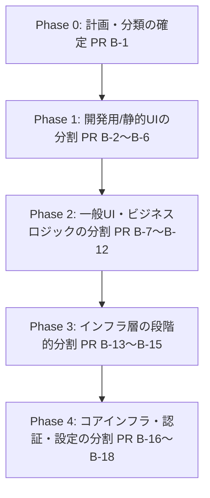

# 📊 巨大ファイル（17件）の分類・優先順位付き分割計画書

## 1. はじめに
Nightly Patrol における最重要品質指標の一つである「巨大ファイル（600行以上）」の件数は、現在 **17件** 検知されています。このため、システムの健康度スコア（Health Score）は大きく減点され `11 / 100` (Grade F) と低迷しています。

本計画書は、健康度スコアの回復とシステム全体の保守性向上のため、17件の巨大ファイルを以下の4つの領域に分類し、影響度が低く安全に進められる順（リスクの低い順）に段階的な分割を実施するためのロードマップを定義したものです。

---

## 2. 巨大ファイル17件の分類と現状分析

現在検知されている巨大ファイルを**「UIコンポーネント」「domain/logic」「repository/infra」「app/config」**の4象限に分類しました。

### ① UIコンポーネント（計10件）
ユーザーインターフェースを描画するReactコンポーネントです。一部の開発用ツールやスタティックページは本番機能への影響度が低く、最優先（低リスク）で取り組むことができます。

| ファイルパス | 行数 | 影響・リスク | 主な責務・分割方針 |
|:---|:---:|:---:|:---|
| `src/pages/SupportPlanGuidePage.tsx` | 603 | 🟢 極小 | 福祉支援計画のガイド表示（静的コンテンツ）。<br>→ ガイド文章のJSON/Markdown化と、表示ロジックへの分離。 |
| `src/debug/HydrationHud.tsx` | 626 | 🟢 極小 | 開発用ハイドレーション確認HUDツール。<br>→ サブパネル（Telemetry、Stateログ）をコンポーネント分割。 |
| `src/debug/SpDevPanel.tsx` | 806 | 🟢 極小 | 開発用SharePointダミーデータ操作パネル。<br>→ 各タブ（Token操作、List操作）を独立コンポーネント化。 |
| `src/pages/HealthPage.tsx` | 681 | 🟢 低 | システム診断ダッシュボード画面。<br>→ 指標チャート、チェックリストなどのパネルをコンポーネント分割。 |
| `src/features/diagnostics/health/HealthDiagnosisPage.tsx` | 786 | 🟢 低 | システム健康状態診断詳細画面。<br>→ 診断ログビュワー、チャート等をコンポーネント分割。 |
| `src/features/ibd/analysis/iceberg/IcebergDetailSidebar.tsx` | 800 | 🟡 中 | Icebergインシデント詳細のサイドバーUI。<br>→ 表示用パネルと、アクション・フォーム類への分離。 |
| `src/features/today/transport/TransportStatusCard.tsx` | 719 | 🟡 中 | 当日運行状況表示カードUI。<br>→ ヘッダー、ステータス、ルートリスト等のサブコンポーネント化. |
| `src/pages/TimeBasedSupportRecordPage.tsx` | 613 | 🟡 中 | タイムライン式支援記録入力画面。<br>→ タイムライン表示部、編集用モーダル、フックへの分離。 |
| `src/features/monitoring/components/MonitoringMeetingForm.tsx` | 629 | 🟡 中 | モニタリング会議記録作成フォーム。<br>→ サブフォーム（参加者、記録、署名）への分離。 |
| `src/app/ProtectedRoute.tsx` | 619 | 🔴 高 | 認証ガードおよびルーティング・ローディング制御。<br>→ MSAL状態監視フック、ローディング表示、ロギングへの分離。 |

### ② domain/logic（計2件）
ビジネスロジックやドメイン知識を表す純粋関数・ヘルパー群です。

| ファイルパス | 行数 | 影響・リスク | 主な責務・分割方針 |
|:---|:---:|:---:|:---|
| `src/features/planning-sheet/tokuseiBridgeBuilders.ts` | 610 | 🟡 中 | 特性確認シートデータの変換・マッパーロジック。<br>→ 各評価領域（Tokusei）ごとのマッパー分離。 |
| `src/features/transport-assignments/domain/transportAssignmentDraft.ts` | 881 | 🟡 中 | 送迎割り当て下書きの計算および最適化ロジック。<br>→ バリデーション、席最適化アルゴリズム、状態遷移の分離。 |

### ③ repository/infra（計4件）
SharePoint APIやREST APIなどの外部データストアとの接続を担うインフラストラクチャ層です。

| ファイルパス | 行数 | 影響・リスク | 主な責務・分割方針 |
|:---|:---:|:---:|:---|
| `src/features/diagnostics/drift/infra/SharePointDriftEventRepository.ts` | 725 | 🟡 中 | SharePointを用いたドリフトイベント記録の永続化。<br>→ リストスキーマ定義、行マッパー、データ取得ロジックの分離。 |
| `src/lib/sp/helpers.ts` | 658 | 🔴 高 | SharePoint API操作の共通ユーティリティ群。<br>→ クエリビルダー、エラーハンドラー、応答マッパーへのモジュール化。 |
| `src/features/daily/infra/Legacy/SharePointDailyRecordRepository.ts` | 669 | 🔴 高 | レガシーな日報データ永続化リポジトリ。<br>→ 膨大な列マッパー関数の切り出し、読込・書込処理の分離。 |
| `src/features/users/infra/RestApiUserRepository.ts` | 874 | 🔴 高 | ユーザー・組織データ取得リポジトリ。<br>→ キャッシュ制御、APIペイロードマッパー、クエリ実行の分離。 |

### ④ app/config（計1件）
アプリケーション全体の設定値やルーティングマップなどの定義ファイルです。

| ファイルパス | 行数 | 影響・リスク | 主な責務・分割方針 |
|:---|:---:|:---:|:---|
| `src/app/hubs/hubDefinitions.ts` | 815 | 🔴 高 | 各事業所（Hub）のメニュー、権限、アクセス定義。<br>→ 静的な定義配列（JSON等）と、権限判定などのロジックへの分離。 |

---

## 3. リファクタリング実行計画（ロードマップ）

リファクタリング中の本番環境およびテスト環境の安全性を確保するため、以下の**5段階（Phase）**に分けてPRを順次作成します。



### 【現在地】PR B-1 (Phase 0)
* **目的**: 本計画書の追加による方針合意および健康度スコア改善のスタートライン設定。

### Phase 1: 開発用ツール・静的UIコンポーネントの分割（低リスク）
本番の主要業務プロセスに直接影響しない開発用HUDやスタティックガイドページを分割します。
1. **PR B-2**: `src/pages/SupportPlanGuidePage.tsx` の表示要素分離
2. **PR B-3**: `src/debug/HydrationHud.tsx` のサブパネルコンポーネント化
3. **PR B-4**: `src/debug/SpDevPanel.tsx` のタブ切り出し
4. **PR B-5**: `src/pages/HealthPage.tsx` のパネル分割
5. **PR B-6**: `src/features/diagnostics/health/HealthDiagnosisPage.tsx` のモジュール化

### Phase 2: 業務UIおよびビジネスロジックの分割（中リスク）
1ファイルで状態管理、APIコール、子描画を抱えているUIコンポーネントと、それらに紐づく変換・ドメイン計算コードを整理します。
1. **PR B-7**: `src/features/ibd/analysis/iceberg/IcebergDetailSidebar.tsx` の分離
2. **PR B-8**: `src/features/today/transport/TransportStatusCard.tsx` の分離
3. **PR B-9**: `src/pages/TimeBasedSupportRecordPage.tsx` の Hook/UI 分離
4. **PR B-10**: `src/features/monitoring/components/MonitoringMeetingForm.tsx` のサブコンポーネント化
5. **PR B-11**: `src/features/planning-sheet/tokuseiBridgeBuilders.ts` の領域別マッパー分割
6. **PR B-12**: `src/features/transport-assignments/domain/transportAssignmentDraft.ts` の計算・型・ユーティリティ分離

### Phase 3: インフラ・リポジトリ層の分割（中〜高リスク）
SharePoint や API 呼び出しを行う中間リポジトリのスキーママッパーやデータアクセス処理を綺麗にします。
1. **PR B-13**: `src/features/diagnostics/drift/infra/SharePointDriftEventRepository.ts` の分割
2. **PR B-14**: `src/features/daily/infra/Legacy/SharePointDailyRecordRepository.ts` の列マッパー分離
3. **PR B-15**: `src/features/users/infra/RestApiUserRepository.ts` のキャッシュ・データアクセス分離

### Phase 4: アプリケーションコア・共通インフラ層の分割（高リスク）
アプリケーション全体が依存する認証ガード、ルーティング定義、共通ユーティリティを分離します。
1. **PR B-16**: `src/app/ProtectedRoute.tsx` の認証監視・UI分離
2. **PR B-17**: `src/lib/sp/helpers.ts` のモジュール分解
3. **PR B-18**: `src/app/hubs/hubDefinitions.ts` の定義・ロジック分離

---

## 4. 品質保証と安全対策（Guardrails）

リファクタリングによる先祖返りや不具合の混入を防ぐため、以下のテストおよび検証ゲートを厳密に遵守します。

### 各PR実行時の検証手順 (Command Gate)
各PRでリファクタリングを実行するたび、ローカルで以下の検証コマンドを実行し、完全な正常終了を確認します。
1. **型チェックの実行**:
   ```bash
   npm run typecheck
   ```
2. **単体/結合テストの実行**:
   ```bash
   npx vitest run
   ```
3. **カバレッジの担保確認**:
   カバレッジに著しい低下がないことを確認します。

### 安全のためのルール（Golden Rules）
* **振る舞いは変えない**: バグ修正や新機能の追加をリファクタリングと同時に行わない。
* **テストを先行配置**: テストコードが存在しないか不十分な箇所は、分割に着手する前に既存コードに対してテストを追加する。
* **小さなPR**: 1つのPRで同時に複数のファイルをリファクタリングしない。必ず1ファイルずつ、または明確に関連するヘルパーのみを対象にする。
