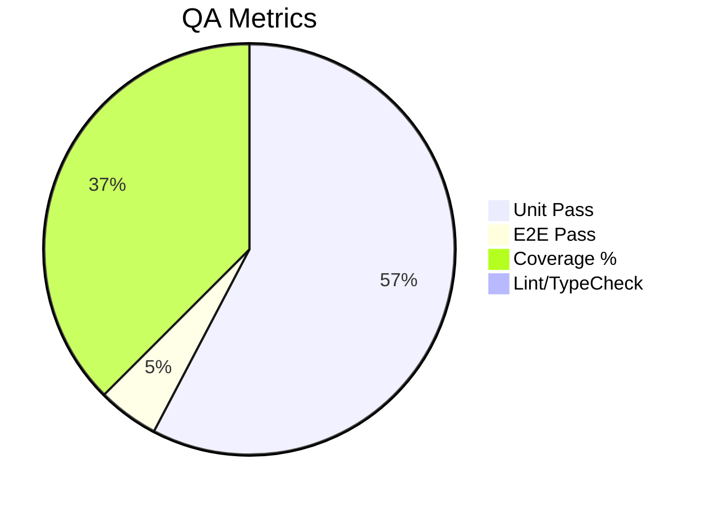

# CHANGELOG — リリース履歴テンプレート

## 目的
- 各リリースの変更点・品質・メトリクスを一元管理し、CI/CD・監査証跡・運用報告に活用する。

---

## 1) リリース概要

- バージョン: vX.Y.Z
- リリース日: YYYY-MM-DD
- 担当: @github-id
- 関連Issue/PR: #123, #456

---

## 2) 変更点（Conventional Commits 準拠）

### Features
- feat: ...

### Fixes
- fix: ...

### Docs/Chore
- docs: ...
- chore: ...

---

## 3) 品質メトリクス（metrics.yaml 参照）

| 種別 | 結果 | しきい値 | 備考 |
|---|---|---|---|
| TypeCheck | pass | 失敗ゼロ |  |
| Lint | pass | 失敗ゼロ |  |
| Unit | 120/120 | 100% |  |
| Coverage | 78% | ≥70% |  |
| E2E Smoke | pass | 主要ルート到達 |  |
| Build | pass | 成功 |  |
| Docs | pass | Mermaid表示OK |  |

---

## 4) メトリクス可視化（Mermaid）

---

## 5) 既知の課題・リスク
- [ ] Flaky test: ...
- [ ] Coverage未達: ...
- [ ] Feature Flag: ...

---

## 6) リリース判定
- [x] CI全緑
- [x] ドキュメント更新
- [x] ロールバック手順確認

---

## 7) 参考
- [metrics.yaml](./metrics.template.yaml)
- [qa-guide.md](../qa/qa-guide.md)
- [audit-observability.md](../metrics/audit-observability.md)
