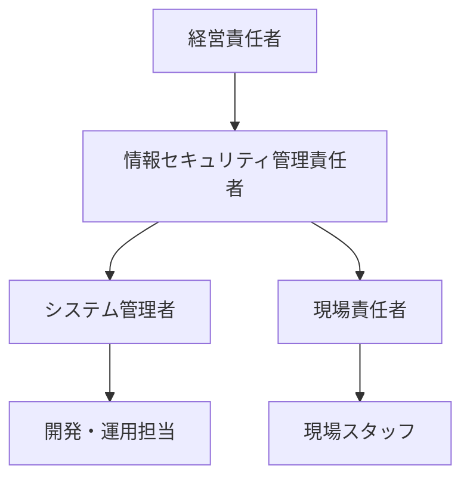

# 情報セキュリティ基本方針（Security Policy）

## 1. 目的
- 本方針は、利用者データ・職員情報・システム資産の**機密性・完全性・可用性**を確保し、法令・契約・社会的責任を果たすことを目的とします。
- ISO/IEC 27001（ISMS）および関連法令（個人情報保護法等）に準拠します。

---

## 2. 適用範囲
- 本システム（Audit Management System）および関連する全ての情報資産・利用者・職員・委託先を対象とします。

---

## 3. 基本原則
1. **機密性**：利用者・職員の個人情報、業務データを厳格に保護する
2. **完全性**：記録・監査ログ・設定情報の正確性を維持する
3. **可用性**：必要な時に必要な情報資産を利用可能に保つ
4. **法令遵守**：個人情報保護法・障害福祉サービス基準等を遵守
5. **継続的改善**：リスク評価・監査・教育を通じて体制を継続的に改善

---

## 4. 組織体制（Mermaid）

---

## 5. 情報資産の管理
- 資産台帳を整備し、システム・データ・アカウント・端末を管理
- アクセス権限（RBAC）を最小権限で設定し、定期的に見直し
- バックアップ・災害対策を実施（runbook.md参照）

---

## 6. セキュリティ対策
- 認証：MSAL/Azure ADによる多要素認証、セッション管理
- 通信：TLS/HTTPS必須、API/DB暗号化
- ログ：監査ログ・操作証跡を取得し、改ざん防止
- 脆弱性管理：依存パッケージ・OSの定期アップデート
- インシデント対応：runbook.mdに従い即時報告・復旧

---

## 7. 教育・訓練
- 職員・開発者に対し、年1回以上の情報セキュリティ教育を実施
- 新規メンバーには必ず本方針・運用ルールを説明

---

## 8. 違反・インシデント対応
- 違反・事故発生時は速やかに管理責任者へ報告し、再発防止策を講じる
- 重大インシデントは経営責任者・関係当局へ報告

---

## 9. 継続的改善
- 年1回以上のリスク評価・内部監査を実施し、必要に応じて方針を改定
- 監査結果・改善アクションは audit/summary.md に記録

---

## 10. 参考・関連ドキュメント
- [architecture/threat-model.md](../architecture/threat-model.md)
- [architecture/rbac.md](../architecture/rbac.md)
- [compliance/checklist.md](../compliance/checklist.md)
- [ops/runbook.md](../ops/runbook.md)
- [audit/summary.md](../audit/summary.md)
