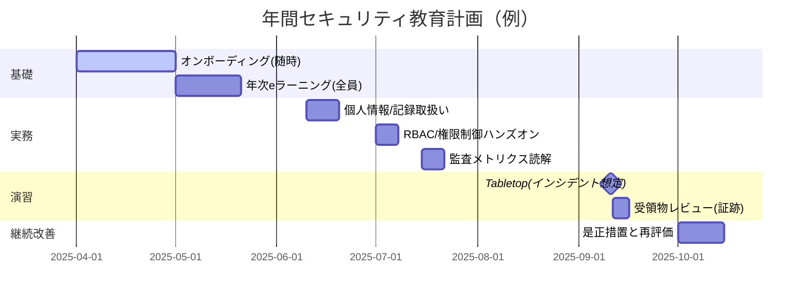
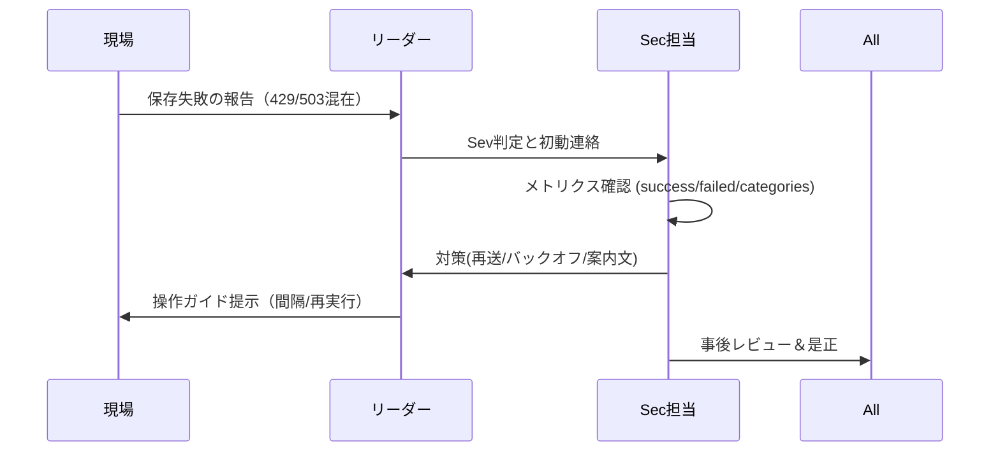

# 目的と適用範囲
- **目的:** 職員/委託先を含む関係者が、情報資産を適切に取り扱うための知識・手順を体系的に習得する。
- **範囲:** 本システム（React + SharePoint）運用に関与する職員、非常勤、委託先、管理者。
- **前提:** `docs/security/policy.md`, `docs/architecture/threat-model.md`, `docs/compliance/checklist.md` に準拠。

---

# 組織体制と責任（RACI）

```mermaid
flowchart LR
  A[セキュリティ責任者(CISO/担当)]:::lead --策定/承認--> B[教育計画]
  A --監督--> C[インシデント対応訓練]
  D[各部門管理者] --受講促進/ローカル手順--> E[現場チーム]
  A --監査/是正--> F[改善計画]
  classDef lead fill:#264653,stroke:#1e1e1e,color:#fff;
```

| 活動 | CISO/担当 | 管理者 | 現場チーム | 情シス/IT | 監査 |
|---|---|---|---|---|---|
| 年間教育計画策定 | R/A | C | C | C | C |
| 受講実施・記録 | C | R/A | R | C | I |
| Tabletop（演習）運営 | R/A | C | R | C | I |
| 是正措置の実行 | A | R | R | C | C |
| 監査・報告 | A | C | I | C | R |

R: Responsible / A: Accountable / C: Consulted / I: Informed

---

# 年間計画（ガント・例）



---

# カリキュラム（モジュール構成）

| ID | モジュール | 対応文書 | 目標 | 評価 |
|---|---|---|---|---|
| M1 | 情報セキュリティ基礎/ポリシー | security/policy.md | 基本原則・責任の理解 | 小テスト(≥80%) |
| M2 | 個人情報・記録の取扱い | compliance/checklist.md | 記録保存/持出禁止/廃棄 | 事例クイズ |
| M3 | RBAC/権限制御 | architecture/rbac.md, auth-flow.md | ロール別到達範囲の理解 | 到達マトリクス演習 |
| M4 | 監査メトリクスの読み方 | metrics/audit-observability.md | 成功率/失敗内訳/重複の解釈 | ダッシュボード演習 |
| M5 | データ流通/外部送信禁止 | architecture/data-flow.md | 境界/IF/保管先の把握 | 設問（送信OK/NG） |
| M6 | インシデント初動/報告 | ops/runbook.md, ops/faq.md | Sev判定/連絡/初期対応 | Tabletop 参加 |

---

# 受講・記録・証跡（LMS/台帳）
- 台帳項目（CSV 例）
  - name, role, module_id, score, pass, completed_at, evidence_link
- 合格基準: 各モジュール 80%以上 / Tabletop 参加記録必須
- 保管: docs/compliance/audit-evidence.md から各期の受講CSV/スクショへリンク

---

# 評価・クイズ例（テンプレ）

### M3: RBAC クイックチェック（抜粋）
1) Viewer は `/dashboard/meeting` に到達できる？ → **できない（退避 or 403）**
2) Duplicate(409) は成功？失敗？ → **成功（冪等）**
3) `schedules` はフラグOFF直リンクでどうなる？ → **/dashboard へ退避**

---

# インシデント対応演習（Tabletop）

シナリオ例:

夕方、日次記録の同期が急に遅くなり失敗が散発（429/503混在）。現場から「保存できない」と連絡。

到達目標:
- Sev 判定 → 連絡フロー（ops/runbook.md）
- 監査メトリクスで throttle/server の区別と再送方針決定
- バックオフ/バッチサイズ調整、運用アナウンス

演習フロー（Mermaid）



記録テンプレ（要保存）
- 事象/時刻/影響範囲
- Sev/初動（連絡先/周知）
- 技術対策（バックオフ・再送・機能フラグ）
- 再発防止（改善点・期限・責任者）

---

# オン/オフボーディング（チェックリスト）

## オンボーディング（抜粋）
- M1〜M3 受講・合格
- アカウント付与/RBAC設定（rbac.md）
- .env 非公開説明・取り扱い

## オフボーディング（抜粋）
- アカウント無効化/権限剥奪
- デバイス/媒体返却・廃棄証跡
- 最終講習/秘密保持再確認

---

# コンプライアンス対応（対応表）

| 要求 | 対応箇所 |
|---|---|
| 教育計画の策定・実施・記録 | 本ドキュメント／台帳CSV／audit-evidence.md |
| 個人情報保護に関する研修 | M2 |
| 情報セキュリティ基本方針の周知 | security/policy.md と連携 |
| 年次の訓練（インシデント） | Tabletop 記録 |

---

# 継続的改善（PDCA）
- Plan: 年間計画/モジュール更新（法改正・フロー変更反映）
- Do: 受講・演習・記録
- Check: 監査/リリース・メトリクス（releases/metrics.yaml）
- Act: 是正と次年度計画へ反映

---

# 付録：様式テンプレ
- 受講台帳 CSV（ヘッダのみ）

name,role,module_id,score,pass,completed_at,evidence_link

- Tabletop 事後レビュー（Markdown雛形）

# 事後レビュー: YYYY-MM-DD
- 概要/影響:
- Sev/初動:
- 技術対応:
- 改善/期限/責任者:
- 参考メトリクス/ログ:
