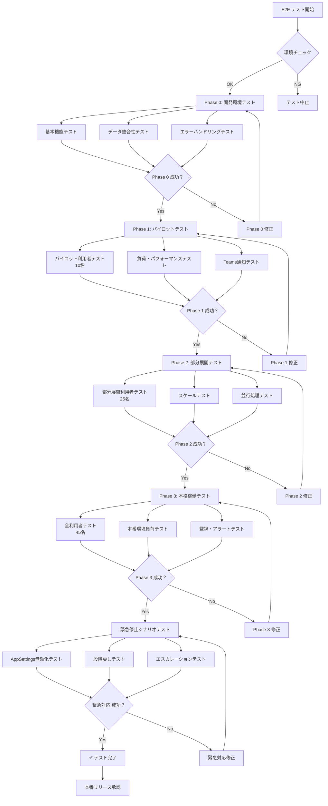
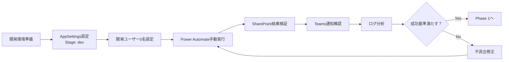
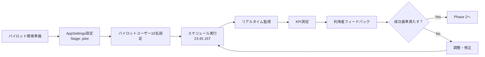
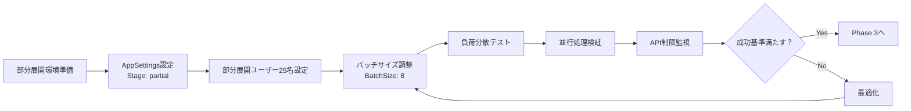
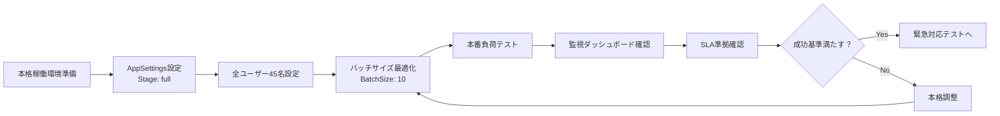
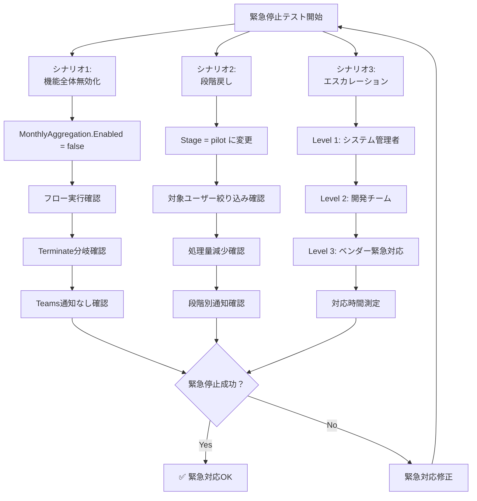
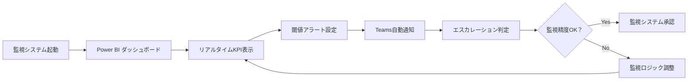

# E2Eテスト戦略 - 月次記録集計システム

## 概要

段階デプロイ戦略に基づく月次記録集計システムの包括的E2Eテスト計画。各フェーズでの負荷試験、KPI監視の自動化、緊急停止シナリオ検証を含む。

## テストシナリオ全体図



## フェーズ別テストシナリオ

### Phase 0: 開発環境テスト



#### 成功基準
- **実行成功率**: 100%（5名全員）
- **処理時間**: 2分以内
- **データ整合性**: 手動集計と完全一致
- **Teams通知**: 正常配信

### Phase 1: パイロットテスト



#### 成功基準
- **実行成功率**: 95%以上
- **処理時間**: 5分以内
- **データ整合性**: 手動集計との差分5%以内
- **利用者満足度**: 重大な問題報告なし

### Phase 2: 部分展開テスト



#### 成功基準
- **実行成功率**: 98%以上
- **処理時間**: 8分以内
- **API使用率**: SharePoint制限の70%以内
- **業務影響**: 日常業務への支障なし

### Phase 3: 本格稼働テスト



#### 成功基準
- **実行成功率**: 99%以上
- **処理時間**: 10分以内
- **データ整合性**: 手動集計との差分2%以内
- **SLA準拠**: 99.5%稼働率

## 緊急停止シナリオテスト



## KPI監視自動化テスト

### 監視項目テスト



#### 監視KPI
- **実行成功率**: リアルタイム表示
- **処理時間**: トレンド分析
- **エラー発生率**: パターン解析
- **API使用率**: 制限監視
- **Teams通知配信率**: 通知品質

---

## 実行可能チェックリスト

### 🔧 事前準備チェックリスト

#### SharePoint環境
- [ ] **AppSettings リスト作成済み**
  ```powershell
  Get-PnPList -Identity "AppSettings" -ErrorAction SilentlyContinue
  ```
- [ ] **Users_Master にフラグフィールド追加済み**
  ```powershell
  Get-PnPField -List "Users_Master" -Identity "IsPilot"
  Get-PnPField -List "Users_Master" -Identity "IsPartialDeploy"
  ```
- [ ] **MonthlyRecord_Summary の制約設定済み**
  ```powershell
  Get-PnPField -List "MonthlyRecord_Summary" -Identity "Key" | Select-Object Indexed, EnforceUniqueValues
  ```

#### Power Automate環境
- [ ] **フロー作成済み**
- [ ] **接続設定済み** (SharePoint, Teams)
- [ ] **変数初期化設定済み** (varSuccess, varUpdate, varFail)

#### Teams環境
- [ ] **Webhook URL設定済み**
- [ ] **通知チャンネル準備済み**
- [ ] **Adaptive Cards テンプレート準備済み**

### 📋 Phase 0: 開発環境テスト

#### A. 環境設定
- [ ] **1. AppSettings 初期設定**
  ```powershell
  $settings = @(
      @{Key="MonthlyAggregation.Enabled"; Value="true"},
      @{Key="MonthlyAggregation.Stage"; Value="dev"},
      @{Key="MonthlyAggregation.NotifyTeams"; Value="true"},
      @{Key="MonthlyAggregation.RetryCount"; Value="3"},
      @{Key="MonthlyAggregation.BatchSize"; Value="5"},
      @{Key="MonthlyAggregation.TimeoutMinutes"; Value="10"}
  )
  foreach ($setting in $settings) {
      Add-PnPListItem -List "AppSettings" -Values $setting
  }
  ```

- [ ] **2. 開発ユーザー設定**
  ```powershell
  $devUsers = @('DEV001', 'DEV002', 'DEV003', 'DEV004', 'DEV005')
  foreach ($user in $devUsers) {
      Set-PnPListItem -List "Users_Master" -Filter "UserId eq '$user'" -Values @{IsPilot=$true; IsActive=$true}
  }
  ```

#### B. 基本機能テスト
- [ ] **3. Power Automate 手動実行**
  - 実行時刻記録: `____:____`
  - 実行結果: `成功/失敗`
  - 処理時間: `____分____秒`

- [ ] **4. SharePoint結果確認**
  ```powershell
  Get-PnPListItem -List "MonthlyRecord_Summary" | Where-Object {$_.FieldValues["Key"] -like "*_$(Get-Date -Format 'yyyy-MM')"} | Select-Object @{n='Key';e={$_.FieldValues["Key"]}}, @{n='CompletedCount';e={$_.FieldValues["CompletedCount"]}}, @{n='CompletionRate';e={$_.FieldValues["CompletionRate"]}}
  ```
  - レコード件数: `____件`
  - データ整合性: `OK/NG`

- [ ] **5. Teams通知確認**
  - 通知受信: `あり/なし`
  - 内容正確性: `OK/NG`
  - 配信時間: `____:____`

#### C. エラーハンドリングテスト
- [ ] **6. SharePoint接続エラー模擬**
  - 権限削除してテスト実行
  - エラーハンドリング動作: `OK/NG`
  - Teams エラー通知: `あり/なし`

- [ ] **7. データ不整合テスト**
  - 不正なKey値でレコード作成
  - ユニーク制約エラー処理: `OK/NG`
  - リトライ動作: `OK/NG`

#### D. 成功基準チェック
- [ ] **8. 成功基準評価**
  - 実行成功率: `____%` (基準: 100%)
  - 処理時間: `____分` (基準: 2分以内)
  - データ整合性: `OK/NG` (基準: 完全一致)
  - Teams通知: `OK/NG` (基準: 正常配信)

### 📈 Phase 1: パイロットテスト

#### A. パイロット環境設定
- [ ] **9. AppSettings更新**
  ```powershell
  Set-PnPListItem -List "AppSettings" -Filter "Key eq 'MonthlyAggregation.Stage'" -Values @{Value="pilot"}
  ```

- [ ] **10. パイロットユーザー設定**
  ```powershell
  $pilotUsers = @('U001', 'U002', 'U003', 'U004', 'U005', 'U006', 'U007', 'U008', 'U009', 'U010')
  foreach ($user in $pilotUsers) {
      Set-PnPListItem -List "Users_Master" -Filter "UserId eq '$user'" -Values @{IsPilot=$true; IsActive=$true}
  }
  ```

#### B. スケジュール実行テスト
- [ ] **11. トリガー設定確認**
  - スケジュール: `23:45 JST`
  - タイムゾーン設定: `OK/NG`

- [ ] **12. 実行監視** (14日間継続)

  | 日付 | 実行時刻 | 成功数 | 失敗数 | 処理時間 | 備考 |
  |------|----------|--------|--------|----------|------|
  | 11/07 | ____:____ | ___/10 | ___/10 | ___分 | _____ |
  | 11/08 | ____:____ | ___/10 | ___/10 | ___分 | _____ |
  | 11/09 | ____:____ | ___/10 | ___/10 | ___分 | _____ |
  | ... | ... | ... | ... | ... | ... |

#### C. KPI測定
- [ ] **13. 成功率計算**
  ```powershell
  # 過去14日の実行結果集計
  $results = Get-PnPListItem -List "FlowRunHistory" | Where-Object {$_.FieldValues["RunDate"] -ge (Get-Date).AddDays(-14)}
  $successRate = ($results | Where-Object {$_.FieldValues["Status"] -eq "Success"}).Count / $results.Count * 100
  Write-Host "成功率: $successRate%"
  ```
  - 算出成功率: `____%` (基準: 95%以上)

- [ ] **14. 利用者フィードバック収集**
  - パイロット利用者へのアンケート実施
  - 重大問題報告: `あり/なし`
  - 改善要望: `_____________`

#### D. 成功基準チェック
- [ ] **15. Phase 1 成功基準評価**
  - 実行成功率: `____%` (基準: 95%以上)
  - 処理時間: `____分` (基準: 5分以内)
  - データ整合性: `____%` (基準: 差分5%以内)
  - 利用者満足度: `OK/NG` (基準: 重大問題なし)

### 📊 Phase 2: 部分展開テスト

#### A. 部分展開環境設定
- [ ] **16. AppSettings更新**
  ```powershell
  Set-PnPListItem -List "AppSettings" -Filter "Key eq 'MonthlyAggregation.Stage'" -Values @{Value="partial"}
  Set-PnPListItem -List "AppSettings" -Filter "Key eq 'MonthlyAggregation.BatchSize'" -Values @{Value="8"}
  ```

- [ ] **17. 部分展開ユーザー設定**
  ```powershell
  $partialUsers = @('U001', 'U002', 'U003', 'U004', 'U005', 'U006', 'U007', 'U008', 'U009', 'U010', 'U011', 'U012', 'U013', 'U014', 'U015', 'U016', 'U017', 'U018', 'U019', 'U020', 'U021', 'U022', 'U023', 'U024', 'U025')
  foreach ($user in $partialUsers) {
      Set-PnPListItem -List "Users_Master" -Filter "UserId eq '$user'" -Values @{IsPartialDeploy=$true; IsActive=$true}
  }
  ```

#### B. 負荷分散テスト
- [ ] **18. バッチ処理監視**
  - バッチサイズ: `8名/バッチ`
  - バッチ数: `4バッチ (25名 ÷ 8 + 余り)`
  - 並行実行: `確認済み/未確認`

- [ ] **19. API制限監視**
  ```powershell
  # SharePoint API使用率の監視（仮想的な例）
  # 実際の監視はPower Automateのログまたは外部ツールで実施
  ```
  - API使用率: `____%` (基準: 70%以内)
  - スロットリング発生: `あり/なし`

#### C. スケールテスト
- [ ] **20. 処理時間測定** (21日間継続)

  | 日付 | 対象数 | 処理時間 | 成功数 | 失敗数 | API使用率 | 備考 |
  |------|--------|----------|--------|--------|-----------|------|
  | 11/07 | 25名 | ___分 | ___/25 | ___/25 | ___% | _____ |
  | 11/08 | 25名 | ___分 | ___/25 | ___/25 | ___% | _____ |
  | ... | ... | ... | ... | ... | ... | ... |

#### D. 成功基準チェック
- [ ] **21. Phase 2 成功基準評価**
  - 実行成功率: `____%` (基準: 98%以上)
  - 処理時間: `____分` (基準: 8分以内)
  - API使用率: `____%` (基準: 70%以内)
  - 業務影響: `OK/NG` (基準: 支障なし)

### 🚀 Phase 3: 本格稼働テスト

#### A. 本格稼働環境設定
- [ ] **22. AppSettings最終更新**
  ```powershell
  Set-PnPListItem -List "AppSettings" -Filter "Key eq 'MonthlyAggregation.Stage'" -Values @{Value="full"}
  Set-PnPListItem -List "AppSettings" -Filter "Key eq 'MonthlyAggregation.BatchSize'" -Values @{Value="10"}
  ```

- [ ] **23. 全ユーザー有効化確認**
  ```powershell
  $activeUsers = Get-PnPListItem -List "Users_Master" | Where-Object {$_.FieldValues["IsActive"] -eq $true}
  Write-Host "対象ユーザー数: $($activeUsers.Count)名"
  ```
  - 対象ユーザー数: `____名` (基準: 45名)

#### B. 本番負荷テスト
- [ ] **24. フル負荷実行** (30日間継続監視)

  | 週 | 平均処理時間 | 平均成功率 | API使用率 | インシデント数 | SLA準拠 |
  |----|--------------|------------|-----------|----------------|---------|
  | 1週目 | ___分 | ___% | ___% | ___件 | OK/NG |
  | 2週目 | ___分 | ___% | ___% | ___件 | OK/NG |
  | 3週目 | ___分 | ___% | ___% | ___件 | OK/NG |
  | 4週目 | ___分 | ___% | ___% | ___件 | OK/NG |

#### C. 監視ダッシュボードテスト
- [ ] **25. Power BI ダッシュボード構築**
  - リアルタイム表示: `OK/NG`
  - KPIメトリクス表示: `OK/NG`
  - アラート機能: `OK/NG`

- [ ] **26. Teams監視通知設定**
  - 成功通知: `正常/異常`
  - エラーアラート: `正常/異常`
  - 週次レポート: `正常/異常`

#### D. 成功基準チェック
- [ ] **27. Phase 3 成功基準評価**
  - 実行成功率: `____%` (基準: 99%以上)
  - 処理時間: `____分` (基準: 10分以内)
  - データ整合性: `____%` (基準: 差分2%以内)
  - SLA準拠: `____%` (基準: 99.5%稼働率)

### 🚨 緊急停止シナリオテスト

#### A. 機能全体無効化テスト
- [ ] **28. 緊急停止実行**
  ```powershell
  Set-PnPListItem -List "AppSettings" -Filter "Key eq 'MonthlyAggregation.Enabled'" -Values @{Value="false"}
  ```
  - 実行時刻: `____:____`
  - 停止時刻: `____:____` (即時反映確認)

- [ ] **29. フロー実行確認**
  - Terminate分岐動作: `OK/NG`
  - Teams通知なし確認: `OK/NG`
  - 完全停止確認: `OK/NG`

#### B. 段階戻しテスト
- [ ] **30. パイロットへの段階戻し**
  ```powershell
  Set-PnPListItem -List "AppSettings" -Filter "Key eq 'MonthlyAggregation.Enabled'" -Values @{Value="true"}
  Set-PnPListItem -List "AppSettings" -Filter "Key eq 'MonthlyAggregation.Stage'" -Values @{Value="pilot"}
  ```
  - 対象ユーザー絞り込み: `OK/NG` (10名のみ)
  - 処理量減少確認: `OK/NG`
  - 段階別通知確認: `OK/NG`

#### C. エスカレーションテスト
- [ ] **31. Level 1エスカレーション** (システム管理者)
  - 連絡時刻: `____:____`
  - 対応開始: `____:____`
  - 対応時間: `____分` (基準: 30分以内)

- [ ] **32. Level 2エスカレーション** (開発チーム)
  - 連絡時刻: `____:____`
  - 対応開始: `____:____`
  - 対応時間: `____分` (基準: 1時間以内)

- [ ] **33. Level 3エスカレーション** (ベンダー緊急対応)
  - 連絡時刻: `____:____`
  - 対応開始: `____:____`
  - 対応時間: `____分` (基準: 2時間以内)

#### D. 緊急対応成功基準
- [ ] **34. 緊急対応評価**
  - 機能停止反映時間: `____分` (基準: 5分以内)
  - 段階戻し成功: `OK/NG`
  - エスカレーション対応時間: `OK/NG` (各Level基準内)

---

## ✅ 最終承認チェックリスト

### 技術的承認
- [ ] **全フェーズテスト完了** (Phase 0-3 + 緊急対応)
- [ ] **成功基準すべて満足**
- [ ] **監視システム正常動作**
- [ ] **ドキュメント整備完了**

### 業務的承認
- [ ] **利用者研修完了**
- [ ] **運用手順書承認**
- [ ] **緊急連絡網整備**
- [ ] **SLA合意取得**

### 本番リリース承認
- [ ] **システム管理者承認**: _________________ (署名・日付)
- [ ] **開発チームリーダー承認**: _________________ (署名・日付)
- [ ] **業務責任者承認**: _________________ (署名・日付)
- [ ] **最終承認者承認**: _________________ (署名・日付)

---

**🎯 本番リリース実行日時**: ______年______月______日 ______:______

**🔄 リリース後監視期間**: 30日間（毎日監視 → 週次監視 → 月次監視）