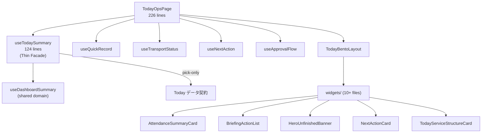

# /today 改修ガードレール

> **目的**: `/today` を改修する際の不変条件・テスト範囲・レビュー基準。
> 「やって消す画面」としての性質を守りつつ、安全に変更を届ける。

---

## 1. アーキテクチャ概要



### Hook 間の責務境界

| Hook | 責務 |
|------|------|
| **useTodaySummary** | Dashboard ドメインに委譲し、Today が必要なデータだけを **pick** する薄いファサード |
| **useQuickRecord** | 未記録ユーザーの簡易入力、自動次ユーザー遷移 |
| **useNextAction** | 次にやるべきアクションの導出と urgency 判定 |
| **useTransportStatus** | 送迎進捗の管理 |
| **useApprovalFlow** | 承認ダイアログの状態管理 |

> Today に新しい集約ロジックが必要な場合は、**Dashboard 側に追加してから pick する**。Today 自身に集約を持ち込まない。

---

## 2. 不変条件

### 2.1 Thin Facade 原則（最重要）

| ルール | 詳細 |
|--------|------|
| **Pick-only** | `useTodaySummary` は `useDashboardSummary` の return から必要なキーだけを pick する |
| **集約禁止** | Today 側で独自の useMemo 集約を作らない — Dashboard ドメインに追加してから pick |
| **データ契約** | pick リストの拡張は意図的なレビューが必要 (ADR-002 参照) |

> [!CAUTION]
> `useTodaySummary` の pick リストは **Today のデータ契約**。追加・削除は Dashboard 側の整合性に影響する。

### 2.2 Bento レイアウト

| ルール | 詳細 |
|--------|------|
| **レイアウト一元管理** | `TodayBentoLayout.tsx` がウィジェット配置を決める |
| **ウィジェット独立** | 各ウィジェットは props のみで駆動し、他ウィジェットに直接依存しない |
| **視線フロー** | Attendance → Briefing → ServiceStructure → Users → Transport の順序を維持 |

### 2.3 「やって消す」原則

- Today は **朝開いて → 全部済ませて → 閉じる** 画面
- 残タスクをゼロにすることがゴール
- 過去データの振り返り・統計は **Dashboard に委譲**
- 申し送りの詳細ワークフローは **Handoff Timeline に委譲**
- Handoff 簡易表示 (`TodayHandoffTimelineList`) は **読み取りのみ** — consumer

### 2.4 外部参照

| 外部ファイル | 使用内容 |
|-------------|---------|
| `features/dashboard/useDashboardSummary.ts` | データソース（Today の全データはここから pick） |
| `features/handoff/TodayHandoffTimelineList.tsx` | 申し送り簡易表示（consumer） |
| `features/attendance/` | 出席ストア |
| `features/staff/` | 職員ストア |

> [!IMPORTANT]
> `useDashboardSummary` の return 型が変わると Today のファサードに直接影響する。Dashboard 側の改修時は Today の pick リストの整合性を確認する。

---

## 3. 変更カテゴリ別チェックリスト

### ✅ 低リスク

- [ ] ウィジェット内の UI テキスト・色・余白調整
- [ ] 既存ウィジェットのリファクタ（export 変更なし）
- [ ] テストの追加
- [ ] Bento レイアウト内のサイズ微調整

### ⚠️ 中リスク

- [ ] 新しいウィジェットの追加 → `TodayBentoLayout` + `TodayOpsPage` に組み込み
- [ ] `useTodaySummary` の pick リスト拡張（Dashboard 側に先にプロパティ追加）
- [ ] `useNextAction` の urgency 判定ロジック変更
- [ ] `useQuickRecord` の自動遷移ロジック変更
- [ ] 送迎 (`transport/`) の状態種類追加

### 🔴 高リスク

- [ ] `useTodaySummary` で独自集約を追加（Thin Facade 原則違反）
- [ ] Bento レイアウトの視線フロー順序変更
- [ ] Today 内でステータス変更・保存操作を追加（「やって消す」原則の範囲を超える）
- [ ] `useDashboardSummary` の return 型変更（Dashboard 側 — Today に波及）
- [ ] Handoff 操作機能を Today に持ち込む（consumer 原則違反）

---

## 4. テスト安全ネット

### 4.1 既存テストスイート — 14 spec files

```bash
# Actions
npx vitest run src/features/today/actions/alertActions.logger.spec.ts
npx vitest run src/features/today/actions/alertActions.storage.spec.ts

# Hooks
npx vitest run src/features/today/hooks/buildNextActionViewModel.spec.ts
npx vitest run src/features/today/hooks/deriveUrgency.spec.ts
npx vitest run src/features/today/hooks/useNextActionProgress.spec.ts

# Records
npx vitest run src/features/today/records/__tests__/resolveNextUser.spec.ts
npx vitest run src/features/today/records/__tests__/useQuickRecord.spec.tsx
npx vitest run src/features/today/records/autoNextCounters.spec.ts

# Transport
npx vitest run src/features/today/transport/__tests__/transportStatusLogic.spec.ts

# Widgets
npx vitest run src/features/today/widgets/AttendanceSummaryCard.spec.tsx
npx vitest run src/features/today/widgets/BriefingActionList.spec.tsx
npx vitest run src/features/today/widgets/HeroUnfinishedBanner.spec.tsx
npx vitest run src/features/today/widgets/NextActionCard.spec.tsx
npx vitest run src/features/today/widgets/TodayServiceStructureCard.spec.tsx
```

### 4.2 一括実行

```bash
npx vitest run src/features/today/
```

### 4.3 ブラウザ確認ポイント

1. **朝の Bento**: Attendance → Briefing → ServiceStructure の視線フローが自然か
2. **未記録バナー**: 全員記録済みのときにバナーが消えるか
3. **QuickRecord**: ドロワーから簡易入力 → 自動次ユーザー遷移が動くか
4. **送迎進捗**: TransportStatusCard のステータス更新が反映されるか
5. **Handoff 簡易表示**: 読み取り専用で、ステータス変更ボタンがないか

---

## 5. ファイルサイズ警報ライン

| ファイル | 現在 | 閾値 | 超えたら |
|---------|------|------|---------|
| `TodayOpsPage.tsx` | 226 行 | 300 行 | ウィジェット組み立てロジックを hook に抽出 |
| `useTodaySummary.ts` | 124 行 | 200 行 | pick リストが膨張 — Dashboard 側の整理を検討 |
| `TodayBentoLayout.tsx` | — | 200 行 | レスポンシブ分岐を別ファイルに抽出 |

---

*最終更新: 2026-03-09 — 構造分析に基づき作成*
*関連: [Dashboard ガードレール](./dashboard-guardrails.md) / [Handoff ガードレール](./handoff-timeline-guardrails.md) / [3画面クイックリファレンス](./architecture/screen-responsibility-quickref.md)*
