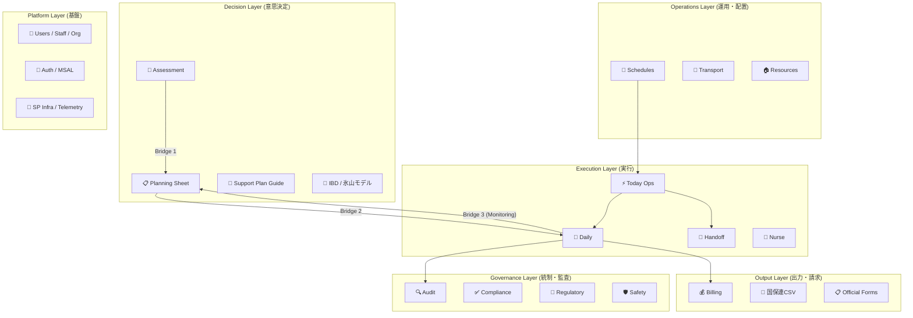

# System Map v2 — Support Operations OS

> **Architecture:** SharePoint 中心の業務 OS。`spFetch` + `Repository DI` が本流。
> **Generated:** 2026-03-27T14:17:38.799Z
> **Source of truth:** `src/features/`, `scripts/system-map/metadata.ts`

## 0. アーキテクチャとシステムレイヤー

## 1. Feature Module Registry

### Decision Layer

| Module | Route | Maturity | DataSource | Prod | Files | Bridges |
|:---|:---|:---:|:---|:---:|:---:|:---|
| `analysis` | — | **Expanding** | localStorage, zustand | ✅ | 11 | — |
| `assessment` | — | **Expanding** | **SP(1 keys)**, localStorage, zustand | ✅ | 15 | — |
| `ibd` | `analysis (approx)` | **Expanding** | **SP(2 keys)**, localStorage, firestore, zustand, msal | ✅ | 109 | — |
| `monitoring` | — | **Expanding** | **SP(2 keys)**, localStorage, zustand | ✅ | 53 | — |
| `planning-sheet` | — | **Expanding** | **SP**, localStorage, zustand | ✅ | 53 | assessmentBridge supportTemplateBridge monitoringToPlanningBridge planningToRecordBridge tokuseiBridgeBuilders tokuseiToPlanningBridge |
| `recommendation` | — | **Prototype** | pure-function | — | 3 | — |
| `support-plan-guide` | — | **Expanding** | **SP(1 keys)**, localStorage | ✅ | 104 | — |
| `tag-analytics` | — | **Prototype** | pure-function | — | 11 | — |

### Execution Layer

| Module | Route | Maturity | DataSource | Prod | Files | Bridges |
|:---|:---|:---:|:---|:---:|:---:|:---|
| `callLogs` | — | **Expanding** | **SP** | 🔶 | 32 | — |
| `daily` | `records` `schedule` | **Core** | **SP(1 keys)**, localStorage, firestore, zustand | ✅ | 177 | — |
| `dailyOps` | — | **Core** | **SP** | ✅ | 11 | — |
| `dashboard` | — | **Core** | **SP** | ✅ | 101 | syncGuardrails |
| `handoff` | — | **Core** | **SP**, localStorage | ✅ | 136 | — |
| `meeting` | `records (approx)` | **Core** | **SP(4 keys)** | ✅ | 22 | MeetingSync.int.test |
| `meeting-minutes` | `records (approx)` | **Core** | **SP**, localStorage | ✅ | 17 | — |
| `nurse` | — | **Core** | **SP(1 keys)**, localStorage, firestore, zustand | ✅ | 58 | NurseSyncButton NurseSyncHud.stories NurseSyncHud NurseToastBridge SyncNowButton.stories SyncNowButton SyncResultAnnouncer SyncStatusCaption.stories ObservationBridge useLastSync useNurseSync useOnlineSyncToast |
| `timeline` | — | **Expanding** | pure-function | ✅ | 9 | — |
| `today` | — | **Core** | **SP(1 keys)**, localStorage, firestore, zustand | ✅ | 159 | — |

### Operations Layer

| Module | Route | Maturity | DataSource | Prod | Files | Bridges |
|:---|:---|:---:|:---|:---:|:---:|:---|
| `operationFlow` | — | **Expanding** | **SP**, firestore | ✅ | 14 | phaseConfigBridge |
| `ops-dashboard` | — | **Expanding** | localStorage | 🔶 | 9 | — |
| `planDeployment` | — | **Dormant** | localStorage | — | 3 | — |
| `resources` | — | **Expanding** | **SP** | ✅ | 16 | — |
| `schedules` | `daily` `records` `schedule` | **Core** | **SP(1 keys)**, localStorage | ✅ | 132 | — |
| `transport-assignments` | — | **Prototype** | pure-function | 🔶 | 6 | — |

### Governance Layer

| Module | Route | Maturity | DataSource | Prod | Files | Bridges |
|:---|:---|:---:|:---|:---:|:---:|:---|
| `audit` | `records` | **Core** | **SP** | ✅ | 13 | useAuditSync useAuditSyncBatch.core useAuditSyncBatch |
| `compliance-checklist` | `records` | **Core** | **SP(1 keys)** | ✅ | 6 | — |
| `exceptions` | — | **Expanding** | **SP**, localStorage, firestore, zustand | ✅ | 47 | — |
| `import` | — | **Core** | **SP**, localStorage | ✅ | 15 | — |
| `regulatory` | — | **Expanding** | **SP** | ✅ | 7 | — |
| `safety` | — | **Expanding** | localStorage | ✅ | 15 | — |

### Platform Layer

| Module | Route | Maturity | DataSource | Prod | Files | Bridges |
|:---|:---|:---:|:---|:---:|:---:|:---|
| `accessibility` | — | **Infra** | pure-function | ✅ | 5 | — |
| `action-engine` | — | **Prototype** | localStorage, firestore, zustand | 🔶 | 47 | — |
| `attendance` | — | **Core** | **SP** | ✅ | 39 | — |
| `auth` | — | **Core** | **SP**, localStorage, zustand | ✅ | 15 | — |
| `context` | — | **Infra** | pure-function | ✅ | 3 | — |
| `cross-module` | — | **Infra** | firestore | ✅ | 7 | — |
| `demo` | — | **Infra** | localStorage | — | 3 | — |
| `diagnostics` | — | **Infra** | **SP** | ✅ | 9 | — |
| `operation-hub` | — | **Infra** | **SP** | ✅ | 7 | — |
| `org` | — | **Core** | **SP**, zustand | ✅ | 5 | — |
| `settings` | `records` `schedule` | **Infra** | localStorage | ✅ | 20 | — |
| `shared` | — | **Infra** | pure-function | ✅ | 4 | — |
| `staff` | — | **Core** | **SP(1 keys)**, localStorage | ✅ | 41 | — |
| `telemetry` | — | **Infra** | firestore | ✅ | 51 | — |
| `users` | — | **Core** | **SP(2 keys)**, localStorage | ✅ | 76 | — |

### Output Layer

| Module | Route | Maturity | DataSource | Prod | Files | Bridges |
|:---|:---|:---:|:---|:---:|:---:|:---|
| `billing` | — | **Expanding** | **SP** | ✅ | 6 | — |
| `kokuhoren-csv` | — | **Core** | pure-function | ✅ | 8 | — |
| `kokuhoren-preview` | — | **Core** | pure-function | ✅ | 2 | — |
| `kokuhoren-validation` | — | **Core** | pure-function | ✅ | 7 | — |
| `official-forms` | — | **Core** | **SP** | ✅ | 5 | — |
| `records` | `records` | **Core** | **SP** | ✅ | 17 | — |
| `reports` | — | **Expanding** | pure-function | 🔶 | 6 | — |
| `service-provision` | — | **Core** | **SP** | ✅ | 19 | syncAttendanceToProvision useSyncAttendance |
